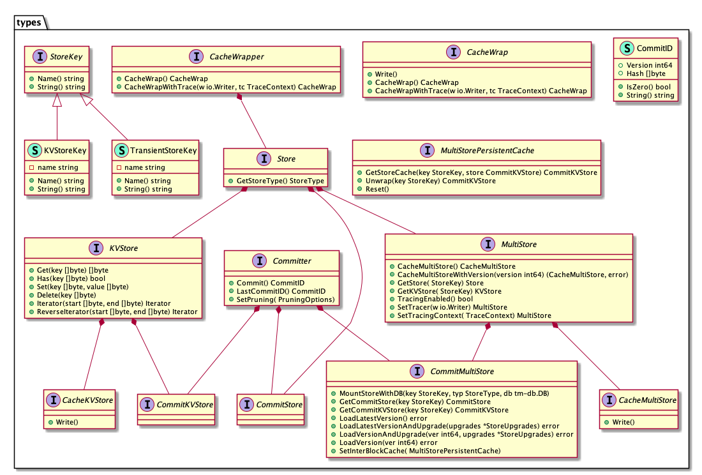

# COSMOS-SDK中的存储

longcpp @ 20200424

为了实现数据的持久化存储, comos-sdk/store路径下实现了一些列的存储类型. 默认情况下, 对于基于cosmos-sdk构建的上层应用来说, 最主要的存储类型是`multistore`, 其中可以根据应用需要存储任意个数的存储器. `multistore`的这种设计是为了支持cosmos-sdk的模块化设计, 以便使得应用的每个模块都可以拥有并且独自管理自己的存储空间, 其中这部分独有的存储空间需要通过一个特定的前缀`key`来访问, 这个`key`通常由模块自身的`keeper`持有并且不对外暴露, 由此可以保证本模块的存储空间不会被其他模块修改.

## 存储器

cosmos-sdk中全局采用了缓存包装(cache-wrapping), 并且要求所有的存储器都实现相应策略. 缓存包装的基本理念是创建关于一个存储器的轻快照(light snapshot), 这个轻快照可以在不影响底层的存储器状态的情况下被传递和更新. 这种设计在区块链项目中很常见, 这是由于区块链业务属性决定的. 由交易触发的链上状态的转换可能成功也可能不成功, 并且在不成功的时候快速撤销所有的更改操作. 有了轻快照,前述的目的容易达成.并且当执行成功的时候, 被更新过的轻快照可以写入底层的存储器中.

` comos-sdk/store/types/storge.go` 路径下跟存储器相关的类型之间的关系在下面的图中展示. 本质上cosmos-sdk中的存储器是一个实现了 `GetStoreType()` 并且持有`CacheWrapper`的实体`Store`. `CacheWrapper`是接口类型, 其中指明了缓存包装相关的方法以及`Write()`方法(在`CacheWrap`接口中). 



将具体的更改持久化底层数据库中的操作由`Commiter`接口中的`Commit() CommitID`方法提供, `CommitID`是根据状态树通过确定性过程计算出来的, 包含两个字段: 版本号`Version`和哈希值`Hash`. 哈希值`Hash`会返回给底层的共识引擎并存储到区块头中. 将持久化操作分离出来放在单独的接口中也是为了支持cosmos-sdk的 object-capabilities 模型. cosmos-sdk的实现中,只有`baseapp`才应该具备持久化修改底层数据库的能力, 例如在gaia中设置初始状态时`setGenesis`会调用`gapp.Commit()`. 另外的示例则来自于`tendermint`项目中`(*BlockExecutor).ApplyBlock`方法对`Commit`的调用(有多层封装), 此处不再展示.

```go
// gaia@v2.0.9 app/app_test.go 38-55
func setGenesis(gapp *GaiaApp) error {

	genesisState := simapp.NewDefaultGenesisState()
	stateBytes, err := codec.MarshalJSONIndent(gapp.cdc, genesisState)
	if err != nil {
		return err
	}

	// Initialize the chain
	gapp.InitChain(
		abci.RequestInitChain{
			Validators:    []abci.ValidatorUpdate{},
			AppStateBytes: stateBytes,
		},
	)
	gapp.Commit()
	return nil
}
```

应用的各个模块对自己模块所拥有的`Store`只能通过`ctx.KVStore()`得到相应的`KVStore`之后,再进行`Get`和`Set`进行读写. 例如cosmos-sdk中的auth模块中, `AccountKeeper`的`GetAccount`和`SetAccount`方法.

```go
// cosmos-sdk@v0.38.3 x/auth/keeper/keeper.go 28-36
// GetAccount implements sdk.AccountKeeper.
func (ak AccountKeeper) GetAccount(ctx sdk.Context, addr sdk.AccAddress) exported.Account {
	store := ctx.KVStore(ak.key)
	bz := store.Get(types.AddressStoreKey(addr))
	if bz == nil {
		return nil
	}
	acc := ak.decodeAccount(bz)
	return acc
}

// cosmos-sdk@v0.38.3 x/auth/keeper/keeper.go 48-57
// SetAccount implements sdk.AccountKeeper.
func (ak AccountKeeper) SetAccount(ctx sdk.Context, acc exported.Account) {
	addr := acc.GetAddress()
	store := ctx.KVStore(ak.key)
	bz, err := ak.cdc.MarshalBinaryBare(acc)
	if err != nil {
		panic(err)
	}
	store.Set(types.AddressStoreKey(addr), bz)
}
```

## 多重存储器 

每个基于cosmos-sdk构建的应用程序都通过持有一个`MultiStore`来完成状态的持久存储, 由于其重要性在下面列出`MultiStore`接口的完整定义, 其中包含了`Store`接口以及额外的几个方法.

```go
// cosmos-sdk@v0.38.3 x/auth/keeper/keeper.go 83-112
type MultiStore interface { //nolint
	Store

	// Cache wrap MultiStore.
	// NOTE: Caller should probably not call .Write() on each, but
	// call CacheMultiStore.Write().
	CacheMultiStore() CacheMultiStore

	// CacheMultiStoreWithVersion cache-wraps the underlying MultiStore where
	// each stored is loaded at a specific version (height).
	CacheMultiStoreWithVersion(version int64) (CacheMultiStore, error)

	// Convenience for fetching substores.
	// If the store does not exist, panics.
	GetStore(StoreKey) Store
	GetKVStore(StoreKey) KVStore

	// TracingEnabled returns if tracing is enabled for the MultiStore.
	TracingEnabled() bool

	// SetTracer sets the tracer for the MultiStore that the underlying
	// stores will utilize to trace operations. The modified MultiStore is
	// returned.
	SetTracer(w io.Writer) MultiStore

	// SetTracingContext sets the tracing context for a MultiStore. It is
	// implied that the caller should update the context when necessary between
	// tracing operations. The modified MultiStore is returned.
	SetTracingContext(TraceContext) MultiStore
}
```

`rootmulti.Store`实现了`MultiStore`接口以及`Committer`接口,  其中的多个存储器通过映射表 `map[types.StoreKey]types.CommitKVStore` 来存储的, 并且借助映射表`map[string]types.StoreKey`和`map[types.StoreKey]storeParams`, `rootmulti.Store`中的每个存储器可以有自己的名字和存储参数.

```go
// cosmos-sdk@v0.38.3 store/rootmulti/store.go 27-43
// Store is composed of many CommitStores. Name contrasts with
// cacheMultiStore which is for cache-wrapping other MultiStores. It implements
// the CommitMultiStore interface.
type Store struct {
	db             dbm.DB
	lastCommitInfo commitInfo
	pruningOpts    types.PruningOptions
	storesParams   map[types.StoreKey]storeParams
	stores         map[types.StoreKey]types.CommitKVStore
	keysByName     map[string]types.StoreKey
	lazyLoading    bool

	traceWriter  io.Writer
	traceContext types.TraceContext

	interBlockCache types.MultiStorePersistentCache
}
```

如前所述, cosmos-sdk中所有的存储器都需要实现缓存策略, `MultiStore`的缓存策略由`cachemulti.Store`实现.

```go
// cosmos-sdk@v0.38.3 store/cachemulti/store.go 17-28
// Store holds many cache-wrapped stores.
// Implements MultiStore.
// NOTE: a Store (and MultiStores in general) should never expose the
// keys for the substores.
type Store struct {
	db     types.CacheKVStore
	stores map[types.StoreKey]types.CacheWrap
	keys   map[string]types.StoreKey

	traceWriter  io.Writer
	traceContext types.TraceContext
}
```

可以利用函数`newCacheMultiStoreFromCMS`从`rootmulti.Store`创建`cachemulti.Store`:

```go
// cosmos-sdk@v0.38.3 store/cachemulti/store.go 68-75
func newCacheMultiStoreFromCMS(cms Store) Store {
	stores := make(map[types.StoreKey]types.CacheWrapper)
	for k, v := range cms.stores {
		stores[k] = v
	}

	return NewFromKVStore(cms.db, stores, nil, cms.traceWriter, cms.traceContext)
}
```

其中`NewFromKVStore`根据输入参数依次初始化`cachemulti.Store`结构体的各个字段. 对输入参数提供的所有的存储器根据`rootmulti.Store`的`cms.TracingEnabled`的返回值调用`store.CacheWrapWithTrace`或者`store.CacheWrap`完成`cachemulti.Store`中`stores`成员的设置.

```go
// cosmos-sdk@v0.38.3 store/cachemulti/store.go 32-56
// NewFromKVStore creates a new Store object from a mapping of store keys to
// CacheWrapper objects and a KVStore as the database. Each CacheWrapper store
// is cache-wrapped.
func NewFromKVStore(
	store types.KVStore, stores map[types.StoreKey]types.CacheWrapper,
	keys map[string]types.StoreKey, traceWriter io.Writer, traceContext types.TraceContext,
) Store {
	cms := Store{
		db:           cachekv.NewStore(store),
		stores:       make(map[types.StoreKey]types.CacheWrap, len(stores)),
		keys:         keys,
		traceWriter:  traceWriter,
		traceContext: traceContext,
	}

	for key, store := range stores {
		if cms.TracingEnabled() {
			cms.stores[key] = store.CacheWrapWithTrace(cms.traceWriter, cms.traceContext)
		} else {
			cms.stores[key] = store.CacheWrap()
		}
	}

	return cms
}
```

`cachemulti.Store`的`Write`方法对针对所有的存储器依次调用`Write`方法. 对比`rootmulti.Store`的相应接口,可以看到`cachemulti.Store`不支持`Commit`接口.

```go
// cosmos-sdk@v0.38.3 store/cachemulti/store.go 110-116
// Write calls Write on each underlying store.
func (cms Store) Write() {
	cms.db.Write()
	for _, store := range cms.stores {
		store.Write()
	}
}
```

## 键值对存储器

键值对存储器(`KVStore`)顾名思义可以用来存储,访问并修改其中的key-value. 遵循cosmos-sdk的要求, 相应的缓存策略由 `CacheKVStore`提供. 为`KVStore`添加`Commiter`接口则成为`CommitKVStore`. 默认`baseapp`中的`CommitMultiStore`中挂载的存储器都是`CommitKVStore`. 如前所述, `KVStore`与`CommitKVStore`是为了基于cosmos-sdk构建的应用中的每个模块独占自己的存储器, 也即实现object-capabilities 模型. 

`baseapp`中默认使用基于IAVL+树实现的`KVStore`以及`CommitKVStore`: `iavl.Store`. IAVL+树基于自平衡二叉树和Merkle树的可认证数据结构, 其`Get`和`Set`操作复杂度均为O(log n), n为树中存储的元素总数. IAVL+树的实现细节参见[可认证数据结构IAVL+树](https://github.com/longcpp/CryptoInAction/blob/master/cosmos-coinex/iavl.md).

```go
// cosmos-sdk@v0.38.3 store/iavl/store.go 32-36
// Store Implements types.KVStore and CommitKVStore.
type Store struct {
	tree    Tree
	pruning types.PruningOptions
}
```

值得提及的是, IAVL+树的构造方式,允许快速的遍历键共享相同前缀的元素. 例如`auth`模块可以基于这种能力,快速遍历应用中所有的`Account`.

```go
// cosmos-sdk@v0.38.3 x/auth/keeper/keeper.go 67-80
// IterateAccounts iterates over all the stored accounts and performs a callback function
func (ak AccountKeeper) IterateAccounts(ctx sdk.Context, cb func(account exported.Account) (stop bool)) {
	store := ctx.KVStore(ak.key)
	iterator := sdk.KVStorePrefixIterator(store, types.AddressStoreKeyPrefix)

	defer iterator.Close()
	for ; iterator.Valid(); iterator.Next() {
		account := ak.decodeAccount(iterator.Value())

		if cb(account) {
			break
		}
	}
}
```

`iavl.Store`同时实现了`Committer`接口, 其中`Commit()`方法的实现是借助IAVL+树的`SaveVersion()`实现的.

```go
// cosmos-sdk@v0.38.3 store/iavl/store.go 121-149
// Commit commits the current store state and returns a CommitID with the new
// version and hash.
func (st *Store) Commit() types.CommitID {
	hash, version, err := st.tree.SaveVersion()
	if err != nil {
		// TODO: Do we want to extend Commit to allow returning errors?
		panic(err)
	}

	// If the version we saved got flushed to disk, check if previous flushed
	// version should be deleted.
	if st.pruning.FlushVersion(version) {
		previous := version - st.pruning.KeepEvery

		// Previous flushed version should only be pruned if the previous version is
		// not a snapshot version OR if snapshotting is disabled (SnapshotEvery == 0).
		if previous != 0 && !st.pruning.SnapshotVersion(previous) {
			err := st.tree.DeleteVersion(previous)
			if errCause := errors.Cause(err); errCause != nil && errCause != iavl.ErrVersionDoesNotExist {
				panic(err)
			}
		}
	}

	return types.CommitID{
		Version: version,
		Hash:    hash,
	}
}
```

cosmos-sdk中要求所有的存储器类型都提供缓存策略的实现, 对于`KVStore`的缓存策略的具体实现由`cachekv.Store`提供.  `cachekv.Store`中的利用映射表`map[string]*cValue`提供缓存服务(其中`cValue`中标记了对应的value的值和状态), 其支撑的存储器`KVStore`则保存在`parent`字段中. 

```go
// cosmos-sdk@v0.38.3 store/cachekv/cache.go 17-32
// If value is nil but deleted is false, it means the parent doesn't have the
// key.  (No need to delete upon Write())
type cValue struct {
	value   []byte
	deleted bool 
	dirty   bool 
}

// Store wraps an in-memory cache around an underlying types.KVStore.
type Store struct {
	mtx           sync.Mutex
	cache         map[string]*cValue
	unsortedCache map[string]struct{}
	sortedCache   *list.List // always ascending sorted
	parent        types.KVStore
}
```

通过`cachekv.Store`进行`Get`操作时,会首先访问缓存`cache`, 不成功则进一步访问底层的`KVStore`, 参见`Get`的实现. 而`Set`和`Delete`操作通过`setCacheValue`仅对`cache`进行更新.

```go
// cosmos-sdk@v0.38.3 store/cachekv/cache.go 50-66
// Implements types.KVStore.
func (store *Store) Get(key []byte) (value []byte) {
	store.mtx.Lock()
	defer store.mtx.Unlock()

	types.AssertValidKey(key)

	cacheValue, ok := store.cache[string(key)]
	if !ok {
		value = store.parent.Get(key)
		store.setCacheValue(key, value, false, false)
	} else {
		value = cacheValue.value
	}

	return value
}

```

`cachekv.Store`的`Write`方法将缓存中的内容推送到`parent`指向的`KVStore`中.

```go
// cosmos-sdk@v0.38.3 store/cachekv/cache.go 95-129
// Implements Cachetypes.KVStore.
func (store *Store) Write() {
	store.mtx.Lock()
	defer store.mtx.Unlock()

	// We need a copy of all of the keys.
	// Not the best, but probably not a bottleneck depending.
	keys := make([]string, 0, len(store.cache))
	for key, dbValue := range store.cache {
		if dbValue.dirty {
			keys = append(keys, key)
		}
	}

	sort.Strings(keys)

	// TODO: Consider allowing usage of Batch, which would allow the write to
	// at least happen atomically.
	for _, key := range keys {
		cacheValue := store.cache[key]
		switch {
		case cacheValue.deleted:
			store.parent.Delete([]byte(key))
		case cacheValue.value == nil:
			// Skip, it already doesn't exist in parent.
		default:
			store.parent.Set([]byte(key), cacheValue.value)
		}
	}

	// Clear the cache
	store.cache = make(map[string]*cValue)
	store.unsortedCache = make(map[string]struct{})
	store.sortedCache = list.New()
}
```

注意`cachekv.Store`的`Write`方法并没有触发真正的数据库写操作. 虽然在内部实现中调用了`store.parent.Set`和`store.parent.Delete`方法, 但是这两个方法并没有引发持久化存储的更改操作.以`store.parent.Set`方法为例, 该方法调用了`KVStore`的`Set`的方法. `iavl.Store`的`Set`方法的实现调用了`st.tree.Set(key, value)`方法.  

```go
// cosmos-sdk@v0.38.3 store/iavl/store.go 185-189
// Implements types.KVStore.
func (st *Store) Set(key, value []byte) {
	types.AssertValidValue(value)
	st.tree.Set(key, value)
}
```

此处的`Set`是由`Tree`接口中支持的方法. 对于`iavl.Store`来说,该方法的具体实现是由[iavl](https://github.com/tendermint/iavl)提供的.

```go
// ival@v0.13.3 mutable_tree.go 115-120
// Set sets a key in the working tree. Nil values are not supported.
func (tree *MutableTree) Set(key, value []byte) bool {
	orphaned, updated := tree.set(key, value)
	tree.addOrphans(orphaned)
	return updated
}
```

 `MutableTree`结构体的定义如下, 其`Set`方法会在其所维持的二叉平衡树内部进行状态的更新, 比如树根节点的更新, 二叉树的再平衡以及由此导致的应当从树中移除的节点. 应当移除的节点由由`orphans`保存. 另外`MutableTree`结构体中的`ndb`成员表示用来存储所有节点信息的数据库. 可以看到`Set`方法所有的副作用均发生在内存层面, 而不会引发`ndb`的更新.

```go
// iavl@v0.13.3 mutable_tree.go 16-23
// MutableTree is a persistent tree which keeps track of versions.
type MutableTree struct {
	*ImmutableTree                  // The current, working tree.
	lastSaved      *ImmutableTree   // The most recently saved tree.
	orphans        map[string]int64 // Nodes removed by changes to working tree.
	versions       map[int64]bool   // The previous versions of the tree saved in disk or memory.
	ndb            *nodeDB
}
```

如前所述, 只有`Committer`接口的`Commit`方法才会触发底层数据库的更新. 根据`iavl.Store`的`Commit`实现, 可以会触发`st.tree.SaveVersion()`方法, 这个方法的具体实现也是在iavl库中. 最终iavl中的`MutableTree`的`SaveVersion`方法实现可以发现, 该方法内会将`(*MutableTree).Set`等方法引发的更改真正写入到数据库`ndb`中. 

## 存储器装饰器

`cachekv.Store`可以看作是`KVStore`的装饰器, 其实现也遵循了装饰器设计模式. 为了适配构建上层应用的需要, cosmos-sdk中提供了另外3个存储器装饰器, 分别为`prefix.Store`, `gaskv.Store`以及`tracekv.Store`.

 `prefix.Store`通过包装底层的`KVStore`, 实现在每次访问修改底层的`KVStore`中的键值对时, 自动给键索引加上前缀. 应用层可以利用该特性将所存储的内容进行分类,不同的分类在访问时使用不同的前缀. 这种设计在应用层通过`PrefixIterator`遍历某个前缀下所存储的所有键值对.

区块链应用都需要某种方式来限制一笔交易交易所消耗的计算资源, 其中包括对数据库的读写次数. `gaskv.Store`通过包装底层的`KVStore`实现每一次对该`KVStore`的读写都可以自动扣费. 

```go
// cosmos-sdk@v0.38.3 store/gaskv/store.go 11-17
// Store applies gas tracking to an underlying KVStore. It implements the
// KVStore interface.
type Store struct {
	gasMeter  types.GasMeter
	gasConfig types.GasConfig
	parent    types.KVStore
}
```

每种操作消耗具体的gas值由`GasConfig`指定, 而`GasMeter`用来追踪消耗的gas的总量以及可以消耗的gas的最大值. 当消耗的gas数量超过允许消耗的gas上限时报错. `GasConfig`中指明了对`KVStore`进行读写操作时,需要耗费的gas值. 下面的代码列表中一同展示了默认的`GasConfig`策略的各项操作所需消耗的gas值.

```go
// cosmos-sdk@v0.38.3 store/tyeps/gas.go 141-163
// GasConfig defines gas cost for each operation on KVStores
type GasConfig struct {
	HasCost          Gas
	DeleteCost       Gas
	ReadCostFlat     Gas
	ReadCostPerByte  Gas
	WriteCostFlat    Gas
	WriteCostPerByte Gas
	IterNextCostFlat Gas
}

// KVGasConfig returns a default gas config for KVStores.
func KVGasConfig() GasConfig {
	return GasConfig{
		HasCost:          1000,
		DeleteCost:       1000,
		ReadCostFlat:     1000,
		ReadCostPerByte:  3,
		WriteCostFlat:    2000,
		WriteCostPerByte: 30,
		IterNextCostFlat: 30,
	}
}
```

从`KVStore`中读取100个字节,需要消耗的gas总量为`ReadCostFlat + ReadCostPerByte * 100 = 1300`. 向`KVStore`中写入100个字节,需要消耗的gas总量为`WriteCostFlat + WriteCostPerByte * 100 = 5000`. 可以看到向`KVStore`中写的代价远远高于从`KVStore`中读的代价. 下面展示`gaskv.Store`的`Set`方法的实现. 

```go
// cosmos-sdk@v0.38.3 store/gaskv/store.go 46-53
// Implements KVStore.
func (gs *Store) Set(key []byte, value []byte) {
	types.AssertValidValue(value)
	gs.gasMeter.ConsumeGas(gs.gasConfig.WriteCostFlat, types.GasWriteCostFlatDesc)
	// TODO overflow-safe math?
	gs.gasMeter.ConsumeGas(gs.gasConfig.WriteCostPerByte*types.Gas(len(value)), types.GasWritePerByteDesc)
	gs.parent.Set(key, value)
}
```

其中`gs.gasMeter.ConsumeGas`用来追踪到目前为止消耗的gas总量,并与内部持有的gas限制做比较. 如果所需消耗的gas值超过了上线,会引发`panic`. 在cosmos-sdk中,默认所有的`KVStore`都被`gaskv.Store`包装过. 在cosmos-sdk中为了处理一个请求,需要首先构建处理请求所需要的上下文`Context`, 而`Context`中的一个成员是`MultiStore`, 从`MultiStore`中获取`KVStore`的操作由`Context`的方法`KVStore`提供, 方法返回的是经过`gaskv`包装过的`KVStore`.

```go
// cosmos-sdk@v0.38.3 types/context.go 210-213
// KVStore fetches a KVStore from the MultiStore.
func (c Context) KVStore(key StoreKey) KVStore {
	return gaskv.NewStore(c.MultiStore().GetKVStore(key), c.GasMeter(), stypes.KVGasConfig())
}
```

在接口`MultiStore`的定义中, 有一个字段我们还没有讨论, 那就是`TracingEnabled`字段. 当`TracingEnabled`为`true`时, 通过`MultiStore`的`GetKVStore()`方法返回的`KVStore`是`tracekv.Store`. 

```go
// cosmos-sdk@v0.38.3 store/rootmulti/store.go 376-390
// GetKVStore returns a mounted KVStore for a given StoreKey. If tracing is
// enabled on the KVStore, a wrapped TraceKVStore will be returned with the root
// store's tracer, otherwise, the original KVStore will be returned.
//
// NOTE: The returned KVStore may be wrapped in an inter-block cache if it is
// set on the root store.
func (rs *Store) GetKVStore(key types.StoreKey) types.KVStore {
	store := rs.stores[key].(types.KVStore)

	if rs.TracingEnabled() {
		store = tracekv.NewStore(store, rs.traceWriter, rs.traceContext)
	}

	return store
}
```

此时, `Context`的`KVStore()`方法, 此时返回的是经过两次装饰的`KVStore`, 也即底层的`KVStore`先经过`tracekv.Store`装饰,然后再经过`gaskv.Store`装饰. `tracekv.Store`的定义如下.

```go
// cosmos-sdk@v0.38.3 store/tracekv/store.go 20-43
type (
	// Store implements the KVStore interface with tracing enabled.
	// Operations are traced on each core KVStore call and written to the
	// underlying io.writer.
	//
	// TODO: Should we use a buffered writer and implement Commit on
	// Store?
	Store struct {
		parent  types.KVStore
		writer  io.Writer
		context types.TraceContext
	}

	// operation represents an IO operation
	operation string

	// traceOperation implements a traced KVStore operation
	traceOperation struct {
		Operation operation              `json:"operation"`
		Key       string                 `json:"key"`
		Value     string                 `json:"value"`
		Metadata  map[string]interface{} `json:"metadata"`
	}
)
```

当从`tracekv.Store`调用底层`KVStore`的方法时, `tracekv.Store`自动向`writter`以`json`格式写入日志信息, 日志信息包括操作的名字, 操作相关的键值对以及来自于`TraceContext`的`metadata`信息. 以`Set`方法为例, 在调用底层`KVStore`的`Set`方法之前,先通过`writeOperation`进行日志记录.

```go
// cosmos-sdk@v0.38.3 store/tracekv/store.go 60-65
// Set implements the KVStore interface. It traces a write operation and
// delegates the Set call to the parent KVStore.
func (tkv *Store) Set(key []byte, value []byte) {
	writeOperation(tkv.writer, writeOp, tkv.context, key, value)
	tkv.parent.Set(key, value)
}

// cosmos-sdk@v0.38.3 store/tracekv/store.go 175-198
// writeOperation writes a KVStore operation to the underlying io.Writer as
// JSON-encoded data where the key/value pair is base64 encoded.
func writeOperation(w io.Writer, op operation, tc types.TraceContext, key, value []byte) {
	traceOp := traceOperation{
		Operation: op,
		Key:       base64.StdEncoding.EncodeToString(key),
		Value:     base64.StdEncoding.EncodeToString(value),
	}

	if tc != nil {
		traceOp.Metadata = tc
	}

	raw, err := json.Marshal(traceOp)
	if err != nil {
		panic(fmt.Sprintf("failed to serialize trace operation: %v", err))
	}

	if _, err := w.Write(raw); err != nil {
		panic(fmt.Sprintf("failed to write trace operation: %v", err))
	}

	io.WriteString(w, "\n")
}
```

至此也可以更好的理解`rootmulti.Store`中的`SetTracer()`和`SetTracingContext()`方法. 其中前一个方法设置写日志信息的`Writer`, 而`SetTracingContext()`通过将传入的`TraceContext`与当前的`TraceContext`值进行融合来更新当前的追踪上下文. 

```go
// cosmos-sdk@v0.38.3 store/rootmulti/store.go 258-272
// SetTracingContext updates the tracing context for the MultiStore by merging
// the given context with the existing context by key. Any existing keys will
// be overwritten. It is implied that the caller should update the context when
// necessary between tracing operations. It returns a modified MultiStore.
func (rs *Store) SetTracingContext(tc types.TraceContext) types.MultiStore {
	if rs.traceContext != nil {
		for k, v := range tc {
			rs.traceContext[k] = v
		}
	} else {
		rs.traceContext = tc
	}

	return rs
}
```

`SetTracingContext`的一个使用示例是, 在cosmos-sdk的`(*BaseApp).BeginBlock()`方法的实现中, 会先判断其持有的`MultiStore`中是否设置了`TracingEnabled`. 如果为`true`, 则会调用该方法:

```go
func (app *BaseApp) BeginBlock(req abci.RequestBeginBlock) (res abci.ResponseBeginBlock) {
	if app.cms.TracingEnabled() {
		app.cms.SetTracingContext(sdk.TraceContext(
			map[string]interface{}{"blockHeight": req.Header.Height},
		))
	}
  // ...
```

##数据库装饰器与瞬时存储

`cosmos-sdk/store/dbadapter`路径下额外提供了`dbadapter.Store`,用来将[`github.com/tendermint/tm-db`](https://github.com/tendermint/tm-db)中定义的数据库接口`DB`包装成为`Store`接口的形式. 所有`Store`接口的方法调用在`dbadapter.Store`中直接转换成`DB`的适当方法的调用, 参见下面`Get()`方法的实现.

```go
// cosmos-sdk@v0.38.3 store/dbadapter/store.go 13-26
// Wrapper type for dbm.Db with implementation of KVStore
type Store struct {
	dbm.DB
}

// Get wraps the underlying DB's Get method panicing on error.
func (dsa Store) Get(key []byte) []byte {
	v, err := dsa.DB.Get(key)
	if err != nil {
		panic(err)
	}

	return v
}
```

而这种数据库装饰器是为了实现瞬时存储器`transient.Store`准备的. `transient.Store`利用`dbadapter.Store`将内存数据库[MemDB](https://github.com/tendermint/tm-db/blob/master/memdb.go)包装成`Store`形式的瞬时存储器.也即相关的读取和修改操作都发生在内存当中.

```go
// cosmos-sdk@v0.38.3 store/transient/store.go 14-22
// Store is a wrapper for a MemDB with Commiter implementation
type Store struct {
	dbadapter.Store
}

// Constructs new MemDB adapter
func NewStore() *Store {
	return &Store{Store: dbadapter.Store{DB: dbm.NewMemDB()}}
}
```

当调用`Store`的`Commit()`方法时会重置当前的`Store`. 

```go
// Implements CommitStore
// Commit cleans up Store.
func (ts *Store) Commit() (id types.CommitID) {
	ts.Store = dbadapter.Store{DB: dbm.NewMemDB()}
	return
}
```

瞬时存储器适合处理只与每个区块相关联的信息, 一个示例便是处理只在一个区块范围内有效的参数更改. cosmos-sdk中`subspace`包用来处理各个应用模块的参数. 其中的`(Subspace).transientStore()`方法会返回一个装饰两次的`KVStore`: 首先通过`(Context).TransientStore`获取跟`key`对应的`KVStore`, 该`KVStore`是`transient.Store`类型(在构建`rootmulti.Store`时, 可以通过`MountStoreWithDB()`方法将`transient.Store`挂载到键`key`下), 然后经过`gaskv.Store`装饰后, 再经由`prefix.Store`装饰.

```go
// cosmos-sdk@v0.38.3 x/params/subspace/subspace.go 77-82
// Returns a transient store for modification
func (s Subspace) transientStore(ctx sdk.Context) sdk.KVStore {
	// append here is safe, appends within a function won't cause
	// weird side effects when its singlethreaded
	return prefix.NewStore(ctx.TransientStore(s.tkey), append(s.name, '/'))
}

// cosmos-sdk@v0.38.3 types/context.go 215-218
// TransientStore fetches a TransientStore from the MultiStore.
func (c Context) TransientStore(key StoreKey) KVStore {
	return gaskv.NewStore(c.MultiStore().GetKVStore(key), c.GasMeter(), stypes.TransientGasConfig())
}
```

