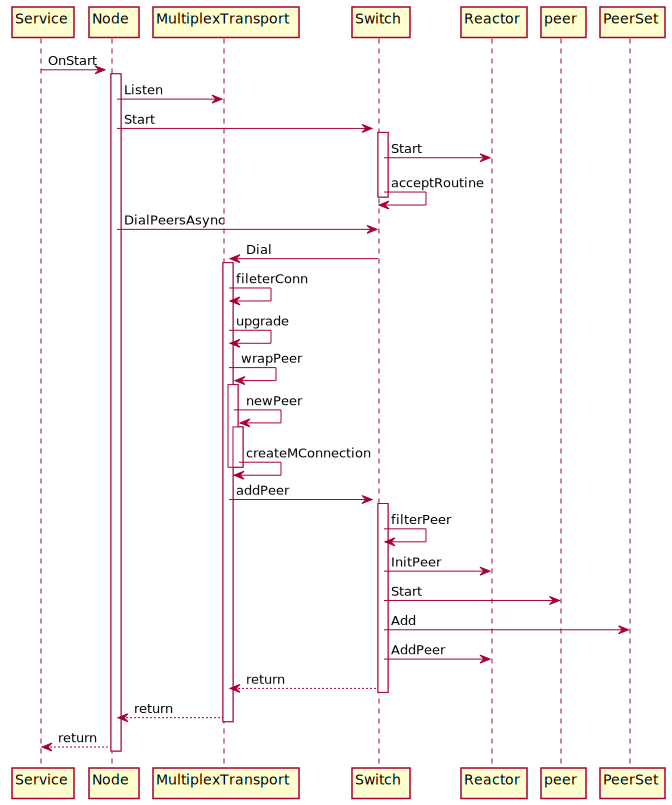
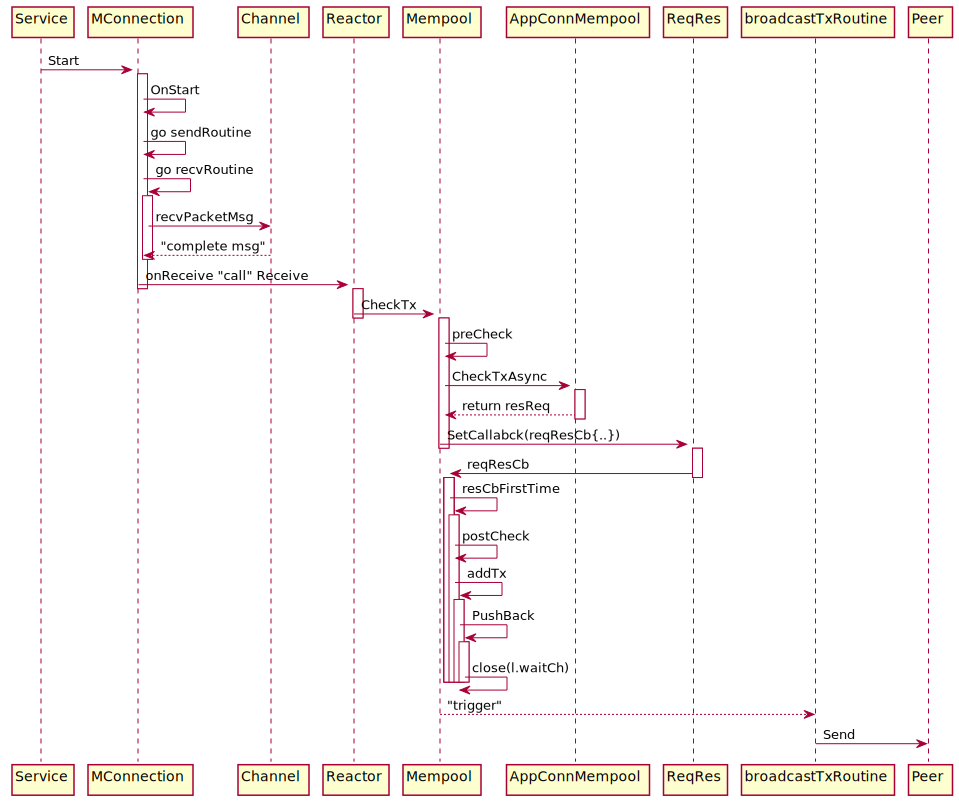

# Tendermint架构设计

longcpp@200519

tendermint@v0.33.3

## 概要介绍

Tendermint项目提供了P2P网络的实现以及Tendermint共识协议,并通过ABCI接口与应用层进行交互,其中Tendermint通过共识组装区块为交易排序, 排好序的交易通过ABCI接口传递给上层应用进行执行, 而执行的结果也是通过ABCI的接口最终写入到区块链中. 从Tendermint项目提供的功能, 可以知道该项目中需要实现基本的网络连接服务, P2P节点发现与维护, P2P网络通信, 接收和传递交易, 接收和传递区块并参与共识协议, 处理RPC请求等等. Tendermint项目将所有的功能都集中到`Node`结构体之中, 也即`Node`结构体是运行一个Tendermint节点的入口点. 

为了在一个项目中支持如此复杂的业务逻辑, 需要对业务逻辑进行抽象,借助Go语言的接口等设计, Tendermint项目利用抽象出来几个基本概念`Service`, `Reactor`, `Switch`以及`MultiplexTransport`等接口和结构体完成了整个项目的架构.

- `Service`服务接口抽象了与服务生命周期相关的接口, 例如服务启动`Start()`, 停止`Stop()`以及重置`Reset()`等. 为了避免一个服务的重复启动或者重复停止, `BaseService`结构体中实现了`Service`接口并通过原子化操作避免重复启动和关闭. 通过扩展`BaseService`结构体, 项目中不同的服务类型可以基于自身业务逻辑实现更多的服务功能.
- `Reactor`反应器接口抽象了处理从P2P网络接收到的消息相关的逻辑接口, 例如添加和删除对等节点`AddPeer()`和`RemovePeer()`接口, 以及从对等节点接收消息的`Receive()`接口. 共识过程等可以据此定制实现服务于自身逻辑的功能. 为了处理一个消息, 可能需要不同的反应器相互配合来完成处理逻辑, 反应器之间通过`Switch`结构体可以进行交互. 与`BaseServie`的初衷一样, `BaseReactor`为不同的反应器实现提供了起点. `BaseReactor`中包含两个字段,其中`BaseService`来管理反应器服务的启动和终止,而`Switch`结构则让不同反应器之间相互配合成为可能. 通过`Reactor`容易定制化一个节点具体启动的服务, 例如验证者节点和普通全节点需要运行的服务不同.
- `Switch` 转换器结构体是一个全局转换器. 如果说`Node`结构体是整个节点的入口点, 那么`Switch`则负责管理`Node`中所有跟共识逻辑相关的数据和逻辑, 具体来说包括P2P对等节点的发现, 对等节点之间的通信, tendemermint共识过程, 交易和区块的接受, 处理与转发. 所有功能的实现都依赖节点内部模块的通信以及对等节点之间的通信. `Switch`中持有各个功能模块的反应器, 而各个模块的反应器中都有字段指向这个全局的转换器, 由此两个反应器之间通过`Swtich`可以查找到对方并进行通信. P2P网络通信方面, `Switch`利用`pex` 模块进行节点发现并记录在`AddressBook`中, 利用`MultiplexTransport`建立并管理与对等节点之间所有的物理网络连接.
- `MultiplexTransport`多路复用传输结构体负责建立并维护对等节点之间的网络通信. Tendermint项目通过`MConnection`结构体封装了普通的TCP连接以达到对一条TCP连接的多路复用. 这是因为两个P2P之间需要不定时交换多种信息, 例如区块传播, 交易传播或者投票信息传播. 基于此Tendermint项目进一步实现了`Channel`的概念, 一个`MConnection`对应一个物理网络连接, 而一个`MConnection`可以由多个`Channel`共用. 此外, 这种设计方式还可以避免TCP连接的慢启动(Slow Start)导致的网络传输效率问题. 另外,  与Bitcoin, Ethereum等网络不通, Tendermint网络中的对等节点之间的通信通过Station-to-Station协议进行密钥交换并利用AEAD对称加密算法对所有通信进行加密. 


建立P2P网络连接之前, 首先要进行P2P对等节点发现,这是通过`pex`模块来完成的, `pex`是 peer exchange的缩写, 意为节点信息交换. 通过`pex`模块反应器`pex.Reactor`的发现节点信息保存在`AddressBook`中. 与网络上位未知的节点节点通信时, 总需要考虑安全问题. 另一方面不同的节点的网络通信情况等也各不相同, 作为一个节点希望连接到网络状况良好的节点. 基于这些考虑, Tendermint实现了相应的逻辑来帮助管理对等节点, 此处我们不再深入相关主题. 

基于`MultiplexTransport`提供的P2P网络通信能力, 可以构建Tendermint共识相关的逻辑. 共识的目的是就当前状态和接下来的交易顺序达成一致, 而区块链网络中所有的交易都包含在区块中. 另外, 当新设立一个节点时, 该节点为了获得最新的区块状态需要从P2P网络获得所有的历史区块并在本地构建区块链状态(todo state-sync). Tendermint项目用`BlockChainReactor`来实现区块处理相关的逻辑, 其中`BlockPool`用于节点追块时存储接收到区块, 而这些区块是通过`bpRequester`请求得到的. 交易接受方面通过`mempool.Reactor`来接收从P2P网络收到的交易信息, 接收到的交易则利用结构体`CListMempool`管理, 其核心成员为存储合法交易的并发单链表(Concurrent linked-list of good txs). 另外BFT类型的共识协议, 如Tendermint协议都需要考虑活跃验证者节点作恶可能性, 常用的方式是引入举报-惩罚机制. 网络中的任意节点都可以就自己发现的某个节点的恶意行为进行举报, 如果举报信息属实则会对相应的验证者进行乘法. 举报信息也是通过交易形式提交到网络上的, Tendermint项目中为举证引入了`evidence.Reactor`用来实现举证相关的逻辑处理. 接收到的交易打包成区块之外, 全网会对该区块的合法性达成共识, Tendermint共识协议的相应逻辑由`consensus.Reactor`反应器实现, Tendermint共识需要超时机制的辅助来保持网络活性, 因此引入了`timeoutTicker`结构体来在超时发生时触发相应的动作. 

上图中总结了Tendermint基于前述的基本接口和结构体的整体设计. 除了前述的基本接口和结构体设计之外, 反应器的实现本身可能需要额外的数据结构辅助, 也在下图中展示.  基于`Service`服务接口, `Reactor`反应器接口, `Switch` 全局转换器结构体和`MultiplexTransport`多路复用传输结构体这几个基本设计, Tendermint构建了完整的P2P网络通信功能以及Tendermint共识协议功能. 至此, 对Tendermint的整体设计(非ABCI接口相关的部分)做了非常概要介绍, 接下来详细介绍几处重点实现. 

一个节点入口点是`Node`结构体, 本小节详细探究下`Node`结构体中各个字段的含义,在了解全貌的基础上, 加深对`Node`结构体的理解. 首先给出`Node`结构体的定义, 其中包含了10多个字段. 部分字段有相应的注释, 接下来我们解析其中的主要字段, 配合上面的图可以理解一个节点运行的内部机制, 也详细介绍重要的接口设计和结构体定义. 

```go
// tendermint/node/node.go 169-203
// Node is the highest level interface to a full Tendermint node.
// It includes all configuration information and running services.
type Node struct {
	service.BaseService

	// config
	config        *cfg.Config
	genesisDoc    *types.GenesisDoc   // initial validator set
	privValidator types.PrivValidator // local node's validator key

	// network
	transport   *p2p.MultiplexTransport
	sw          *p2p.Switch  // p2p connections
	addrBook    pex.AddrBook // known peers
	nodeInfo    p2p.NodeInfo
	nodeKey     *p2p.NodeKey // our node privkey
	isListening bool

	// services
	eventBus         *types.EventBus // pub/sub for services
	stateDB          dbm.DB
	blockStore       *store.BlockStore // store the blockchain to disk
	bcReactor        p2p.Reactor       // for fast-syncing
	mempoolReactor   *mempl.Reactor    // for gossipping transactions
	mempool          mempl.Mempool
	consensusState   *cs.State      // latest consensus state
	consensusReactor *cs.Reactor    // for participating in the consensus
	pexReactor       *pex.Reactor   // for exchanging peer addresses
	evidencePool     *evidence.Pool // tracking evidence
	proxyApp         proxy.AppConns // connection to the application
	rpcListeners     []net.Listener // rpc servers
	txIndexer        txindex.TxIndexer
	indexerService   *txindex.IndexerService
	prometheusSrv    *http.Server
}
```

## 作为服务的`Node`

 `Node`本身的行为也是一种服务, 因此`Node`扩展了`servcie.BaseService`. `service.BaseService`是实现了`Service`接口的结构体, `Service`是Tendermint项目中比较基础的概念, 因为项目中包含的很多功能都被抽象为一个`Service`, 如实现区块接收逻辑的`BlockPool`, 实现交易接收逻辑的`Mempool`, 处理网络连接的`MConnection`. `Service`中抽象了关于服务的常见接口, 例如启动`Start()`, 结束`Stop()`, 重置`Reset()`以及设置日志记录者`SetLogger(log.Logger)`等接口, 参见`Service`接口的定义.

```go
// tendermint/libs/service/service.go 23-53
// Service defines a service that can be started, stopped, and reset.
type Service interface {
	// Start the service.
	// If it's already started or stopped, will return an error.
	// If OnStart() returns an error, it's returned by Start()
	Start() error
	OnStart() error

	// Stop the service.
	// If it's already stopped, will return an error.
	// OnStop must never error.
	Stop() error
	OnStop()

	// Reset the service.
	// Panics by default - must be overwritten to enable reset.
	Reset() error
	OnReset() error

	// Return true if the service is running
	IsRunning() bool

	// Quit returns a channel, which is closed once service is stopped.
	Quit() <-chan struct{}

	// String representation of the service
	String() string

	// SetLogger sets a logger.
	SetLogger(log.Logger)
}
```

`Service`接口中的方法在基本的服务启动, 停止, 重置, 查询等操作之外, 还额外提供了`OnStart()`, `OnStop()`和`OnReset()`方法. 这几个方法允许具体实现`Service`接口的数据结构启动, 停止和重置时实现定制化的逻辑. 这些定制化的逻辑如果存在, 会通过`Start`, `Stop`和`Reset`方法进行调用. `Start`, `Stop`和`Reset`方法对`OnStart()`, `OnStop()`和`OnReset()`方法的调用提供了一定的保证, 而后者也需要遵循一定的规则.

- `OnStart()`允许返回错误信息, 并且该错误信息会由`Start()`传递给更上层调用者
- `OnStop()`不允许返回返回错误信息
- `OnReset()`允许返回错误信息, `BaseService`的实现中,`OnReset()`会直接`panic`.

`BaserService`结构体提供了`Service`接口的基础实现, Tendermint项目中所有的服务类型均是通过扩展`BaseService`来实现. `BaseService`结构体中的重要成员是原子型的整数`started`和`stopped`, 这两个成员用于确保一个服务不会多次启动/停止. 

```go
// tendermint/libs/service/service.go 97-106
type BaseService struct {
	Logger  log.Logger
	name    string
	started uint32 // atomic
	stopped uint32 // atomic
	quit    chan struct{}

	// The "subclass" of BaseService
	impl Service
}
```

`BaseService`的实现中确保在不发生错误的情况下, `Start()`方法中仅调用一次`OnStart()`, 而`Stop()`中仅调用一次`OnStop()`, 并且默认的`OnStart()`和`OnStop()`实现内部不做任何事情. 而默认的`OnReset()`方法实现则直接`panic`, 因此通过扩展`BaseService`实现的服务中为了能够调用`Reset()`方法, 一定要重新实现`OnReset()`方法. 为了帮助理解, 仅展示`BaseService`的`Reset`方法和`OnReset()`方法的实现, 其中可以发现对`stopped`成员的原子操作以及对`OnReset()`的调用.

```go
// tendermint/libs/service/service.go 180-198
// Reset implements Service by calling OnReset callback (if defined). An error
// will be returned if the service is running.
func (bs *BaseService) Reset() error {
	if !atomic.CompareAndSwapUint32(&bs.stopped, 1, 0) {
		bs.Logger.Debug(fmt.Sprintf("Can't reset %v. Not stopped", bs.name), "impl", bs.impl)
		return fmt.Errorf("can't reset running %s", bs.name)
	}

	// whether or not we've started, we can reset
	atomic.CompareAndSwapUint32(&bs.started, 1, 0)

	bs.quit = make(chan struct{})
	return bs.impl.OnReset()
}

// OnReset implements Service by panicking.
func (bs *BaseService) OnReset() error {
	panic("The service cannot be reset")
}
```

##可配置的`Node`

可以通过配置信息定制节点运行处理各种逻辑时的行为, `Node`结构体的第二个成员`config`包含了所有的可配置参数. 其中`BaseConfig`包含了链ID`chainID`, 本地存储链数据的文件夹`RootDir`, ABCI应用的TCP或者Unix Socket地址等参数. `Config`结构体中其余的字段分别用来自配置不同的功能模块, 如P2P网络相关的配置`P2P`, 共识相关的配置`Consensus`层, 此处不再敖述. 

```go
// tendermint/config/config.go 59-72
// Config defines the top level configuration for a Tendermint node
type Config struct {
	// Top level options use an anonymous struct
	BaseConfig `mapstructure:",squash"`

	// Options for services
	RPC             *RPCConfig             `mapstructure:"rpc"`
	P2P             *P2PConfig             `mapstructure:"p2p"`
	Mempool         *MempoolConfig         `mapstructure:"mempool"`
	FastSync        *FastSyncConfig        `mapstructure:"fastsync"`
	Consensus       *ConsensusConfig       `mapstructure:"consensus"`
	TxIndex         *TxIndexConfig         `mapstructure:"tx_index"`
	Instrumentation *InstrumentationConfig `mapstructure:"instrumentation"`
}
```

之前提到, Tendermint共识需要一组验证者集合, 在网络运行时可以通过PoS机制根据节点质押的代币数量进行排序选择活跃验证者结合, 但是在链刚启动的时候, 如何确定初始的验证者集合? 这就是`Node`的第3个成员`genesisDoc`的作用, 通过该字段可以链的开始时间`GenesisTime`, 共识参数`ConsensusParams`, 初始的验证者集合`Validators`, 初始的应用层状态`AppState`和相对应的哈希值`AppHash`.

```go
// tendermint/types/genesis.go 37-45
// GenesisDoc defines the initial conditions for a tendermint blockchain, in particular its validator set.
type GenesisDoc struct {
	GenesisTime     time.Time          `json:"genesis_time"`
	ChainID         string             `json:"chain_id"`
	ConsensusParams *ConsensusParams   `json:"consensus_params,omitempty"`
	Validators      []GenesisValidator `json:"validators,omitempty"`
	AppHash         tmbytes.HexBytes   `json:"app_hash"`
	AppState        json.RawMessage    `json:"app_state,omitempty"`
}
```

接下来作为验证者节点, 需要参与Tendermint共识过程并进行投票. 在Tendermint共识中, 投票其实就是对区块或者`nil`值进行数字签名的过程. 数字签名需要指定对应的签名私钥, `Node`中的第4个成员`privValidator`是一个接口成员, 抽象了关于验证者投票的方法. 签名私钥的具体存放位置通过`config.BaseConfig.PrivValidatorKey`进行指定, 利用从这个位置读取的私钥可以实现`PrivValidator`接口. 通过`PrivValidator`接口, Tendermint项目可以方便的支持签名/投票过程与Tendermint节点的分隔, 通过这种方式, 节点运营者可以将投票的私钥存放在安全性更高的服务器上.

```go
// tendermint/types/priv_validator.go 12-20
// PrivValidator defines the functionality of a local Tendermint validator
// that signs votes and proposals, and never double signs.
type PrivValidator interface {
	// TODO: Extend the interface to return errors too. Issue: https://github.com/tendermint/tendermint/issues/3602
	GetPubKey() crypto.PubKey

	SignVote(chainID string, vote *Vote) error
	SignProposal(chainID string, proposal *Proposal) error
}
```

##作为对等节点的`Node`

通过`service.BaseService`, `Node`具备了服务的基本功能,可以启动, 终止, 重置等. 利用配置信息, `Node`则拥有了可遵循的参数以及初始状态. 利用这些信息可以启动`Node`, 启动后的`Node`表现为P2P网络中的一个对等节点, 为了真正参与网络需要进行P2P节点发现, 与对等网络建立连接等. 本小节介绍`Node`结构体中与P2P网络通信相关的成员. 

前面已经提到过, Tendermint的P2P网络中的通信是加密通信, 意味着每个节点都需要代表自己的身份的公私钥对来与另外的节点的进行密钥协商并根据写上结果派生出真正用于加密网络通信流量的对称加密算法的私钥. 注意这与之前提到的验证者节点参与共识协议用来进行投票的私钥不是同一个, 为了区分期间, 参与共识的称为投票私钥, 而用于P2P网络加密通信的私钥称为通信私钥. `Node`中的 `nodeKey *p2p.NodeKey`用来存储当前节点的通信私钥, 可以看到`p2p.NodeKey`是一个保存了私钥的结构体, 这是因为该通信私钥就应该位于本机, 也就无需像投票私钥一样需要将具体的签名过程隐藏在一个统一的接口背后. 

```go
// tendermint/p2p/key.go
// NodeKey is the persistent peer key.
// It contains the nodes private key for authentication.
type NodeKey struct {
	PrivKey crypto.PrivKey `json:"priv_key"` // our priv key
}
```

每个`Node`有了公私钥之后, 在P2P网络中也有了唯一的身份ID, `Node`结构体中的`nodeInfo p2p.NodeInfo`抽象了关于节点的基本信息, 其中`ID()`方法返回节点的身份ID: 十六进制编码的地址, 而该地址是通过与通信私钥相对应的公钥派生而来. `nodeInfoAddress`接口中的`NetADdress()`方法返回节点的网络IP地址和端口号信息, 而`nodeInfoTransport`接口中可以`Validate()`方法可以对`NodeInfo`进行合法性验证, 而`CompatibleWith()`方法则检查本地节点与网络上一个节点之间的兼容性, 只有共享相同的`chainID`以及相同的`ProtocolVersion`两个节点之间才可以进行P2P网络通信. 

```go
// tendermint/p2p/node_info.go 24-41
// NodeInfo exposes basic info of a node
// and determines if we're compatible.
type NodeInfo interface {
	ID() ID
	nodeInfoAddress
	nodeInfoTransport
}

type nodeInfoAddress interface {
	NetAddress() (*NetAddress, error)
}

// nodeInfoTransport validates a nodeInfo and checks
// our compatibility with it. It's for use in the handshake.
type nodeInfoTransport interface {
	Validate() error
	CompatibleWith(other NodeInfo) error
}

// tendermint/p2p/key.go 31-34
// ID returns the peer's canonical ID - the hash of its public key.
func (nodeKey *NodeKey) ID() ID {
	return PubKeyToID(nodeKey.PubKey())
}
```

通过`pex`模块发现的P2P网络节点存储在`addrBook pex.AddrBook`中, 这是一个接口类型, `pex.addrBook`具体实现了该接口. 此处我们不再深入介绍该模块, 因为具体的节点发现是比较独立的功能, 与Tendermint项目本身的架构不存在耦合. 接下来`IsListening`布尔值则标记了当前节点是否处于监听状态, 处于该状态意味着可以接受其他节点的连接请求. 根据之前的叙述可以知道 `transport *p2p.MultiplexTransport`中管理了所有的物理网络连接, 而`sw  *p2p.Switch`则利用`transport`和`addrBook`管理与所有P2P节点的之间的连接. 也即`sw`通过`pex`模块发现的P2P网络节点`addrBook`通过`transport`进行实际的通信. `Switch`, `MultiplexTransport`, `PeerSet`以及`BaseReactor`等结构体之间的关系在下图中展示. 


连接建立之后, 就需要具体处理从P2P网络接收到的各种信息. 如前所述, 具体的消息处理是通过各个业务模块的反应器进行的, 也因此, `Switch`结构体中也需要持有处理各种逻辑的反应器`reactors map[string]Reactor`, 以便将接收到消息路由给适当的反应器做进一步处理.

`Switch`通过`transpor Transport`接口调用`MultiplexTransport`完成具体的网络连接建立. `MultiplexTransport`结构体实现了接口`Transport`和`transportLifecycle`. `Transport`接口抽象了主动与远端P2P节点建立连接的方法`Dial()`,  而接口 `transportLifecycle`中的`Listen()`方法抽象了接受远端节点的连接请求的过程.

`MultiplexTransport`结构体通过成员`conns ConnSet`负责记录并维护节点所有的P2P连接, 并且本地节点与一个远端P2P节点之间仅存在一条TCP连接`net.Conn`. Tendermint项目中在`net.Conn`的基础上实现了多路复用的连接`MConnection`.  多路复用意味着两个P2P节点之间不同模块所需要传递的消息均通过这一条网络连接传输. 要理解多路复用的作用, 首先需要了解下P2P网络节点在Tendermint项目中的抽象.

 `Peer`接口抽象了一个P2P网络上的节点所应具备的功能, 例如获取实际网络地址的方法`SocketAddr()`和用于发送消息的`Send()`方法. 结构体`peer`实现了`Peer`接口并且扩展了结构体`peerConn`. `peerConn`中包含了原始的TCP连接以及配置信息. `peer`扩展了`peerConn`并且包含了基于`peerConn`中的TCP连接构造而来的多路复用的TCP连接`mconn *tmconn.MConnection`.  多路复用的TCP连接是指将一个真实的TCP连接划分成多个`Channel`, 多个`Channel`共用底层的同一个TCP连接. 节点中的每一个反应器`Reactor`通过一个`Channel`进行与P2P网络中的另一个节点进行消息交换.`MConnection`主要用来处理多路复用的网络连接, 达到多个逻辑信道共用一个信道进行消息传输的效果. P2P网络中两个节点之间仅有一个`MConnection`用来处理两个节点之间所有的消息交换. `MConnection`结构体中维护着从`channelId`到`channel`的映射. 当`MConnection`收到`packetMsg`时，会根据消息`channelId`选择相应的`channel`接受该消息. 又因为`channel`对应到一个特定的`Reactor`，通过`MConnection`的`onReceive`方法, 可以出发特定`Reactor`的`Receive()`方法来进一步处理该消息. `Transport`, `Swtich`, `Reactor`, `Peer`, `MConnection`等接口和结构体之间的关系在下图中展示.


如前所述, `Node`结构体扩展了`BaseService`, 意味着可以通过定制化`OnStart`方法的实现来启动节点. 接下来我们考察当通过`BaseService`调用`Node`的`OnStart()`方法时所触发的一系列动作, 借此了解`Node`, `Transport`, `Swtich`, `Reactor`, `Peer`以及`PeerSet`如何相互协作完成节点启动与P2P网络连接建立. 其中涉及到的主要函数和方法调用在下图中展示. 

接下来介绍主要的执行逻辑. `Service`的`Start()`方法会调用`OnStart()`方法, `Node`中有`OnStart()`的定制化实现:

1. 根据P2P网络的配置信息,指示`MultiplexTransport` 通过`Listen`启动本地网络端口的监听

2. 启动`Switch`服务, `Switch`的`OnStart()`中启动所有`Reactor`的服务, 并启动`acceptRoutine`以处理连接请求

3. 指示`Switch`通过`DialPeersAsync`与配置文件中给出的P2P节点建立连接

4. `Switch`通过`MultiplexTransport`的`Dial`方法完成具体网络连接建立

5. `Dial`根据提供的网络地址`NetAddress`以及`peerConfig`与远端P2P节点建立TCP连接`conn`

6. `Dial`内部利用`filterconn`对返回的`conn`进行去重并将新的`conn`添加到`MultiplexTransport`的`ConnSet`中

7. 节点之间通信需加密, `upgrade`方法在`conn`上进行密钥协商握手并返回`secretConn`

8. 利用`upgrade`方法返回的`secretConn`以及其他信息通过`wrapPeer`实例化远端P2P节点

9. `wrapPeer`内部通过辅助函数`newPeer`创建新的实例`peer`,其扩展的`peerConn`中持有`secretConn`.

10. 辅助函数`newPeer`内部利用`createMConnection`在`secretConn`基础上构建多路复用连接并保存在`peer`中

11. 至此`Dial`方法完成并返回新的`peer`实例, 接下来通过`addPeer`只是`Swich`在`PeerSet`中添加新的`peer`实例

12. `Switch`用`filterPeer`确保`PeerSet`中的节点不重复

13. 随后`Switch`用该节点对所有的`Reactor`执行`InitPeer`操作, 反应器可以趁此给该节点实例初始化状态

14. 随后`Start()`方法启动该P2P节点服务, `peer`的`OnStart()`方法内部启动`MConnection`服务, `MConnection`的`OnStart()`方法会启动`sendRoutine()`和`recvRoutine`两个goroutine以发送和接收P2P网络消息

15. P2P节点服务成功启动之后, `Swtich`指示`PeerSet`通过方法`Add()`在其集合中添加该P2P节点实例

16. `addPeer`的最后, `Switch`为指示所有的`Reactor`通过`AddPeer`方法为该P2P节点实例启动go routine以处理收到的消息

    




尚未讨论的是, Tendermint项目为和要在普通的网络连接之上不厌其烦的构建多路复用连接`MConnection`. 其中一个原因是这种方式可以减少网络Socket连接的消耗. 一个节点中通常会运行着多个反应器, 而每个反应器均需要与P2P网络中的其他节点进行通信. 假设一个节点中运行着5个不同的反应器, 而每个反应器均需要与10个其他节点建立连接. 如果让反应器自身管理网络连接, 则该节点需要建立50个不同的网络Socket连接. 利用`MConnection`提供的多路复用连接, 该节点仅需要与10个节点分别建立一个网络连接即可, 通过这种方式, 不同的`Reactor`可以复用这10个网络连接, 而根据`Channel`的概念, 容易将一条网络连接上的数据包做区分. 另外一个原因则与TCP连接本身有关系. P2P层的消息交换, 主要包括交易广播, 区块广播以及共识信息等. 我们希望这些所有种类的信息都能够尽快的在整个P2P网络中广播. 然而TCP连接本身作为同样的可靠传输层, 引入了诸多机制来控制TCP连接的数据发送速率以及可靠性, 其中包括窗口大小以及慢启动等. 窗口大小在TCP的整个生命周期中会不断调整, 从而影响TCP的传输速率, 这也是TCP的慢启动过程存在的部分原因. 刚才已经提到, 考虑到P2P网络层消息传递的种类, 我们希望P2P层所有的消息传递都能够尽快完成, 尽量不被TCP自身的特性所限制. `MConnection`对TCP连接进行了包装,在通过`Channel`的概念提供基本的多路复用功能之外, 还针对TCP本身的特性引入了各种辅助机制, 通过在适当的时候发送适当的数据包维持较大的TCP连接的窗口大小, 今儿能够提升P2P网络的消息传播速度.


关于`Node`服务的`OnStart`方法的介绍中,略去了很多琐碎的细节, 仅保留了我们认为的主干流程, 对照时序图, 类图关系以及文字描述可以看到`Node`, `Transport`, `Swtich`, `Reactor`, `Peer`之间的相互协作. `Node`的`OnStart`方法结束之后, `Switch`控制的`PeerSet`不断接受P2P网络消息并触发相应的`Reactor`处理消息. 而本地节点中的`Reactor`也可以借助`PeerSet`向别的对等节点发送消息. 值得注意的是, 在`Node`启动时, 仅与配置文件中指定的P2P节点建立连接, 随后P2P等节点的发现和管理是通过`pex`模块进行的, 此处不再介绍.

## `Node`中的`Reactor`简介

在`Node`的启动中,提及到了`Reactor`反应器的存在. Tendermint项目中利用`Reactor`来根据收到的消息触发相应的调用. `Reactor`接口的定义如下. `Node`的启动流程中, `peer`启动服务前后, `Switch`会指示`Reactor`对`peer`调用`InitPeer`和`AddPeer`操作.  其中`InitPeer`会在`Reactor`内为该`peer`分配状态, 而`AddPeer()`则在`Reactor`内部为`peer`启动了消息处理的goroutine. 同一个节点内部的不同反应器可能需要相互协作才能完整处理一个消息, 不同的`Reactor`通过在`Switch`结构实现相互调用, 而方法`SetSwitch()`可以为`Reactor`设置`Switch`. `Reactor`通过`Channel`与P2P网络交互, 而一个`Reactor`可能需要处理来自多个对等节点的消息, `GetChannels()`方法返回一个`Reactor`中所有的`Channel`的信息. `Reactor`消息处理逻辑的入口点是`Receive()`方法, 在典型的`Receive`方法实现中会根据接收到的消息类型触发对应的处理逻辑. 

```go
// tendermint/p2p/base_reactor.go 8-48
// Reactor is responsible for handling incoming messages on one or more
// Channel. Switch calls GetChannels when reactor is added to it. When a new
// peer joins our node, InitPeer and AddPeer are called. RemovePeer is called
// when the peer is stopped. Receive is called when a message is received on a
// channel associated with this reactor.
//
// Peer#Send or Peer#TrySend should be used to send the message to a peer.
type Reactor interface {
   service.Service // Start, Stop

   // SetSwitch allows setting a switch.
   SetSwitch(*Switch)

   // GetChannels returns the list of MConnection.ChannelDescriptor. Make sure
   // that each ID is unique across all the reactors added to the switch.
   GetChannels() []*conn.ChannelDescriptor

   // InitPeer is called by the switch before the peer is started. Use it to
   // initialize data for the peer (e.g. peer state).
   //
   // NOTE: The switch won't call AddPeer nor RemovePeer if it fails to start
   // the peer. Do not store any data associated with the peer in the reactor
   // itself unless you don't want to have a state, which is never cleaned up.
   InitPeer(peer Peer) Peer

   // AddPeer is called by the switch after the peer is added and successfully
   // started. Use it to start goroutines communicating with the peer.
   AddPeer(peer Peer)

   // RemovePeer is called by the switch when the peer is stopped (due to error
   // or other reason).
   RemovePeer(peer Peer, reason interface{})

   // Receive is called by the switch when msgBytes is received from the peer.
   //
   // NOTE reactor can not keep msgBytes around after Receive completes without
   // copying.
   //
   // CONTRACT: msgBytes are not nil.
   Receive(chID byte, peer Peer, msgBytes []byte)
}
```

Tendermint项目在`Reactor`接口中实现了`pex.Reactor`, `mempool.Reactor`, `evidence.Reactor`, `consensus.Reactor`以及`BlockchainReactor`. 其中`pex.Reactor`用于P2P网络的节点发现与管理, 此处不再介绍. 另外的4个反应器分别处理交易, 举证, 共识以及区块消息. 为了方便阅读, 再次引入Tendermint底层的架构设计图.


上图中可以看到, 为了实现`mempool.Reactor`, `evidence.Reactor`, `consensus.Reactor`以及`BlockchainReactor`, 在对应的模块中分别引入了额外的数据结构. 为了支持交易的处理, 为`mempool.Reactor`引入了`mempool.CListMempool`用一个并发单链表作为交易的存储池, 为`evidence.Reactor`引入了`evidence.Pool`存储所有合法的举证, 为`consensus.Reactor`引入了`consensus.State`来记录共识过程的状态, 为`BlockchainReactor`引入了`BlockPool`作为区块的存储池和`bpRequester`用于请求区块. 

##`Node`的`mempool.Reactor`

为增进对Tendermint架构的理解, 我们深入到`mempool.Reactor`的实现,以了解`Reactor`的具体实现逻辑. `mempool.Reactor`处理P2P网络的交易接收与发送, 所有的读写均通过`peer`持有的`MConnection`多路复用连接进行. 具体来说, `mempool.Reactor`通过`MempoolChannel`处理消息`TxMessage`. `mempool.Reactor`的具体定义如下. 其中`CListeMempool`是一个有序存储交易的交易池, 具体采用的数据结构为支持并发的双向链表, 此处不再深入介绍该数据结构.  `Node`结构体中与`mempool.Reactor`相关的字段为的`mempoolReactor *mempl.Reactor` 和`mempool mempl.Mempool`.

```go
// tendermint/mempool/reactor.go 33-41
// Reactor handles mempool tx broadcasting amongst peers.
// It maintains a map from peer ID to counter, to prevent gossiping txs to the
// peers you received it from.
type Reactor struct {
	p2p.BaseReactor
	config  *cfg.MempoolConfig
	mempool *CListMempool
	ids     *mempoolIDs
}
```

`mempool.Reactor`实现了`Reactor`接口, 为了加深对`Reactor`接口的理解, 此处介绍下`mempool.Reactor`中的`InitPeer()`和`AddPeer()`方法的实现. `InitPeer()` 方法在`peer`启动服务之前由`Switch`调用, `mempool.Reactor`的`InitPeer()`方法中为输入的`peer`分配ID. `AddPeer()`方法在`peer`启动服务之后由`Switch`调用, `mempool.Reactor`的`AddPeer()`方法为输入的`peer`启动goroutine `broadcastTxRoutine`用来在后续的操作中确保交易能够广播到`peer`节点.

```go
// tendermint/mempool/reactor.go 117-121
// InitPeer implements Reactor by creating a state for the peer.
func (memR *Reactor) InitPeer(peer p2p.Peer) p2p.Peer {
	memR.ids.ReserveForPeer(peer)
	return peer
}

// tendermint/mempool/reactor.go 148-152
// AddPeer implements Reactor.
// It starts a broadcast routine ensuring all txs are forwarded to the given peer.
func (memR *Reactor) AddPeer(peer p2p.Peer) {
	go memR.broadcastTxRoutine(peer)
}
```

`Receive()`方法为`Reactor`处理逻辑的入口点. 完整的过程是当`mempool.Reactor`所依赖的`MConnection`收到`packetMsg`时，会根据`packetMsg`中的`ChannelID`字段将调用对应的`Channel`的`recvPacketMsg()`方法. 

会根据消息`channelId`选择相应的`channel`接受该消息. 又因为`channel`对应到一个特定的`Reactor`，通过`MConnection`的`onReceive`方法, 可以触发特定`Reactor`的`Receive()`方法来进一步处理该消息. `Transport`, `Swtich`, `Reactor`, `Peer`, `MConnection`等接口和结构体之间的关系在下图中展示.

. `mempool.Reactor`仅关心从P2P网络收到的交易`TxMessage`. 并不是所有从P2P网络接收到的交易都会存入交易池中, 交易池中仅存储所有通过了检查的交易. 有3种检查, 一种是通过ABCI接口`CheckTx()`让上层应用检查交易的合法性, 另外两个检查则是`Mempool`接口自带的`preCheck`和`postCheck`. 这2次检查是在`CheckTx`之前和之后的可选检查, 没有通过检查的交易不会进入交易池. `preCheck` 可以用来检查交易的字节数没有超过允许的最大值,  `postCheck`则可以用来检查一笔交易所需的gas费没有超过允许的最大值. 不再深入介绍这部分内容, 在``mempool.Reactor`的`Receive()`实现中, 交易解码之后利用`CheckTx`进行检查. 

```go
// tendermint/mempool/reactor.go 162-185
// Receive implements Reactor.
// It adds any received transactions to the mempool.
func (memR *Reactor) Receive(chID byte, src p2p.Peer, msgBytes []byte) {
	msg, err := memR.decodeMsg(msgBytes)
	if err != nil {
		memR.Logger.Error("Error decoding message", "src", src, "chId", chID, "msg", msg, "err", err, "bytes", msgBytes)
		memR.Switch.StopPeerForError(src, err)
		return
	}
	memR.Logger.Debug("Receive", "src", src, "chId", chID, "msg", msg)

	switch msg := msg.(type) {
	case *TxMessage:
		txInfo := TxInfo{SenderID: memR.ids.GetForPeer(src)}
		if src != nil {
			txInfo.SenderP2PID = src.ID()
		}
		err := memR.mempool.CheckTx(msg.Tx, nil, txInfo)
		if err != nil {
			memR.Logger.Info("Could not check tx", "tx", txID(msg.Tx), "err", err)
		}
		// broadcasting happens from go routines per peer
	default:
		memR.Logger.Error(fmt.Sprintf("Unknown message type %v", reflect.TypeOf(msg)))
	}
}
```

当节点收到一个交易并且交易合法的时候, 应该将该交易放到交易池中并且向P2P网络广播这笔交易, 前面已经提到, goroutine`broadcastTxRoutine`用来向P2P网络广播交易. 但是在该`Receive()`方法的实现中似乎看不到对交易池的改动也看不到交易广播的操作, 但是代码中的注释又额外说明了用goroutine完成具体的广播操作. 

对交易池的修改和对goroutine `broadcastTxRoutine`的触发实际上都是在`CheckTx()`的回调函数完成的, 下面的时序图中展示了完整的过程,包含了刚才提到的对交易的两次额外的检查, 向交易池中添加交易`addTx()`以及向P2P网络广播这笔交易`Send`.  接下来我们介绍从`MConnection`服务启动开始的整个流程. `CheckTx()`是Tendermint的ABCI接口中的方法, 这里不深入讨论ABCI, 仅讨论`Service`和`Reactor`之间如何相互配合完成对网络接收到的交易的处理流程, 以加深对Tendermint架构的理解. 

1. `MConnection`的`OnStart`方法会启动`sendRoutine`和`recvRoutine`两个go routine, 分别用来发送和接收消息
2. `recvRoutine`收到数据包并解析之后,根据数据包中`ChannelID`调用对应`Channel`的`recvPacketMsg`进行消息组装(一个完整的P2P网络消息可能分成多个网络数据包到达)
3. 当收到完整的P2P网络消息之后`recvPacketMsg`返回完整的消息, `recvRoutine`接下来调用`MConnection`的`onReceive()`方法处理该消息, `onReceive()`的输入有`ChannelID`以及完整的消息, 由此可以调用合适的`Reactor`来处理该消息
4. `MConnection`的`onReceive()`方法与`mempool.Reactor`的`Receive()`方法的绑定是在创建`MConnection`的时候绑定的, 参见后文关于`createMConnection()`的描述
5. ``MConnection`的`onReceive()`的方法调用`mempool.Reactor`的`Receive()`来执行交易检查, 广播和向交易池中添加交易的过程. `Receive()`方法中针对收到的交易信息调用`CheckTx()`方法
6. `CheckTx()`内部首先对交易进行检查`preCheck()`并通过`AppConnMempool`的`CheckTxAsync()`方法让应用层进一步检查交易, 检查结果为`ResReq`类型的`reqres`
7. 接下来调用`SetCallBack()`为检查结果`reqres`设置回到函数`resReqCb()`, `SetCallBack()`内部会执行该回调函数
8. `reqResCb()`内部会调用`resCbFirstTime()`,`resCbFirstTime()`内部用`postCheck()`检查交易, 对于合法的交易调用`addTx()` 方法, `addTx()`内部通过`PushBack()`方法将交易添加到内存池中, 至此合法的交易被放入交易池中
9. `PushBack()`方法除了将交易放入交易池中之外, 还会执行`close(l.waitCh)`操作, 关闭`waitCh chan struct{}`, 而该操作会出发`broadcastTxRoutine`, 该go routine是在`AddPeer()`时启动的并在`l.waitCh`上等待.
10. `broadcastTxRoutine`被处罚之后, 通过`Peer`的`Send()`方法将交易转发给P2P网络上的节点



为了增进理解,尤其是`MConnection`的`onReceive()`方法与`Reactor`的`Receive()`方法之间的联系, 下面的代码片段列出了辅助函数`createMConnection()`的实现. 可以看到在创建`MConnection`时, 会构建函数闭包`nReceive`并将新创建的`MConnection`的`onReceive`字段设置成函数闭包`nReceive`. `nReceive`内部会首先通过`chID`找到合适的`Reactor`, 然后调用`Reactor`的`Receive`处理消息. 由此我们看到了`MConnection`的`onReceive()`方法总是跟适当的`Reactor`的`Receive()`绑定到一起.

```go
// tendermint/p2p/peer.go 365-400
func createMConnection(
	conn net.Conn,
	p *peer,
	reactorsByCh map[byte]Reactor,
	chDescs []*tmconn.ChannelDescriptor,
	onPeerError func(Peer, interface{}),
	config tmconn.MConnConfig,
) *tmconn.MConnection {

	nReceive := func(chID byte, msgBytes []byte) {
		reactor := reactorsByCh[chID]
		if reactor == nil {
			// Note that its ok to panic here as it's caught in the conn._recover,
			// which does onPeerError.
			panic(fmt.Sprintf("Unknown channel %X", chID))
		}
		labels := []string{
			"peer_id", string(p.ID()),
			"chID", fmt.Sprintf("%#x", chID),
		}
		p.metrics.PeerReceiveBytesTotal.With(labels...).Add(float64(len(msgBytes)))
		reactor.Receive(chID, p, msgBytes)
	}

	onError := func(r interface{}) {
		onPeerError(p, r)
	}

	return tmconn.NewMConnectionWithConfig(
		conn,
		chDescs,
		onReceive,
		onError,
		config,
	)
}
```

至此, 联系之前讲过的`Node`的`OnStart()`方法以及及`mempool.Reactor`中对交易消息的处理逻辑, 展示了Tendermint中通过`Service`, `Reactor`, `MultiplexTransport`, `Switch`, `Peer`以及`MConnection`等接口和结构体完成节点如何相互配合, 共同实现了节点的功能: 

- 通过`Service`实现节点内各种服务的启动与停止等功能
- 通过`Peer`抽象了P2P网络节点并通过`MConnection`与P2P网络节点进行通信
- 通过`Reactor`实现对各种消息的处理逻辑
- 通过`Switch`结构将各种组件进行了连接,是各个组件之间相互配合的桥梁

值得注意的是, `evidence.Reactor`, `consensus.Reactor`以及`BlockchainReactor`的基本实现逻辑与`mempool.Reactor`一致, 所不同的仅仅是具体消息的处理逻辑以及需要维护的状态不同. 此处不再深入介绍其余几个`Reactor`的实现, 仅就具体的逻辑实现做概要描述.

##`Node`的`evidence.Reactor`

BFT类共识协议均需要考虑验证者节点作恶的情况, 如前所述, 常用的手段是引入举证和惩罚机制. 网络中的任一节点可以就自己观察到的验证者节点作恶的情况进行举证. 如果举证合法, 则通过经济激励层对作恶节点进行惩罚. 也因此在Tendermint的区块中有专门的字段来存储举证信息. 同样的, 作为P2P网络中的节点, 也需要向对待交易一样, 接收举证并进行广播, 另外也需要主动去发现作恶信息. 具体的逻辑由`evidence.Reactor`实现, 与`mempool.Reactor`一样,也是消息驱动模式的实现. 值得指出的是, 交易通常是由上层应用的用户发出的, 而举证信息是由验证者节点通过参与共识过程发信并自动提交到网络上的. `Node`结构体中与`evidence.Reactor`有关的字段是`evidencePool  *evidence.Pool`.

```go
// tendermint/evidence/reactor.go 25-30
// Reactor handles evpool evidence broadcasting amongst peers.
type Reactor struct {
	p2p.BaseReactor
	evpool   *Pool
	eventBus *types.EventBus
}
```

`evidence.Reactor`通过`EvidenceChannel`处理消息类型`ListMessage`. `ListMessage`定义为举证信息列表:

```go
// tendermint/evidence/reactor.go 241-244
// ListMessage contains a list of evidence.
type ListMessage struct {
	Evidence []types.Evidence
}
```

与`mempool.Reactor`中仅在内存着中存储交易信息不同, `evidence.Reactor`会将收到的证据进行持久化存储, 也即`evpool   *Pool`中会进行持久化存储, 参见在下面列出的`evidence.Pool`结构体的定义. 这是因为对于交易而言, 通过`CheckTx()`方法可以确保重复的交易(又从网络上接收到了已经被包含到区块中的交易)不会被重复处理,但是对于举证信息来讲, 为了防止举证信息的重复处理, 需要将收到的举证信息进行持久化存储, 这点可以从`evidence.Pool`的`AddEvidence()`方法中看到.  

```go
// tendermint/evidence/pool.go 16-30
// Pool maintains a pool of valid evidence
// in an Store.
type Pool struct {
	logger log.Logger

	store        *Store
	evidenceList *clist.CList // concurrent linked-list of evidence

	// needed to load validators to verify evidence
	stateDB dbm.DB

	// latest state
	mtx   sync.Mutex
	state sm.State
}
```

目前Tendermint项目中仅支持双签作恶行为的举证. 双签作恶是指验证者违反共识规则,在同一区块高度对两个不同的区块(`BlockID`不同)都进行了投票. 在参与Tendermint共识过程中, 每个活跃验证者节点都会不断从P2P网络上关于某个区块的投票信息并通过`VoteSet`结构体保存收集到的投票信息集合. `VoteSet`的`AddVote()`方法, 在向该集合中加入新的投票信息时, 如果发现相互冲突的投票信息, 就会构建类型为`DuplicateVoteEvidence`的举证信息. 其中包含两张投票信息,以及这两张投票的投票人: ` PubKey crypto.PubKey`代表了活跃验证者集合中的某个验证者的公钥. 

```go
// tendermint/types/evidences.go 98-104
// DuplicateVoteEvidence contains evidence a validator signed two conflicting
// votes.
type DuplicateVoteEvidence struct {
	PubKey crypto.PubKey
	VoteA  *Vote
	VoteB  *Vote
}
```

值得指出的是, 当`evidence.Reactor`收到举证信息`ListMessage`后, 通过`evidence.Pool`保存举证信息并触发额外的举证消息的P2P网络广播. 前面提到的根据举证信息对作恶节点进行惩罚的逻辑按照功能划分应是由应用层的经济激励层控制的逻辑. 在介绍cosmos-sdk时具体介绍cosmos hub中的惩罚机制设计与实现.

`evidence.Reactor`中还有一个尚未讨论的成员: `eventBus *types.EventBus`. `Node`中也有一个该类型的成员:`eventBus *types.EventBus`.  然而该版本的Tendermint项目中并没有使用`evidence.Reactor`中的`eventBus` (在创建`evidence.Reactor`时该字段并没有被初始化). `consensus.Reactor`中也有该成员并真的有使用,在`consensus.Reactor`小节再介绍`EventBus`.

##`Node`的`BlockchainReactor`

交易和举证信息都是Tendermint区块的组成部分, 接下来讨论用于区块处理的`BlockChainReactor`, 负责区块的接收和广播并通过ABCI接口与上层应用交互来执行区块中的包含的交易等. `BlockchainReactor`并不处理Tendermint共识协议相关的消息, 共识消息的处理由`consensus.Reactor`. `BlockchainReactor`通过`BlockchainChannel`处理`bcBlockRequestMessage`, `bcBlockResponseMessage`, `bcStatusRequestMessage`和`bcStatusResponseMessage`四种消息. `Node`结构体中与`BlockchainReactor`相关的字段为`stateDB dbm.DB`, `blockStore  *store.BlockStore` 和`bcReactor p2p.Reactor`.

```go
// tendermint/blockchain/v0/reactor.go 56-70
// BlockchainReactor handles long-term catchup syncing.
type BlockchainReactor struct {
	p2p.BaseReactor

	// immutable
	initialState sm.State

	blockExec *sm.BlockExecutor
	store     *store.BlockStore
	pool      *BlockPool
	fastSync  bool

	requestsCh <-chan BlockRequest
	errorsCh   <-chan peerError
}
```

当设立新节点或者节点下线之后再上线,首先通过快速同步过程从P2P网络请求历史区块信息,并根据这些历史区块信息以及初始状态`initialState`在本地重构链上状态.字段`fastSync`用来表示当前节点是否处于快速同步阶段. `pool *BlockPool`用于在快速同步阶段追踪P2P网络节点(响应区块请求的节点), 追踪区块请求以及区块响应. `pool *BlockPool`启动时, 会创建一系列go routine来从P2P网络并行请求历史区块. 

```go
// tendermint/blockchain/v0/pool.go 99-105
// OnStart implements service.Service by spawning requesters routine and recording
// pool's start time.
func (pool *BlockPool) OnStart() error {
	go pool.makeRequestersRoutine()
	pool.startTime = time.Now()
	return nil
}
```

在快速同步阶段的区块请求过程中, 会同时监控提供历史区块的节点的状态,通过及时剔除速度过慢的节点等保证快速同步阶段能够尽快完成.快速同步依赖前面提到的4中消息的配合. 

- `bcBlockRequestMessage`: 请求指定高度区块的信息
- `bcBlockResponseMessage`: 请求指定高度区块的信息的响应信息, 内容为对应高度的完整区块
- `bcStatusRequestMessage`: 请求对等节点的最新区块高度的信息
- `bcStatusResponseMessage`:请求对等节点的最新区块高度的信息的响应信息, 内容为节点的最新区块高度 

基于上面的4种消息, 可以获知P2P网络中节点的最新区块高度,并持续请求缺失的区块信息最终实现与网络的同步. 区块快速同步状态的逻辑示意图如下.


从P2P网络请求得到的区块会通过`store  *store.BlockStore`的`SaveBlock()`方法进行持久化存储, 该方法是由`BlockChainReactor`的`poolRoutine()`方法调动的, 并且采用了批量区块写的方式加快区块存储过程. `store.BlockStore`中存储了所有的区块信息, 主要包括:

- 区块元数据`BlockMeta`: 记录区块的`BlockID`, 字节数`BlockSize`,区块头`Header`以及区块中的交易个数`NumTxs`
- 区块分片: Tendermint网络中一个区块是被划分成不同的分片进行网络传播的
- 区块的Commit信息: 活跃验证者对于一个区块的投票信息, 包含区块高度, 达成共识的轮数, 区块ID, 以及投票集合

```go
// tendermint/types/block_meta.go 9-15
// BlockMeta contains meta information.
type BlockMeta struct {
	BlockID   BlockID `json:"block_id"`
	BlockSize int     `json:"block_size"`
	Header    Header  `json:"header"`
	NumTxs    int     `json:"num_txs"`
}
```

```go
// tendermint/types/part_set.go 22-26
type Part struct {
	Index int                `json:"index"`
	Bytes tmbytes.HexBytes   `json:"bytes"`
	Proof merkle.SimpleProof `json:"proof"`
}
```

```go 
// tendermint/types/block.go 554-571
// Commit contains the evidence that a block was committed by a set of validators.
// NOTE: Commit is empty for height 1, but never nil.
type Commit struct {
	// NOTE: The signatures are in order of address to preserve the bonded
	// ValidatorSet order.
	// Any peer with a block can gossip signatures by index with a peer without
	// recalculating the active ValidatorSet.
	Height     int64       `json:"height"`
	Round      int         `json:"round"`
	BlockID    BlockID     `json:"block_id"`
	Signatures []CommitSig `json:"signatures"`

	// Memoized in first call to corresponding method.
	// NOTE: can't memoize in constructor because constructor isn't used for
	// unmarshaling.
	hash     tmbytes.HexBytes
	bitArray *bits.BitArray
}
```

完成区块的存储之后, `BlockChainReactor`的`poolRoutine()`方法会调用`blockExec *BlockExecutor`的`ApplyBlock()`方法根据当前状态执行区块内容. 区块内容与交易和举证信息相关,并且具体的交易执行是由上层应用完成的, 因此`BlockExecutor`结构体中包含了`mempool mempl.Mempool`, `evpool  EvidencePool`和`proxyApp proxy.AppConnConsensus`. 交易本身会修改链上状态, 验证者集合, 共识参数并返回执行结果, 这些信息通过`db dbm.DB`字段存储. 在这些字段之外, 又一次碰到了`eventBus`字段, 稍后介绍. 

```go
// tendermint/state/execution.go 17-40
// BlockExecutor handles block execution and state updates.
// It exposes ApplyBlock(), which validates & executes the block, updates state w/ ABCI responses,
// then commits and updates the mempool atomically, then saves state.

// BlockExecutor provides the context and accessories for properly executing a block.
type BlockExecutor struct {
	// save state, validators, consensus params, abci responses here
	db dbm.DB

	// execute the app against this
	proxyApp proxy.AppConnConsensus

	// events
	eventBus types.BlockEventPublisher

	// manage the mempool lock during commit
	// and update both with block results after commit.
	mempool mempl.Mempool
	evpool  EvidencePool

	logger log.Logger

	metrics *Metrics
}
```

`BlockExecutor`的`ApplyBlock()`会通过辅助函数`execBlockOnProxyApp()`通过`proxyApp`完成区块的执行并返回`ABCIResponses`类型的结果, 其中的三个字段分别对应每一笔交易的处理结果`DeliverTxs`, 整个区块结束之后的结果`EndBlock`以及区块开始时结果`BeginBlock`(ABCI接口允许在区块开始时和区块结束时分别定义一些操作, 这些操作同样需要返回结果). 

```go
// tendermint/state/state.go 118-125
// ABCIResponses retains the responses
// of the various ABCI calls during block processing.
// It is persisted to disk for each height before calling Commit.
type ABCIResponses struct {
	DeliverTxs []*abci.ResponseDeliverTx `json:"deliver_txs"`
	EndBlock   *abci.ResponseEndBlock    `json:"end_block"`
	BeginBlock *abci.ResponseBeginBlock  `json:"begin_block"`
}
```

每个结果中除了包含必要的信息(具体的字段留待介绍ABCI时再做详细讨论)之外,还会包含类型为`Event`结构体的成员. 借此我们介绍`types.EventBus`结构体.`types.EventBus`结构体整个节点内部的公共总线, 系统内发生的所有事件(Events)均通过这条公共总线进行发布. `Node`结构体中的相关字段为`eventBus *types.EventBus`.

```go
// tendermint/types/event_bus.go 30-36
// EventBus is a common bus for all events going through the system. All calls
// are proxied to underlying pubsub server. All events must be published using
// EventBus to ensure correct data types.
type EventBus struct {
	service.BaseService
	pubsub *tmpubsub.Server
}
```

以为例, `types.BlockEventPublisher`接口中可以借助公共总线发布以下事件.对这些时间感兴趣的组件, 如区块链浏览器等, 可以利用`EventBus`的`Subscribe()`订阅相关的事情, 从而可以在链上发生相应事件时触发区块链浏览器的更新. 

```go
// tendermint/types/events.go 164-170
// BlockEventPublisher publishes all block related events
type BlockEventPublisher interface {
	PublishEventNewBlock(block EventDataNewBlock) error
	PublishEventNewBlockHeader(header EventDataNewBlockHeader) error
	PublishEventTx(EventDataTx) error
	PublishEventValidatorSetUpdates(EventDataValidatorSetUpdates) error
}
```

当活跃验证者节点追上最新高度后,会调用`consensus.Reactor`的`SwitchToConsensus()`方法从快速同步状态切换到共识参与状态, 此时`fastSync`被设置为`false`,同时`BlockPool`以及`go pool.makeRequestersRoutine()`也都会释放, 并启动共识状态机`conR.conS.Start()`参与共识过程.

##`Node`的`consensus.Reactor`

当节点通过区块快速同步机制同步到区块链网络的最新高度后, 会从快速同步状态切换到共识执行状态. Tendermint共识协议的实现在`consensu.Reactor`中实现. `conS *State`负责共识算法的执行,处理区块投票和提议新区块,并在达成共识的时候将区块提交到链上并调用上层应用执行区块. 根据Tendermint共识协议, `conS *State`的状态切换可以由定时器触发, 可以由节点维护的P2P节点的状态变动触发, 也可以由从P2P网络上接收到的消息触发.  `consensus.Reactor`总共需要处理9种消息,这9种消息通过4个`Channel`进行读写:

- `StateChannel`: 处理`NewRoundStepMessage`, `NewValidBlockMessage`, `HasVoteMessage`, `VoteSetMaj23Message`
- `DataChannel`: 处理`ProposalMessage`, `BlockPartMessage`, `ProposalPOLMessage`
- `VoteChannel`: 处理`VoteMessage`
- `VoteSetBitsChannel`:处理 `VoteSetBitsMessage`

```go
// tendermint/consensus/reactor.go 36-47
// Reactor defines a reactor for the consensus service.
type Reactor struct {
	p2p.BaseReactor // BaseService + p2p.Switch

	conS *State

	mtx      sync.RWMutex
	fastSync bool
	eventBus *types.EventBus

	metrics *Metrics
}
```

此处不再具体讨论`conS *State`具体的实现逻辑, 而是留到深入介绍Tendermint共识协议时在对照共识协议进行说明. `Node`结构体中与`consensus.Reactor`相关的字段为`consensusState *cs.State`和``consensusReactor *cs.Reactor``.


`Node`中尚未讨论的字段中`TxIndex`和`IndexerService`提供了交易的索引的接口和服务, `rpcListeners []net.Listener`负责节点对外提供的PRC服务, ``prometheusSrv *http.Server`则负责Prometheus监控报警服务, 这些大多涉及节点提供的周边服务, 此处不再讨论. 

## 总结

至此, 已经完整介绍了`Node`结构体中的所有字段, 为了清晰期间, 在下面总结`Node`结构体中所有的字段. 

- `service.BaseService`: 提供一项服务的基本功能, 开始, 结束等
- `config *cfg.Config`: 区块链的配置信息(todo: 对应的文件)
- `genesisDoc *types.GenesisDoc`: 区块链的初始状态(todo 文件), 用于初始化链状态
- `privValidator types.PrivValidator`: 验证节点的签名私钥,用于共识过程中投票
- `transport *p2p.MultiplexTransport`:  管理与P2P对等节点的所有TCP连接
- `sw *p2p.Switch`: `Node`的核心枢纽, 连接反应器, 网络连接与P2P节点
- `addrBook pex.AddrBook`: P2P网络上已知的其他节点, `pex`模块负责管理
- `nodeInfo p2p.NodeInfo`: 本地节点的信息
- `nodeKey *p2p.NodeKey`: 本地节点的共识投票私钥
- `isListening bool`: 布尔变量标记本地节点是否在监听网络端口
- `eventBus *types.EventBus`: 节点内部的公共贡献,负责发布时间和处理事件订阅
- `stateDB dbm.DB`: 持久化数据库
- `blockStore *store.BlockStore`: 负责区块存储
- `bcReactor p2p.Reactor`: 区块反应器, 负责快速同步区块
- `mempoolReactor *mempl.Reactor`:交易池反应器, 负责交易的检查和转发
- `mempool mempl.Mempool`: 存储交易的交易池
- `consensusState *cs.State`: 共识协议的状态机
- `consensusReactor *cs.Reactor`: 共识反应器, 借助`consensusState`实现共识协议
- `pexReactor *pex.Reactor`: 节点信息反应器, 负责P2P网络节点发现与节点管理
- `evidencePool *evidence.Pool`: 举证池, 用来存储举证信息
- `proxyApp proxy.AppConns`:  负责与上层应用通过ABCI接口进行交互
- `rpcListeners []net.Listener`: 负责相应RPC请求
- `txIndexer txindex.TxIndexer`: 索引和搜索交易的具体实现
- `indexerService *txindex.IndexerService`: 交易索引与搜索服务
- `prometheusSrv *http.Server`: Prometheus监控报警服务

最后总结一下Tendermint项目的整体架构. Tendermint项目中实现了P2P网络通信和Tendermint共识协议, 并且通过ABCI接口来与上层应用进行交互, 负责具体的交易执行和结果返回. 共识过程的完成依赖于P2P网络通信, 而共识过程的结果执行则依赖ABCI接口. 整个项目的目标较为复杂, 但是Tendermint通过引入的几个基本组件, 成功实现了各种逻辑的分离.

`Service`接口以及`BaseService`结构体是Tendermint项目中所有服务共用的基础组件, 通过抽象服务的统一接口`Start()`, `Stop()`等所有的服务均可以专注于自身的逻辑实现. P2P网络通信方面, 通过`MConnection`封装TCP连接, 可以保证P2P层的通信可以避免受TCP连接窗口大小导致的传输速率问题, 以保证消息尽可能快的在全网广播. 在具体的消息处理方面, 抽象出`Reactor`接口可以分离交易, 区块, 举证以及共识的处理逻辑. 通过分离不同消息的处理逻辑, Tendermint项目可以支持不同节点类型的启动, 如普通全节点和参与共识投票的活跃验证者节点可以分别启动不同的`Reactor`. 由于每一个`Reactor`都需要与多个P2P节点进行通信, 通过将`MConnection`划分成逻辑上的多个`Channel`, 既保证了每个`Reactor`都有自己独有的可以读写的P2P网络信道, 也降低了对网络Socket的消耗. 更进一步一个节点的所有网络连接均通过`MultiplexTransport`结构体进行管理, 最终引入了`Switch`结构体成为所有组件之间通信的桥梁. Tendermint项目中所有的交易均为普通的字节分片, 具体的解释执行通过ABCI接口与上层应用的交互完成. 通过这种方式, Tendermint项目允许开发者专注于自己想要实现的应用层业务逻辑, 而无需在处理复杂的P2P网络通信和共识协议实现. 