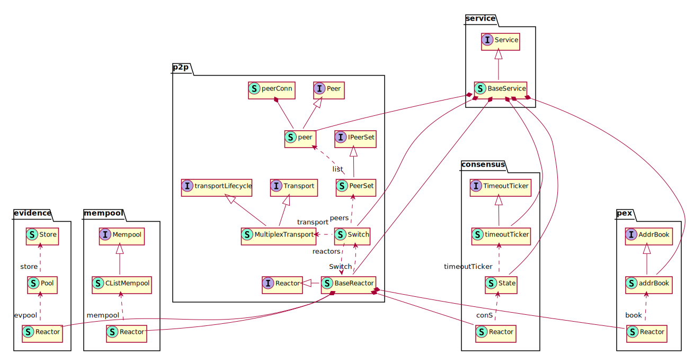
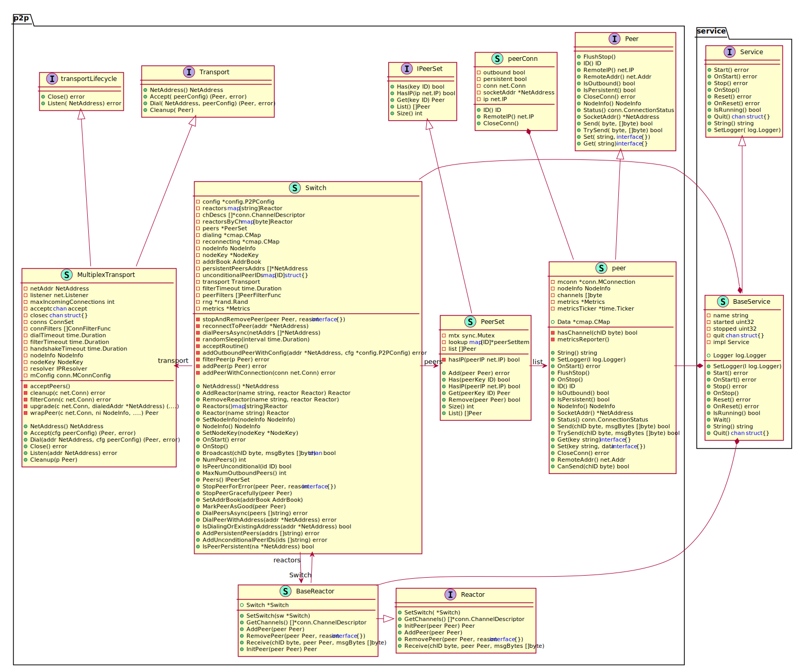
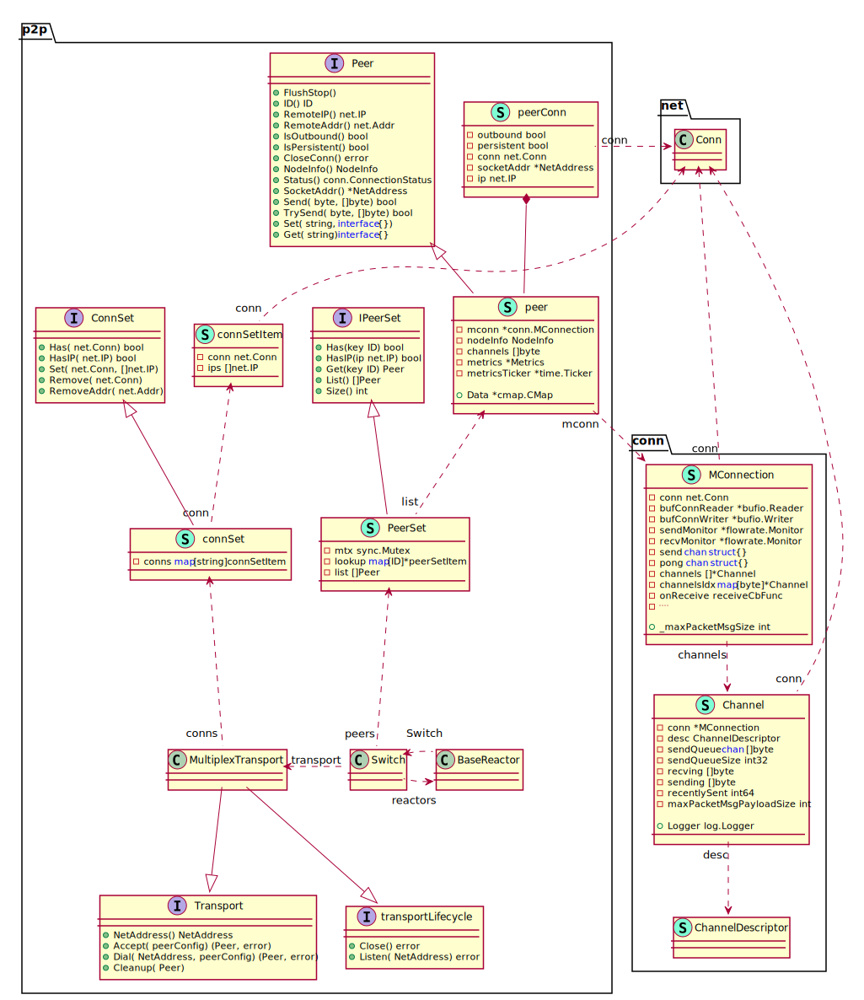

# Tendermint项目的架构设计

longcpp@200519

tendermint@v0.33.3

## 概要介绍

Tendermint项目提供了P2P网络的实现以及Tendermint共识协议,并通过ABCI接口与应用层进行交互,其中Tendermint通过共识组装区块为交易排序, 排好序的交易通过ABCI接口传递给上层应用进行执行, 而执行的结果也是通过ABCI的接口最终写入到区块链中. 从Tendermint项目提供的功能, 可以知道该项目中需要实现基本的网络连接服务, P2P节点发现与维护, P2P网络通信, 接收和传递交易, 接收和传递区块并参与共识协议, 处理RPC请求等等. Tendermint项目将所有的功能都集中到`Node`结构体之中, 也即`Node`结构体是运行一个Tendermint节点的入口点. 

为了在一个项目中支持如此复杂的业务逻辑, 需要对业务逻辑进行抽象,借助Go语言的接口等设计, Tendermint项目利用抽象出来几个基本概念`Service`, `Reactor`, `Switch`以及`MultiplexTransport`等接口和结构体完成了整个项目的架构.

- `Service`服务接口抽象了与服务生命周期相关的接口, 例如服务启动`Start()`, 停止`Stop()`以及重置`Reset()`等. 为了避免一个服务的重复启动或者重复停止, `BaseService`结构体中实现了`Service`接口并通过原子化操作避免重复启动和关闭. 通过扩展`BaseService`结构体, 项目中不同的服务类型可以基于自身业务逻辑实现更多的服务功能.
- `Reactor`反应器接口抽象了处理从P2P网络接收到的消息相关的逻辑接口, 例如添加和删除对等节点`AddPeer()`和`RemovePeer()`接口, 以及从对等节点接收消息的`Receive()`接口. 共识过程等可以据此定制实现服务于自身逻辑的功能. 为了处理一个消息, 可能需要不同的反应器相互配合来完成处理逻辑, 反应器之间通过`Switch`结构体可以进行交互. 与`BaseServie`的初衷一样, `BaseReactor`为不同的反应器实现提供了起点. `BaseReactor`中包含两个字段,其中`BaseService`来管理反应器服务的启动和终止,而`Switch`结构则让不同反应器之间相互配合成为可能. 通过`Reactor`容易定制化一个节点具体启动的服务, 例如验证者节点和普通全节点需要运行的服务不同.
- `Switch` 转换器结构体是一个全局转换器. 如果说`Node`结构体是整个节点的入口点, 那么`Switch`则负责管理`Node`中所有跟共识逻辑相关的数据和逻辑, 具体来说包括P2P对等节点的发现, 对等节点之间的通信, tendemermint共识过程, 交易和区块的接受, 处理与转发. 所有功能的实现都依赖节点内部模块的通信以及对等节点之间的通信. `Switch`中持有各个功能模块的反应器, 而各个模块的反应器中都有字段指向这个全局的转换器, 由此两个反应器之间通过`Swtich`可以查找到对方并进行通信. P2P网络通信方面, `Switch`利用`pex` 模块进行节点发现并记录在`AddressBook`中, 利用`MultiplexTransport`建立并管理与对等节点之间所有的物理网络连接.
- `MultiplexTransport`多路复用传输结构体负责建立并维护对等节点之间的网络通信. Tendermint项目通过`MConnection`结构体封装了普通的TCP连接以达到对一条TCP连接的多路复用. 这是因为两个P2P之间需要不定时交换多种信息, 例如区块传播, 交易传播或者投票信息传播. 基于此Tendermint项目进一步实现了`Channel`的概念, 一个`MConnection`对应一个物理网络连接, 而一个`MConnection`可以由多个`Channel`共用. 此外, 这种设计方式还可以避免TCP连接的慢启动(Slow Start)导致的网络传输效率问题. 另外,  与Bitcoin, Ethereum等网络不通, Tendermint网络中的对等节点之间的通信通过Station-to-Station协议进行密钥交换并利用AEAD对称加密算法对所有通信进行加密. 





建立P2P网络连接之前, 首先要进行P2P对等节点发现,这是通过`pex`模块来完成的, `pex`是 peer exchange的缩写, 意为节点信息交换. 通过`pex`模块反应器`pex.Reactor`的发现节点信息保存在`AddressBook`中. 与网络上位未知的节点节点通信时, 总需要考虑安全问题. 另一方面不同的节点的网络通信情况等也各不相同, 作为一个节点希望连接到网络状况良好的节点. 基于这些考虑, Tendermint实现了相应的逻辑来帮助管理对等节点, 此处我们不再深入相关主题. 

基于`MultiplexTransport`提供的P2P网络通信能力, 可以构建Tendermint共识相关的逻辑. 共识的目的是就当前状态和接下来的交易顺序达成一致, 而区块链网络中所有的交易都包含在区块中. 另外, 当新设立一个节点时, 该节点为了获得最新的区块状态需要从P2P网络获得所有的历史区块并在本地构建区块链状态(todo state-sync). Tendermint项目用`BlockChainReactor`来实现区块处理相关的逻辑, 其中`BlockPool`用于节点追块时存储接收到区块, 而这些区块是通过`bpRequester`请求得到的. 交易接受方面通过`mempool.Reactor`来接收从P2P网络收到的交易信息, 接收到的交易则利用结构体`CListMempool`管理, 其核心成员为存储合法交易的并发单链表(Concurrent linked-list of good txs). 另外BFT类型的共识协议, 如Tendermint协议都需要考虑活跃验证者节点作恶可能性, 常用的方式是引入举报-惩罚机制. 网络中的任意节点都可以就自己发现的某个节点的恶意行为进行举报, 如果举报信息属实则会对相应的验证者进行乘法. 举报信息也是通过交易形式提交到网络上的, Tendermint项目中为举证引入了`evidence.Reactor`用来实现举证相关的逻辑处理. 接收到的交易打包成区块之外, 全网会对该区块的合法性达成共识, Tendermint共识协议的相应逻辑由`consensus.Reactor`反应器实现, Tendermint共识需要超时机制的辅助来保持网络活性, 因此引入了`timeoutTicker`结构体来在超时发生时触发相应的动作. 

上图中总结了Tendermint基于前述的基本接口和结构体的整体设计. 除了前述的基本接口和结构体设计之外, 反应器的实现本身可能需要额外的数据结构辅助, 也在下图中展示.  基于`Service`服务接口, `Reactor`反应器接口, `Switch` 全局转换器结构体和`MultiplexTransport`多路复用传输结构体这几个基本设计, Tendermint构建了完整的P2P网络通信功能以及Tendermint共识协议功能. 至此, 对Tendermint的整体设计(非ABCI接口相关的部分)做了非常概要介绍, 接下来详细介绍几处重点实现. 

## `Node`结构体

一个节点入口点是`Node`结构体, 本小节详细探究下`Node`结构体中各个字段的含义,在了解全貌的基础上, 加深对`Node`结构体的理解. 首先给出`Node`结构体的定义, 其中包含了10多个字段. 部分字段有相应的注释, 接下来我们解析其中的主要字段, 配合上面的图可以理解一个节点运行的内部机制, 也详细介绍重要的接口设计和结构体定义. 

```go
// tendermint/node/node.go 169-203
// Node is the highest level interface to a full Tendermint node.
// It includes all configuration information and running services.
type Node struct {
	service.BaseService

	// config
	config        *cfg.Config
	genesisDoc    *types.GenesisDoc   // initial validator set
	privValidator types.PrivValidator // local node's validator key

	// network
	transport   *p2p.MultiplexTransport
	sw          *p2p.Switch  // p2p connections
	addrBook    pex.AddrBook // known peers
	nodeInfo    p2p.NodeInfo
	nodeKey     *p2p.NodeKey // our node privkey
	isListening bool

	// services
	eventBus         *types.EventBus // pub/sub for services
	stateDB          dbm.DB
	blockStore       *store.BlockStore // store the blockchain to disk
	bcReactor        p2p.Reactor       // for fast-syncing
	mempoolReactor   *mempl.Reactor    // for gossipping transactions
	mempool          mempl.Mempool
	consensusState   *cs.State      // latest consensus state
	consensusReactor *cs.Reactor    // for participating in the consensus
	pexReactor       *pex.Reactor   // for exchanging peer addresses
	evidencePool     *evidence.Pool // tracking evidence
	proxyApp         proxy.AppConns // connection to the application
	rpcListeners     []net.Listener // rpc servers
	txIndexer        txindex.TxIndexer
	indexerService   *txindex.IndexerService
	prometheusSrv    *http.Server
}
```

### 作为服务的`Node`

 `Node`本身的行为也是一种服务, 因此`Node`扩展了`servcie.BaseService`. `service.BaseService`是实现了`Service`接口的结构体, `Service`是Tendermint项目中比较基础的概念, 因为项目中包含的很多功能都被抽象为一个`Service`, 如实现区块接收逻辑的`BlockPool`, 实现交易接收逻辑的`Mempool`, 处理网络连接的`MConnection`. `Service`中抽象了关于服务的常见接口, 例如启动`Start()`, 结束`Stop()`, 重置`Reset()`以及设置日志记录者`SetLogger(log.Logger)`等接口, 参见`Service`接口的定义.

```go
// tendermint/libs/service/service.go 23-53
// Service defines a service that can be started, stopped, and reset.
type Service interface {
	// Start the service.
	// If it's already started or stopped, will return an error.
	// If OnStart() returns an error, it's returned by Start()
	Start() error
	OnStart() error

	// Stop the service.
	// If it's already stopped, will return an error.
	// OnStop must never error.
	Stop() error
	OnStop()

	// Reset the service.
	// Panics by default - must be overwritten to enable reset.
	Reset() error
	OnReset() error

	// Return true if the service is running
	IsRunning() bool

	// Quit returns a channel, which is closed once service is stopped.
	Quit() <-chan struct{}

	// String representation of the service
	String() string

	// SetLogger sets a logger.
	SetLogger(log.Logger)
}
```

`Service`接口中的方法在基本的服务启动, 停止, 重置, 查询等操作之外, 还额外提供了`OnStart()`, `OnStop()`和`OnReset()`方法. 这几个方法允许具体实现`Service`接口的数据结构启动, 停止和重置时实现定制化的逻辑. 这些定制化的逻辑如果存在, 会通过`Start`, `Stop`和`Reset`方法进行调用. `Start`, `Stop`和`Reset`方法对`OnStart()`, `OnStop()`和`OnReset()`方法的调用提供了一定的保证, 而后者也需要遵循一定的规则.

- `OnStart()`允许返回错误信息, 并且该错误信息会由`Start()`传递给更上层调用者
- `OnStop()`不允许返回返回错误信息
- `OnReset()`允许返回错误信息, `BaseService`的实现中,`OnReset()`会直接`panic`.

`BaserService`结构体提供了`Service`接口的基础实现, Tendermint项目中所有的服务类型均是通过扩展`BaseService`来实现. `BaseService`结构体中的重要成员是原子型的整数`started`和`stopped`, 这两个成员用于确保一个服务不会多次启动/停止. 

```go
// tendermint/libs/service/service.go 97-106
type BaseService struct {
	Logger  log.Logger
	name    string
	started uint32 // atomic
	stopped uint32 // atomic
	quit    chan struct{}

	// The "subclass" of BaseService
	impl Service
}
```

`BaseService`的实现中确保在不发生错误的情况下, `Start()`方法中仅调用一次`OnStart()`, 而`Stop()`中仅调用一次`OnStop()`, 并且默认的`OnStart()`和`OnStop()`实现内部不做任何事情. 而默认的`OnReset()`方法实现则直接`panic`, 因此通过扩展`BaseService`实现的服务中为了能够调用`Reset()`方法, 一定要重新实现`OnReset()`方法. 为了帮助理解, 仅展示`BaseService`的`Reset`方法和`OnReset()`方法的实现, 其中可以发现对`stopped`成员的原子操作以及对`OnReset()`的调用.

```go
// tendermint/libs/service/service.go 180-198
// Reset implements Service by calling OnReset callback (if defined). An error
// will be returned if the service is running.
func (bs *BaseService) Reset() error {
	if !atomic.CompareAndSwapUint32(&bs.stopped, 1, 0) {
		bs.Logger.Debug(fmt.Sprintf("Can't reset %v. Not stopped", bs.name), "impl", bs.impl)
		return fmt.Errorf("can't reset running %s", bs.name)
	}

	// whether or not we've started, we can reset
	atomic.CompareAndSwapUint32(&bs.started, 1, 0)

	bs.quit = make(chan struct{})
	return bs.impl.OnReset()
}

// OnReset implements Service by panicking.
func (bs *BaseService) OnReset() error {
	panic("The service cannot be reset")
}
```

### 可配置的`Node`

可以通过配置信息定制节点运行处理各种逻辑时的行为, `Node`结构体的第二个成员`config`包含了所有的可配置参数. 其中`BaseConfig`包含了链ID`chainID`, 本地存储链数据的文件夹`RootDir`, ABCI应用的TCP或者Unix Socket地址等参数. `Config`结构体中其余的字段分别用来自配置不同的功能模块, 如P2P网络相关的配置`P2P`, 共识相关的配置`Consensus`层, 此处不再敖述. 

```go
// tendermint/config/config.go 59-72
// Config defines the top level configuration for a Tendermint node
type Config struct {
	// Top level options use an anonymous struct
	BaseConfig `mapstructure:",squash"`

	// Options for services
	RPC             *RPCConfig             `mapstructure:"rpc"`
	P2P             *P2PConfig             `mapstructure:"p2p"`
	Mempool         *MempoolConfig         `mapstructure:"mempool"`
	FastSync        *FastSyncConfig        `mapstructure:"fastsync"`
	Consensus       *ConsensusConfig       `mapstructure:"consensus"`
	TxIndex         *TxIndexConfig         `mapstructure:"tx_index"`
	Instrumentation *InstrumentationConfig `mapstructure:"instrumentation"`
}
```

之前提到, Tendermint共识需要一组验证者集合, 在网络运行时可以通过PoS机制根据节点质押的代币数量进行排序选择活跃验证者结合, 但是在链刚启动的时候, 如何确定初始的验证者集合? 这就是`Node`的第3个成员`genesisDoc`的作用, 通过该字段可以链的开始时间`GenesisTime`, 共识参数`ConsensusParams`, 初始的验证者集合`Validators`, 初始的应用层状态`AppState`和相对应的哈希值`AppHash`.

```go
// tendermint/types/genesis.go 37-45
// GenesisDoc defines the initial conditions for a tendermint blockchain, in particular its validator set.
type GenesisDoc struct {
	GenesisTime     time.Time          `json:"genesis_time"`
	ChainID         string             `json:"chain_id"`
	ConsensusParams *ConsensusParams   `json:"consensus_params,omitempty"`
	Validators      []GenesisValidator `json:"validators,omitempty"`
	AppHash         tmbytes.HexBytes   `json:"app_hash"`
	AppState        json.RawMessage    `json:"app_state,omitempty"`
}
```

接下来作为验证者节点, 需要参与Tendermint共识过程并进行投票. 在Tendermint共识中, 投票其实就是对区块或者`nil`值进行数字签名的过程. 数字签名需要指定对应的签名私钥, `Node`中的第4个成员`privValidator`是一个接口成员, 抽象了关于验证者投票的方法. 签名私钥的具体存放位置通过`config.BaseConfig.PrivValidatorKey`进行指定, 利用从这个位置读取的私钥可以实现`PrivValidator`接口. 通过`PrivValidator`接口, Tendermint项目可以方便的支持签名/投票过程与Tendermint节点的分隔, 通过这种方式, 节点运营者可以将投票的私钥存放在安全性更高的服务器上.

```go
// tendermint/types/priv_validator.go 12-20
// PrivValidator defines the functionality of a local Tendermint validator
// that signs votes and proposals, and never double signs.
type PrivValidator interface {
	// TODO: Extend the interface to return errors too. Issue: https://github.com/tendermint/tendermint/issues/3602
	GetPubKey() crypto.PubKey

	SignVote(chainID string, vote *Vote) error
	SignProposal(chainID string, proposal *Proposal) error
}
```

### 作为对等节点的`Node`

通过`service.BaseService`, `Node`具备了服务的基本功能,可以启动, 终止, 重置等. 利用配置信息, `Node`则拥有了可遵循的参数以及初始状态. 利用这些信息可以启动`Node`, 启动后的`Node`表现为P2P网络中的一个对等节点, 为了真正参与网络需要进行P2P节点发现, 与对等网络建立连接等. 本小节介绍`Node`结构体中与P2P网络通信相关的成员. 

前面已经提到过, Tendermint的P2P网络中的通信是加密通信, 意味着每个节点都需要代表自己的身份的公私钥对来与另外的节点的进行密钥协商并根据写上结果派生出真正用于加密网络通信流量的对称加密算法的私钥. 注意这与之前提到的验证者节点参与共识协议用来进行投票的私钥不是同一个, 为了区分期间, 参与共识的称为投票私钥, 而用于P2P网络加密通信的私钥称为通信私钥. `Node`中的 `nodeKey *p2p.NodeKey`用来存储当前节点的通信私钥, 可以看到`p2p.NodeKey`是一个保存了私钥的结构体, 这是因为该通信私钥就应该位于本机, 也就无需像投票私钥一样需要将具体的签名过程隐藏在一个统一的接口背后. 

```go
// tendermint/p2p/key.go
// NodeKey is the persistent peer key.
// It contains the nodes private key for authentication.
type NodeKey struct {
	PrivKey crypto.PrivKey `json:"priv_key"` // our priv key
}
```

每个`Node`有了公私钥之后, 在P2P网络中也有了唯一的身份ID, `Node`结构体中的`nodeInfo p2p.NodeInfo`抽象了关于节点的基本信息, 其中`ID()`方法返回节点的身份ID: 十六进制编码的地址, 而该地址是通过与通信私钥相对应的公钥派生而来. `nodeInfoAddress`接口中的`NetADdress()`方法返回节点的网络IP地址和端口号信息, 而`nodeInfoTransport`接口中可以`Validate()`方法可以对`NodeInfo`进行合法性验证, 而`CompatibleWith()`方法则检查本地节点与网络上一个节点之间的兼容性, 只有共享相同的`chainID`以及相同的`ProtocolVersion`两个节点之间才可以进行P2P网络通信. 

```go
// tendermint/p2p/node_info.go 24-41
// NodeInfo exposes basic info of a node
// and determines if we're compatible.
type NodeInfo interface {
	ID() ID
	nodeInfoAddress
	nodeInfoTransport
}

type nodeInfoAddress interface {
	NetAddress() (*NetAddress, error)
}

// nodeInfoTransport validates a nodeInfo and checks
// our compatibility with it. It's for use in the handshake.
type nodeInfoTransport interface {
	Validate() error
	CompatibleWith(other NodeInfo) error
}

// tendermint/p2p/key.go 31-34
// ID returns the peer's canonical ID - the hash of its public key.
func (nodeKey *NodeKey) ID() ID {
	return PubKeyToID(nodeKey.PubKey())
}
```

通过`pex`模块发现的P2P网络节点存储在`addrBook pex.AddrBook`中, 这是一个接口类型, `pex.addrBook`具体实现了该接口. 此处我们不再深入介绍该模块, 因为具体的节点发现是比较独立的功能, 与Tendermint项目本身的架构不存在耦合. 接下来`IsListening`布尔值则标记了当前节点是否处于监听状态, 处于该状态意味着可以接受其他节点的连接请求. 根据之前的叙述可以知道 `transport *p2p.MultiplexTransport`中管理了所有的物理网络连接, 而`sw  *p2p.Switch`则利用`transport`和`addrBook`管理与所有P2P节点的之间的连接. 也即`sw`通过`pex`模块发现的P2P网络节点`addrBook`通过`transport`进行实际的通信. `Switch`, `MultiplexTransport`, `PeerSet`以及`BaseReactor`等结构体之间的关系在下图中展示. 



连接建立之后, 就需要具体处理从P2P网络接收到的各种信息. 如前所述, 具体的消息处理是通过各个业务模块的反应器进行的, 也因此, `Switch`结构体中也需要持有处理各种逻辑的反应器`reactors map[string]Reactor`, 以便将接收到消息路由给适当的反应器做进一步处理.

```go
// tendermint/p2p/switch.go 65-94
// Switch handles peer connections and exposes an API to receive incoming messages
// on `Reactors`.  Each `Reactor` is responsible for handling incoming messages of one
// or more `Channels`.  So while sending outgoing messages is typically performed on the peer,
// incoming messages are received on the reactor.
type Switch struct {
	service.BaseService

	config       *config.P2PConfig
	reactors     map[string]Reactor
	chDescs      []*conn.ChannelDescriptor
	reactorsByCh map[byte]Reactor
	peers        *PeerSet
	dialing      *cmap.CMap
	reconnecting *cmap.CMap
	nodeInfo     NodeInfo // our node info
	nodeKey      *NodeKey // our node privkey
	addrBook     AddrBook
	// peers addresses with whom we'll maintain constant connection
	persistentPeersAddrs []*NetAddress
	unconditionalPeerIDs map[ID]struct{}

	transport Transport

	filterTimeout time.Duration
	peerFilters   []PeerFilterFunc

	rng *rand.Rand // seed for randomizing dial times and orders

	metrics *Metrics
}
```

`Switch`通过`transpor Transport`接口调用`MultiplexTransport`完成具体的网络连接建立. `MultiplexTransport`结构体实现了接口`Transport`和`transportLifecycle`. `Transport`接口抽象了主动与远端P2P节点建立连接的方法`Dial()`,  而接口 `transportLifecycle`中的`Listen()`方法抽象了接受远端节点的连接请求的过程.

```go
// tendermint/p2p/transport.go 54-76
// Transport emits and connects to Peers. The implementation of Peer is left to
// the transport. Each transport is also responsible to filter establishing
// peers specific to its domain.
type Transport interface {
	// Listening address.
	NetAddress() NetAddress

	// Accept returns a newly connected Peer.
	Accept(peerConfig) (Peer, error)

	// Dial connects to the Peer for the address.
	Dial(NetAddress, peerConfig) (Peer, error)

	// Cleanup any resources associated with Peer.
	Cleanup(Peer)
}

// transportLifecycle bundles the methods for callers to control start and stop
// behaviour.
type transportLifecycle interface {
	Close() error
	Listen(NetAddress) error
}
```

`MultiplexTransport`结构体通过成员`conns ConnSet`负责记录并维护节点所有的P2P连接, 并且本地节点与一个远端P2P节点之间仅存在一条TCP连接`net.Conn`. Tendermint项目中在`net.Conn`的基础上实现了多路复用的连接`MConnection`.  多路复用意味着两个P2P节点之间不同模块所需要传递的消息均通过这一条网络连接传输. 要理解多路复用的作用, 首先需要了解下P2P网络节点在Tendermint项目中的抽象.

 `Peer`接口抽象了一个P2P节点所应具备的功能, 例如获取实际网络地址的方法`SocketAddr()`和用于发送消息的`Send()`方法. 结构体`peer`实现了`Peer`接口并且扩展了结构体`peerConn`. `peerConn`中包含了原始的TCP连接以及配置信息. `peer`扩展了`peerConn`并且包含了基于`peerConn`中的TCP连接构造而来的多路复用的TCP连接`mconn *tmconn.MConnection`. 多路复用的TCP连接是指将一个真实的TCP连接划分成多个`Channel`, 多个`Channel`共用底层的同一个TCP连接. 




MultiplexTransport实现了transport接口，用来接受或发起连接（tcp），并将其upgrade为一个peer连接，供Switch进行AddPeer的调用。MultiplexTransport结构体内部包含了ConnSet，每一个ConnSetItem包含一个conn和一个ip地址数组。Switch结构主要用来在不同服务的Reactor之间进行切换。

```go
// tendermint/p2p/transport.go 132-157
// MultiplexTransport accepts and dials tcp connections and upgrades them to
// multiplexed peers.
type MultiplexTransport struct {
	netAddr                NetAddress
	listener               net.Listener
	maxIncomingConnections int // see MaxIncomingConnections

	acceptc chan accept
	closec  chan struct{}

	// Lookup table for duplicate ip and id checks.
	conns       ConnSet
	connFilters []ConnFilterFunc

	dialTimeout      time.Duration
	filterTimeout    time.Duration
	handshakeTimeout time.Duration
	nodeInfo         NodeInfo
	nodeKey          NodeKey
	resolver         IPResolver

	// TODO(xla): This config is still needed as we parameterise peerConn and
	// peer currently. All relevant configuration should be refactored into options
	// with sane defaults.
	mConfig conn.MConnConfig
}
```


Switch结构被包含在tendermint的Node结构中，用来负责处理peer的连接。Switch中包含了一个channelDescriptor的数组，以及一个从chId到Reactor的map(reactorsByCh)，还有一个从string（name）到Reactor的map(reactors)。一个Reactor可能对应若干channel。在收到新的Peer节点的config信息（通过transport接收），Switch会wrap出一个peer，并调用每一个已被添加的Reactor的AddPeer方法，将该peer添加到每个Reactor的peerset中。

Peer在这里被抽象为一个基本服务，一个peer节点包含了一个MConnection（Multiplex connection）的实例化对象，以及一个channelId（抽象的）数组，每一个channel对应一个唯一的id。

MConnection主要用来处理虚拟化的多个信道同时在一个信道上进行消息传输的事宜，它与peer节点是一一对应的，它直接处理跟该peer相关的消息发送、接收。其存储了一个channel数组，一个从channelId到channel的map。当MConnection收到packetMsg时，会根据pkt的channelId选择相应的channel对pkt进行receive。而channel又对应到一个特定的Reactor，通过MConnection的onReceive方法（在CreateMConnection时设定），根据chId定位到实际Reactor的Receive方法。

```go
// tendermint/p2p/switch.go 223-251
// OnStart implements BaseService. It starts all the reactors and peers.
func (sw *Switch) OnStart() error {
	// Start reactors
	for _, reactor := range sw.reactors {
		err := reactor.Start()
		if err != nil {
			return errors.Wrapf(err, "failed to start %v", reactor)
		}
	}

	// Start accepting Peers.
	go sw.acceptRoutine()

	return nil
}

// OnStop implements BaseService. It stops all peers and reactors.
func (sw *Switch) OnStop() {
	// Stop peers
	for _, p := range sw.peers.List() {
		sw.stopAndRemovePeer(p, nil)
	}

	// Stop reactors
	sw.Logger.Debug("Switch: Stopping reactors")
	for _, reactor := range sw.reactors {
		reactor.Stop()
	}
}
```


### `Node`支持的各类服务

Reactor接口定义如下： Reactor针对一个service来定义，用来根据触发条件进行底层服务的调用，包括MempoolReactor、ConsensusReactor、evpoolReactor、BlockchainReactor 等实现。一个Reactor对应于多个peer，因此也对应与多个channel。

### `Node`结构体总结

- `service.BaseService`: 
- `config *cfg.Config`: 区块链的配置信息(todo, 文件)
- `genesisDoc *types.GenesisDoc`: 区块链的初始信息(todo 文件), 用于初始化链状态
- `privValidator types.PrivValidator`: 验证节点的签名私钥,用于共识过程中投票
- `transport *p2p.MultiplexTransport`:  Tendermint实现的TCP连接的多路复用
- `sw *p2p.Switch`: 处理与对等节点之间的网络连接
- `addrBook pex.AddrBook`:
- `nodeInfo p2p.NodeInfo`:
- `nodeKey *p2p.NodeKey`:
- `isListening bool`:
- `eventBus         *types.EventBus`:
- `stateDB          dbm.DB`:
- `blockStore       *store.BlockStore`:
- `bcReactor        p2p.Reactor`: 
- `mempoolReactor   *mempl.Reactor`:
- `mempool          mempl.Mempool`:
- `consensusState   *cs.State`: 	
- `consensusReactor *cs.Reactor`: 
- `pexReactor       *pex.Reactor`: 
- `evidencePool     *evidence.Pool`:
- `proxyApp         proxy.AppConns`: 
- `rpcListeners     []net.Listener`: 
- `txIndexer        txindex.TxIndexer`:
- `indexerService   *txindex.IndexerService`
- `prometheusSrv    *http.Server`:


bcReactor是针对Blockchain服务的Reactor，主要用来发送与接收区块，对应了一个Blockstore来存储验证过的区块，一个BlockPool用来存储区块请求，一个BlockExec用来执行和提交区块。MempoolReactor则与mempool相关，用来接收和发送交易，以及与上层app的CheckTx交互进行交易验证。ConsensusReactor是针对共识的一个Reactor，主要用来处理与共识相关的过程，内部嵌套了一个ConsensusState用来存储当前的共识状态。EvidencePool存储的是尚未打包进块的有效的evidence信息。proxyApp则封装了三种ABCIconn：appConnMempool，appConnConsensus，appConnQuery，以及一个ClientCreator（封装了一个上层app）。 TxIndex和IndexerService提供了交易的索引服务（针对tendermint的kv example applicaiton，支持通过一些tag索引交易）。


`ConsensusReactor`定义了Consensus Service的反应器,其中`BaseReactor`提供了`BaseService`和`Switch`功能.`BaseService`实现了`Service`接口,而`Service`接口定义了可以开始(start),停止(stop)和重置(reset)的服务. `Switch`处理peer连接并对外暴露API来receive incoming messages on `Reactors`.每个反应器负责处理一个或者多个channel上的incoming消息,实现在函数`Receive`中.outing的消息通过peer来处理.`conS *ConsensusState`负责共识算法的执行,处理投票(votes)和提案(proposals),并在达成共识的时候将区块提交到链上并根据应用状态执行区块.状态机的内部状态从peers, internal validator和timer接收输入.`fastSync`标记当前是否出去区块的快速同步模式,快速同步模式能够将落后很久的节点快速同步到最新区块高度. `eventBus *types.EventBus`系统中所有事件都要经过通过公共总线(common bus)`EventBus`来处理,所有的调用通过代理传递给底层的pubsub server. All events must be published using `EventBus` to ensure correct data types.

```go
type ConsensusReactor struct {
	p2p.BaseReactor // BaseService + p2p.Switch

	conS *ConsensusState

	mtx      sync.RWMutex
	fastSync bool
	eventBus *types.EventBus

	metrics *Metrics
}
```

Consensus Reactor总共需要处理9个消息,而Receive`函数中用4个channels接受9种消息类型:

- StateChannel
  - `NewRoundStepMessage`:共识算法执行过程中,step transition时发送
  - `NewValidBlockMessage`:观察到合法区块发送 proposal & +2/3 prevotes
  - `HasVoteMessage`:说明已经收到了某个投票
  - `VoteSetMaj23Message`:对某个blockid收到了+2/3的投票时发送(有两种类型对应PrevoteType和PrecommitType)
- DataChannel
  - `ProposalMessage`: 提议新的区块时发送
  - `BlockPartMessage`:传播提议的区块部分内容时发送
  - `ProposalPOLMessage`:先前的区块被重新提议时发送
- VoteChannel
  - `VoteMessage`: 对某个区块投票时发送,或者表示在当前轮不投票(投nil)
- VoteSetBitsChannel
  - `VoteSetBitsMessage`:就某个blockid收到的区块的投票进行通信(有两种类型对应PrevoteType, PrecommitType)