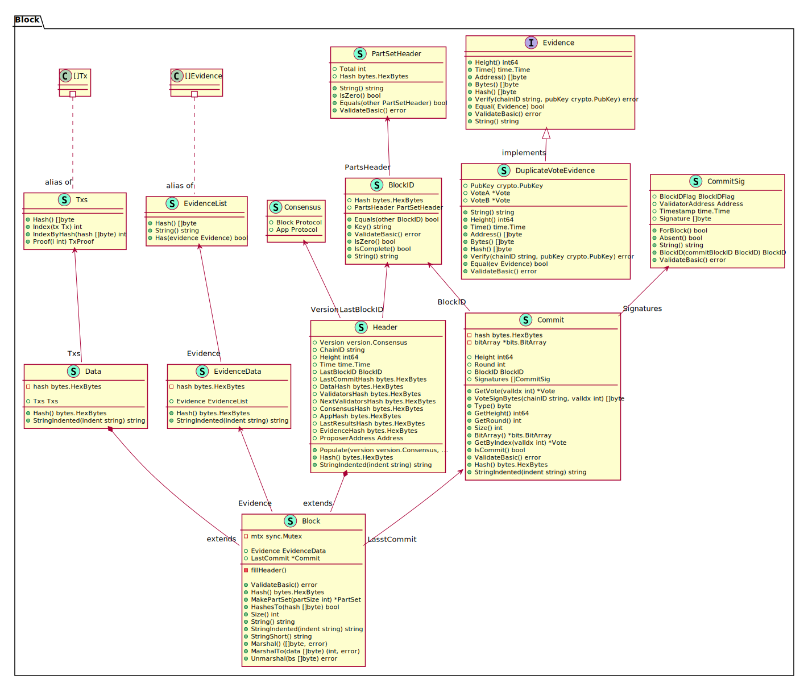
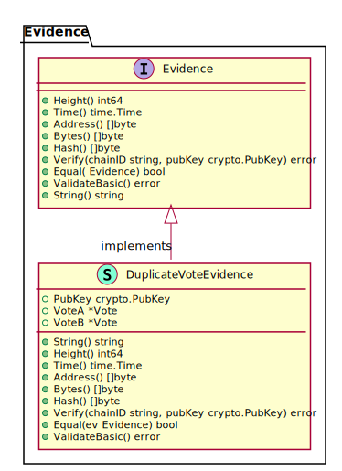
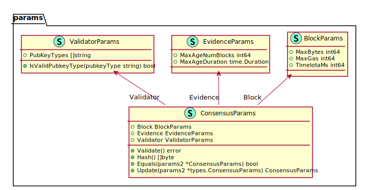
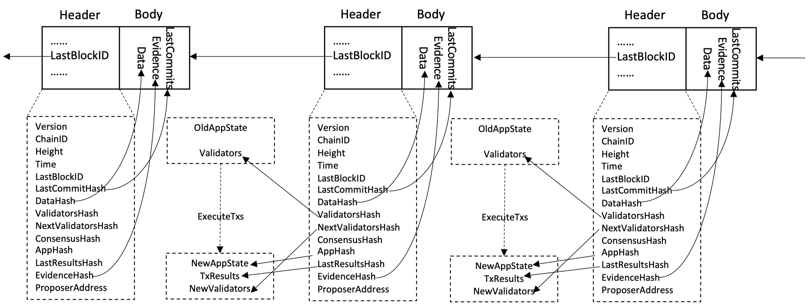

# Tendermint的区块结构


本次来分析Tendermint中的区块结构的设计. 基于Tendermint公式算法的实现的[Tendermint](https://github.com/tendermint/tendermint) 项目包含了P2P网络通信以及Tendermint共识协议两部分的主要功能, 并且通过ABCI接口与上层应用之间进行交互完成交易的处理. Tendermint项目中处理交易时, 不关心交易的具体内容, 仅仅是将交易作为字节数组, 并且通过Tendermint共识协议在所有的验证节点之间对交易顺序(也就是区块中的内容)达成共识. 共识协议的特性以及分层设计的理念,同时影响了Tendermint区块的设计. 

首先回顾[CoinEx Chain的白皮书]()中关于Tendermint共识部分的描述:

>  Tendermint共识协议是半同步的拜占庭共识协议，具有简洁、高效和可追责的特点。共识协议的达成是在已知的验证者集合内完成的，每个验证者通过其公钥进行鉴别。具体的共识过程通过多轮的两阶段（Prevote和Precommit）投票协议以及相应的锁定机制完成。每一轮开始时通过带权重的轮换形式挑选一个验证者为区块提议者（Proposer），由该验证者打包并提议区块，随后验证者就该区块的合法性进行两阶段投票，如果每个阶段都能获得来自多于2/3的验证者的投票则该区块会被提交到链上执行。需要执行多轮的可能原因有：被选中的验证者不在线，提议的区块不合法，在某个投票阶段没有收集到超过2/3的投票信息等等。为了简化对不确定因素的处理，Tendermint中每张投票有两种用途：确认合法信息和确认无效信息。根据投票信息确认当前区块或者进入下一轮，避免了PBFT共识算法中复杂的视图转化协议。可追责的特性则由公钥可鉴别验证者这一约束提供。
>
> 由于CAP定理 [18]的客观存在，Tendermint协议在安全性与可用性之间选择了安全性。也因此Tendermint共识协议有可能会短暂停止直到超过2/3的验证者达成共识。当系统中的恶意的验证者小于1/3时，Tendermint提供了永不分叉的保证。安全性优先于可用性以及永不分叉的承诺对于金融应用至关重要。CoinEx Chain在项目启动时计划支持42个节点，根据Tendermint共识协议的实验数据，在42个节点遍布五大洲的条件下Tendermint能够达到4000TPS的处理速度，能满足去中心化交易所的需求。伴随高TPS的并不是交易确认时间的延长，Tendermint共识机制提供逐区块最终化的特性，能够在秒级完成交易确认。

Tendermint共识协议不分叉承诺以及逐块最终化的特性简化了区块的结构设计和实现, 只需要用哈希指针依次串联起各个区块即可, 无需像比特币一样因为可能的区块回滚而引入复杂的编码, 也无需像Ethereum中考虑链接叔块. 与通常的区块设计一样, Tendermint的区块主要也由区块头和区块体两部分构成. `Block`的定义如下.

```go
// tendermint@v0.33.3 types/block.go 37-44   
// Block defines the atomic unit of a Tendermint blockchain.
type Block struct {
	mtx        sync.Mutex
	Header     `json:"header"` // 区块头
	Data       `json:"data"`	 // 区块体
	Evidence   EvidenceData `json:"evidence"`   // 作恶举证
	LastCommit *Commit      `json:"last_commit"`// 
}
```

其中 `Header`和`Data`分别对应区块头和区块体.  `mtx sync.Mutex` 用于区块之中过程中的加锁保护, 而`Evidence   EvidenceData`和`LastCommit *Commit`字段则与Tendermint支持的PoS机制相关. 为了便于理解, 将`Block`相关的类型信息在下图中展示. 其中区块体的结构比较简单, 仅仅是一些交易`Tx`的数组, 而`Tx`本身如前所述只是`[] byte`的别名. 这些交易构成的Merkle树的树根保存在`Header`中的`DataHash`字段.



`Header`结构体中的基本信息`Version`, `ChainID`,`Height`,`Time`字段分别表示区块的版本号, 链ID, 高度以及生成时间. . 其中`Version`类型`version.Consensus`定义如下. 由于应用层与共识层的为相互独立的两层概念,因此Tendermint应用的版本号需要同时包含区块的版本号`Block`以及应用的版本号`App`, 其中`Protocol`为`uint64`类型的别名. Tendermint中的`Time`类型使用的是[Google Protobuf项目中定义的`Timestamp`类型](https://developers.google.com/protocol-buffers/docs/reference/csharp/class/google/protobuf/well-known-types/timestamp), 该类型中包含2个整型, 1个用来表示秒, 另一个表示纳秒.

```go
// tendermint@v0.33.3 version/version.go 60-66
// Consensus captures the consensus rules for processing a block in the blockchain,
// including all blockchain data structures and the rules of the application's
// state transition machine.
type Consensus struct {
	Block Protocol `json:"block"`
	App   Protocol `json:"app"`
}

```

该区块所指向的上一个区块的唯一标识记录在`LastBlockID`中, 类型为`BlockID`,可以唯一表示一个区块. 结构体`BlockID`中的2个字段均为区块的Merkle树根, 其中`Hash`字段代表区块头中所有字段构成的Merkle树的树根`MerkleRoot(Header)`, 而`PartsHeader`则是关于区块体的Merkle树根. Tendermint中在P2P网络中传播区块体时, 会将序列化后的整个区块分割为小块后再进行广播. `PartSetHeader`结构体中的`Total`记录了分割成的小块的个数, 而`Hash`字段是这些小块构成的Merkle树的树根. 

```go
// tendermint@v0.33.3 types/block.go 892-896
// BlockID defines the unique ID of a block as its Hash and its PartSetHeader
type BlockID struct {
   Hash        tmbytes.HexBytes `json:"hash"`
   PartsHeader PartSetHeader    `json:"parts"`
}

// tendermint@v0.33.3 types/part_set.go 59-62
type PartSetHeader struct {
	Total int              `json:"total"`
	Hash  tmbytes.HexBytes `json:"hash"`
}
```

具体的分割通过`Block`的方法`MakePartSet`调用`NewPartSetFromData`完成, 其中输入参数`data`为整个区块的序列化, 而`partSize`的默认值定义在`types/params.go`中: `BlockPartSizeBytes = 65536 // 64kB`, 也即默认会将整个区块划分为64kB的小块(代码注释有误), 然后再通过P2P网络广播. `PartSet`包含了分割后得到的小块`Part`的集合, 其中每个`Part`包含表示自身序号 的`index`字段, 自身内容的`Bytes`字段以及证明自身属于某个区块的Merkle证明`Proof`. 每个`Part`的构建可参见如下的实现, 此处不再敖述.

```go
// tendermint@v0.33.3 types/part_set.go 100-129
// Returns an immutable, full PartSet from the data bytes.
// The data bytes are split into "partSize" chunks, and merkle tree computed.
func NewPartSetFromData(data []byte, partSize int) *PartSet {
	// divide data into 4kb parts.
	total := (len(data) + partSize - 1) / partSize
	parts := make([]*Part, total)
	partsBytes := make([][]byte, total)
	partsBitArray := bits.NewBitArray(total)
	for i := 0; i < total; i++ {
		part := &Part{
			Index: i,
			Bytes: data[i*partSize : tmmath.MinInt(len(data), (i+1)*partSize)],
		}
		parts[i] = part
		partsBytes[i] = part.Bytes
		partsBitArray.SetIndex(i, true)
	}
	// Compute merkle proofs
	root, proofs := merkle.SimpleProofsFromByteSlices(partsBytes)
	for i := 0; i < total; i++ {
		parts[i].Proof = *proofs[i]
	}
	return &PartSet{
		total:         total,
		hash:          root,
		parts:         parts,
		partsBitArray: partsBitArray,
		count:         total,
	}
}

// tendermint@v0.33.3 types/part_set.go 22-26
type Part struct {
	Index int                `json:"index"`
	Bytes tmbytes.HexBytes   `json:"bytes"`
	Proof merkle.SimpleProof `json:"proof"`
}
```

`Header`中剩余的字段与PoS机制以及Tendermint共识过程引入的验证者, 提案者等概念紧密相关. 在PoS机制中,虽然每个人都可以通过抵押代币成为验证者,并不是每个验证者都会获得投票权, 只有质押代币的数量排名靠前的验证者才有资格参与共识过程投票,称之为活跃验证者, 例如Cosmos Hub网络中目前质押代币数量排名前100的验证者才可以成为活跃验证者. 构造下一个区块时, Tendermint共识机制会通过带权重的轮转方式从PoS机制选出来的活跃验证者集合中挑选一个活跃验证者成为提案者.该提案者可以打包区块并通过P2P网络广播,其它活跃验证者会检查该区块, 没有问题的话会用自己的验证私钥对区块进行投票(也即签名), 表示认同该提案者打包的新区块.当超过2/3的活跃验证者均同意时, 该区块将提交给上层应用执行, 该区块的提案者信息存储在`Header`中的`ProposerAddress`中.

据此,可以发现对一个区块的投票信息(签名)无法存储到当前区块, 因为投票过程开始的时候当前区块的内容不再发生变化, 一个自然的做法则是将这些投票信息存储到下一个高度的区块当中. 这也是`Block`结构体中`LastCommit`字段的用处. `LastCommit`是一个指向`Commit`结构体的指针, `Commit`结构体是用于存储一组签名值`CommitSig`, 以及这些签名(投票)所对应的区块高度`Height`, 轮数`Round`, 以及区块的唯一ID `BlockID`. `ROUND`字段的含义参见Tendermint共识协议的介绍. 其区块头中的`Header`字段是这组签名值`CommitSig`的Merkle树根.

虽然活跃验证者集合中的验证者个数是固定的,但是具体的活跃验证者可以随着验证者质押的代币总数不断变化. 验证者自己可以质押更多代币, 撤回质押等操作. 因此与质押相关的交易会导致按照代币质押量的排名会不断发生变, 从而导致活跃验证者集合的更新. 当前区块中的交易执行完成之后, 需要重新计算活跃验证者集合. 新的验证者集合将参与Tendermint共识协议来构造下一个区块. `Header`中的`ValidatorsHash`是当前区块的活跃验证者集合的Merkle树根, 而`NextValidatorsHash`则表示下一个区块的活跃验证者集合的Merkle树根.每个区块中的交易执行完成之后会返回交易执行结果, `Header`中的`LastResultsHash`是上一个区块中所有交易执行结果的Merkle树根. 另外应用层交易的执行结果会影响到应用的内部状态, Tendermint中使用IAVL+树来存储应用的所有状态, `Header`中的`AppHash`字段存储了该树的树根. 



Tendermint共识协议对于活跃验证者的投票具有严格的定义, 然而在开放网络中总会存在恶意活跃验证者的可能性. 恶意验证者可以任意偏离共识协议的约定, 可能是操作失误也可能是有意为之. 为了应用恶意活跃验证者存在的情况, Tendermint共识协议引入了举证惩罚措施. 网络中任意一方均可以对自己发现的恶意活跃验证者行为进行举报. 目前Tendermint中支持的举报行为仅有区块的双签操作. 正常情况下,在同一个区块高度,一个活跃验证者应该只对一个区块进行投票. 如果活跃验证者违反Tendermint共识协议, 在同一个区块高度对不同的区块进行了签名(投票), 则网络的其他参与者看到两个来自同一活跃验证者的相互冲突的投票时,可以对这种进行举报.抽象接口 `Evidence`用于表示举证, 而结构体`DuplicateVoteEvidence`则实现了该接口. 根据下面的定义可以看到双签的证据其实就是一个公钥和两个投票`Vote`.

```go
// tendermint@v0.33.3 types/evidence.go 98-104
// DuplicateVoteEvidence contains evidence a validator signed two conflicting
// votes.
type DuplicateVoteEvidence struct {
	PubKey crypto.PubKey
	VoteA  *Vote
	VoteB  *Vote
}

// tendermint@v0.33.3 types/vote.go  46-57
// Vote represents a prevote, precommit, or commit vote from validators for
// consensus.
type Vote struct {
	Type             SignedMsgType `json:"type"`
	Height           int64         `json:"height"`
	Round            int           `json:"round"`
	BlockID          BlockID       `json:"block_id"` // zero if vote is nil.
	Timestamp        time.Time     `json:"timestamp"`
	ValidatorAddress Address       `json:"validator_address"`
	ValidatorIndex   int           `json:"validator_index"`
	Signature        []byte        `json:"signature"`
}
```

而投票信息`Vote`结构体中, 包含了关于此次投票的所有信息, 投票类型`Type` (投票类型与Tendermint共识协议相关, 主要有`Prevote`和`Precommit`两种投票类型), 区块高度`Height`, 轮数`Round`, 区块ID `BlockID`, 时间戳`Timestamp`, 验证者地址`ValidatorAddress`和索引号`ValidatorIndex`, 以及该验证者对相应区块的签名`Signature`. `DuplicateVoteEvidence`包含一个验证者在同一个高度的两张不同的投票, 通常可以被判定为双签作恶. 一个区块中可以包含多个`Evidence`, 存储在`Block`的`Evidence`字段, 而`Header`中的`EvidenceHash`则是这些举证的Merkle树根.

最后一个我们尚未讨论字段是`Header`中的`ConsensusHash`. Tendermint共识协议, 区块构造, 验证者和举证相关的逻辑均可以通过参数进行配置, 相关参数定义在文件`tendermint/types/parms.go`文件中, 参见下图. `ConsensusHash`是这些配置参数的哈希值.



其中`ConsensusParams`包含3类配置, 关于区块的配置参数`BlockParams`, 关于举证的配置参数`EvidenceParams`, 关于验证者的配置参数`ValidatorParams`. 区块的参数包括允许的区块的最大的字节数`MaxBlockSizeBytes`默认为21MB, 允许的区块的最大Gas值`MaxGas`默认为-1也即没有限制, 连续两个区块允许的最小时间间隔`TimeIotaMs`以毫秒为单位,默认为1000也即1s. 举证的参数包括举证可以针对的最近的区块数`MaxAgeNumBlocks`默认为100000, 举证的有效期`MaxAgeDuration`默认为48小时, 检查证据时, 如果举证针对的区块高度太小或者超出有效期(作恶发生时间与举证时间的差值)都f被认为是无效的举证:

```go
block.Header.Time-evidence.Time < ConsensusParams.Evidence.MaxAgeDuration &&
	block.Header.Height-evidence.Height < ConsensusParams.Evidence.MaxAgeNumBlocks
```

验证者的参数`ValidatorParams`仅包含验证者公钥类型的参数`PubKeyTypes`默认为Ed25519类型的公钥.



至此我们结合Tendermint共识协议以及分层设计的理念介绍了所有`Block`中的字段, 各个字段之间的内在联系以及与应用层之间的关系展示在上图中. `Header`中存储了多种数据的哈希值或者Merkle树根, 其中`TxHash`, `EvidenceHash`, `LastCommitHash`对应的具体内容直接存储在`Block`中. 而 `DataHash`, `ValidatorHash`, `NextValidatorHash`以及`LastResultsHash`这几个哈希值/Merkle树根所对应的数据存存储在`state.State`中. `state.State`结构体中存储了写入的最新区块的信息, 包括更新的活跃验证者集合, 共识参数等,这些信息足够用来产生下一个区块. `state.State`本身是一个实现细节, 此处不再敖述.

```go
// tendermint@v0.33.3 state/state.go 44-83
// State is a short description of the latest committed block of the Tendermint consensus.
// It keeps all information necessary to validate new blocks,
// including the last validator set and the consensus params.
// All fields are exposed so the struct can be easily serialized,
// but none of them should be mutated directly.
// Instead, use state.Copy() or state.NextState(...).
// NOTE: not goroutine-safe.
type State struct {
	Version Version

	// immutable
	ChainID string

	// LastBlockHeight=0 at genesis (ie. block(H=0) does not exist)
	LastBlockHeight int64
	LastBlockID     types.BlockID
	LastBlockTime   time.Time

	// LastValidators is used to validate block.LastCommit.
	// Validators are persisted to the database separately every time they change,
	// so we can query for historical validator sets.
	// Note that if s.LastBlockHeight causes a valset change,
	// we set s.LastHeightValidatorsChanged = s.LastBlockHeight + 1 + 1
	// Extra +1 due to nextValSet delay.
	NextValidators              *types.ValidatorSet
	Validators                  *types.ValidatorSet
	LastValidators              *types.ValidatorSet
	LastHeightValidatorsChanged int64

	// Consensus parameters used for validating blocks.
	// Changes returned by EndBlock and updated after Commit.
	ConsensusParams                  types.ConsensusParams
	LastHeightConsensusParamsChanged int64

	// Merkle root of the results from executing prev block
	LastResultsHash []byte

	// the latest AppHash we've received from calling abci.Commit()
	AppHash []byte
}

```


