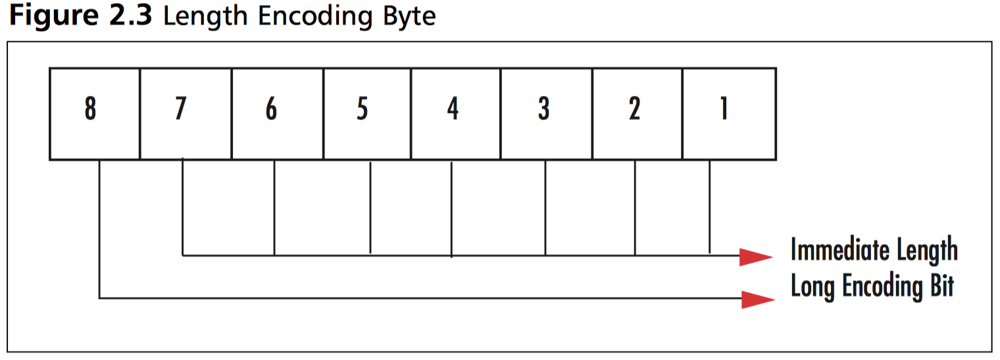
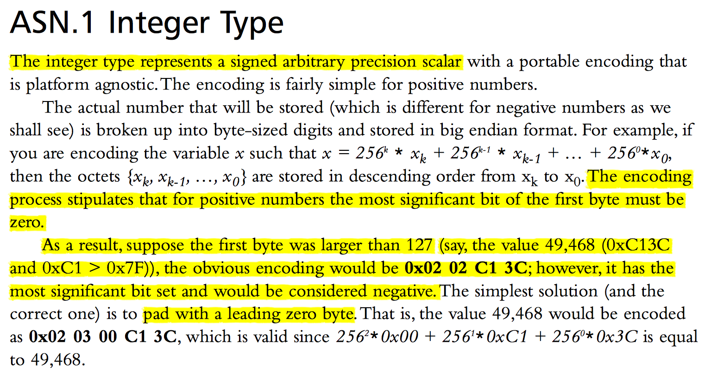

# Problem Related To DER Encode


## The Problem
BCH的Go语言重写过程中，利用secp256k1的库函数`secp256k1_ecdsa_signature_parse_der`解析下面的签名值时失败：

```c
    const char *sig_der =
        // clang-format off
        "3046"
        "0221"
        "002e6f0e8b515b5f25e837592e5e8a834cbe3fabaf98973edf88b19502e0180c2d"
        "0221"
        "00d03cc64f35fb277fe1b69270b542aca5620394ed7b7fae7a3546934dd6fe4288";
    // clang-format on
```
但是应用secp256k1库中的另外一个函数`ecdsa_signature_parse_der_lax`可以成功解析：

```c
int ecdsa_signature_parse_der_lax(
    const secp256k1_context* ctx,
    secp256k1_ecdsa_signature* sig,
    const unsigned char *input,
    size_t inputlen
) SECP256K1_ARG_NONNULL(1) SECP256K1_ARG_NONNULL(2) SECP256K1_ARG_NONNULL(3);
```

## Bug Trace

追踪函数`secp256k1_ecdsa_signature_parse_der`的内部实现：


发现错误发生在文件*ecdsa_imp.h*中的函数`secp256k1_ecdsa_sig_parse`，
更具体是其函数体中对调用`secp256k1_der_parse_integer`尝试解析签名值中的**r**值时返回0值（解析失败）：

```c
    if (!secp256k1_der_parse_integer(rr, &sig, sigend)) {
        return 0;
    }
```
继续追踪`secp256k1_der_parse_integer`发现，导致失败的原因是*上述签名值中表示**r**的部分在最开始的多余额的全0字节*，也即在下面的代码中，注释`/* Excessive 0x00 padding. */`所在分支的非法条件测试满足，导致最终的签名解析失败。

```c
static int secp256k1_der_parse_integer(secp256k1_scalar *r, const unsigned char **sig, const unsigned char *sigend) {
    int overflow = 0;
    unsigned char ra[32] = {0};
    int rlen;

    if (*sig == sigend || **sig != 0x02) {
        /* Not a primitive integer (X.690-0207 8.3.1). */
        return 0;
    }
    (*sig)++;
    rlen = secp256k1_der_read_len(sig, sigend);
    if (rlen <= 0 || (*sig) + rlen > sigend) {
        /* Exceeds bounds or not at least length 1 (X.690-0207 8.3.1).  */
        return 0;
    }
    if (**sig == 0x00 && rlen > 1 && (((*sig)[1]) & 0x80) == 0x00) {
        /* Excessive 0x00 padding. */
        return 0;
    }
    if (**sig == 0xFF && rlen > 1 && (((*sig)[1]) & 0x80) == 0x80) {
        /* Excessive 0xFF padding. */
        return 0;
    }
    if ((**sig & 0x80) == 0x80) {
        /* Negative. */
        overflow = 1;
    }
    while (rlen > 0 && **sig == 0) {
        /* Skip leading zero bytes */
        rlen--;
        (*sig)++;
    }
    if (rlen > 32) {
        overflow = 1;
    }
    if (!overflow) {
        memcpy(ra + 32 - rlen, *sig, rlen);
        secp256k1_scalar_set_b32(r, ra, &overflow);
    }
    if (overflow) {
        secp256k1_scalar_set_int(r, 0);
    }
    (*sig) += rlen;
    return 1;
}
```

如果删掉多余的**00**字节，并调整签名值的DER编码中指示长度的字段，则签名值可以被函数`secp256k1_ecdsa_signature_parse_der`成功解析。

```c++
int main() {
    const char *sig_der =
        // clang-format off
        "3046"
        "0221"
        "002e6f0e8b515b5f25e837592e5e8a834cbe3fabaf98973edf88b19502e0180c2d"
        "0221"
        "00d03cc64f35fb277fe1b69270b542aca5620394ed7b7fae7a3546934dd6fe4288";
    // clang-format on

    auto sig_hex = parse_hex(sig_der);
    for (const auto &e : sig_hex) printf("%02x", e);
    printf("\n");

    secp256k1_context *ctx = secp256k1_context_create(SECP256K1_CONTEXT_VERIFY |
                                                      SECP256K1_CONTEXT_SIGN);
    secp256k1_context_set_illegal_callback(ctx, NULL, NULL);
    secp256k1_context_set_error_callback(ctx, NULL, NULL);

    secp256k1_ecdsa_signature signature;

    int res;
    res = secp256k1_ecdsa_signature_parse_der(ctx, &signature, sig_hex.data(),
                                              sig_hex.size());
    fprintf(stdout, "parse %s\n", res == 1 ? "ok" : "error");

    // remove extra '00' byte 
    const char *sig_der2 =
        // clang-format off
        "3045"
        "0220"
        "2e6f0e8b515b5f25e837592e5e8a834cbe3fabaf98973edf88b19502e0180c2d"
        "0221"
        "00d03cc64f35fb277fe1b69270b542aca5620394ed7b7fae7a3546934dd6fe4288";
    // clang-format on
    auto sig_hex2 = parse_hex(sig_der2);
    for (const auto &e : sig_hex2) printf("%02x", e);
    printf("\n");

    res = secp256k1_ecdsa_signature_parse_der(ctx, &signature, sig_hex2.data(),
                                              sig_hex2.size());
    fprintf(stdout, "parse %s\n", res == 1 ? "ok" : "error");
}
```

上面代码的执行结果如下，其中*secp256k1_der_parse_integer r failed*是追踪问题中添加的用于调试输出信息。

```bash
[bitmain@LongMac ]secp256k1 $ ./libsecp256k1_sig_parse.exe
30460221002e6f0e8b515b5f25e837592e5e8a834cbe3fabaf98973edf88b19502e0180c2d022100d03cc64f35fb277fe1b69270b542aca5620394ed7b7fae7a3546934dd6fe4288
secp256k1_der_parse_integer r failed
parse error
304502202e6f0e8b515b5f25e837592e5e8a834cbe3fabaf98973edf88b19502e0180c2d022100d03cc64f35fb277fe1b69270b542aca5620394ed7b7fae7a3546934dd6fe4288
parse ok
```

## Reason and Related Things

ECDSA签名值包括两个大整数 **r,s**，前述错误发生在尝试解析 **r** 的值时。
DER编码用0x02指示一个INTEGER类型的开始，后面分别是长度字段
（用来指示用多少个字节来编码INEGER的值）和INTEGER的具体编码。
DER编码有两种方式来编码长度，Short Encodings 和 Long Encodings，
当payload的长度小于128个字节时，使用Short Encodings。



对于比特币的ECDSA情形，两个大整数 **r,s** 最多为256个比特（32个字节），
也即在这种情形之下需要使用Short Encoding。

根据DER的编码规则（摘自《Cryptography for Developers》），应该采用最短的编码方式：
> The Distinguished Encoding Rules specify we must choose the shortest encoding that fully represents the length of the element.The encoded lengths do not include the ASN.1 header or length bytes, simply the payload.

针对具体的INTEGER的编码方式如下图展示。
对Integer的编码基本上是以字节为单位的256进制的大端法表示。
编码规则要求对于证书（positive numbers），其第一个字节的最高位比特必须为0。
如果第一个字节的最高位为1，则需要在其之前添加一个全零字节。



根据上述规则，可以发现签名值：

```c
    const char *sig_der =
        // clang-format off
        "3046"
        "0221"
        "002e6f0e8b515b5f25e837592e5e8a834cbe3fabaf98973edf88b19502e0180c2d"
        "0221"
        "00d03cc64f35fb277fe1b69270b542aca5620394ed7b7fae7a3546934dd6fe4288";
    // clang-format on
```
中**s**的编码是正确的，因为第一个字节为**d0**，也即最高比特位是1，
所以需要在其前面添加一个字节的**00**，
而对于**r**的编码，第一个字节为**2e**，按照DER的最短编码原则以及Integer的编码规则，
其前面的**00**字节是多余的，也即**r**的DER编码并没有完全按照DER的规则进行编码。
这也是函数`secp256k1_der_parse_integer`中的判断条件
`if (**sig == 0x00 && rlen > 1 && (((*sig)[1]) & 0x80) == 0x00)`
判定解析失败的原因。
而函数`ecdsa_signature_parse_der_lax`可以处理这种没有严格按照DER规则的编码情况。

```c
/** Parse a signature in "lax DER" format
 *
 *  Returns: 1 when the signature could be parsed, 0 otherwise.
 *  Args: ctx:      a secp256k1 context object
 *  Out:  sig:      a pointer to a signature object
 *  In:   input:    a pointer to the signature to be parsed
 *        inputlen: the length of the array pointed to be input
 *
 *  This function will accept any valid DER encoded signature, even if the
 *  encoded numbers are out of range. In addition, it will accept signatures
 *  which violate the DER spec in various ways. Its purpose is to allow
 *  validation of the Bitcoin blockchain, which includes non-DER signatures
 *  from before the network rules were updated to enforce DER. Note that
 *  the set of supported violations is a strict subset of what OpenSSL will
 *  accept.
 *
 *  After the call, sig will always be initialized. If parsing failed or the
 *  encoded numbers are out of range, signature validation with it is
 *  guaranteed to fail for every message and public key.
 */
 
int ecdsa_signature_parse_der_lax(
    const secp256k1_context* ctx,
    secp256k1_ecdsa_signature* sig,
    const unsigned char *input,
    size_t inputlen
) SECP256K1_ARG_NONNULL(1) SECP256K1_ARG_NONNULL(2) SECP256K1_ARG_NONNULL(3);

```

**BIP66**的引入也是为了处理类似的情况，
由于OpenSSL的各个版本对这种没有完全遵循DER编码规则的编码的处理效果不同，
所以依赖不同版本的OpenSSL的客户端面对同样的编码值时，
解析结果可能不同，有的成功，有的失败。
这种情况可能会到网络的分裂（部分网络认同一个签名，另一部分网络拒绝这个签名），
所以BIP66中对DER的严格约束，也是为了防止网络的分裂，确保全网共识的一致性。
