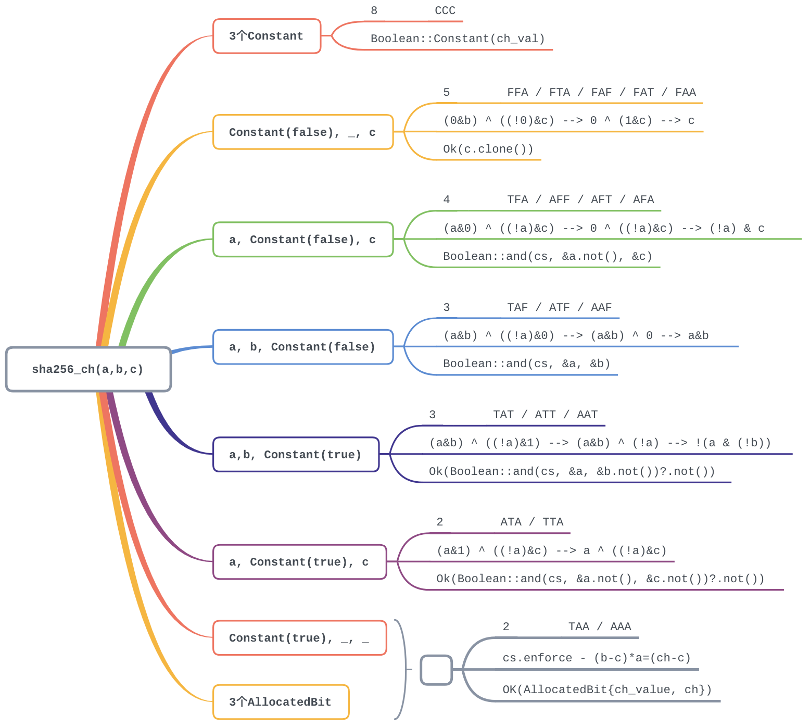
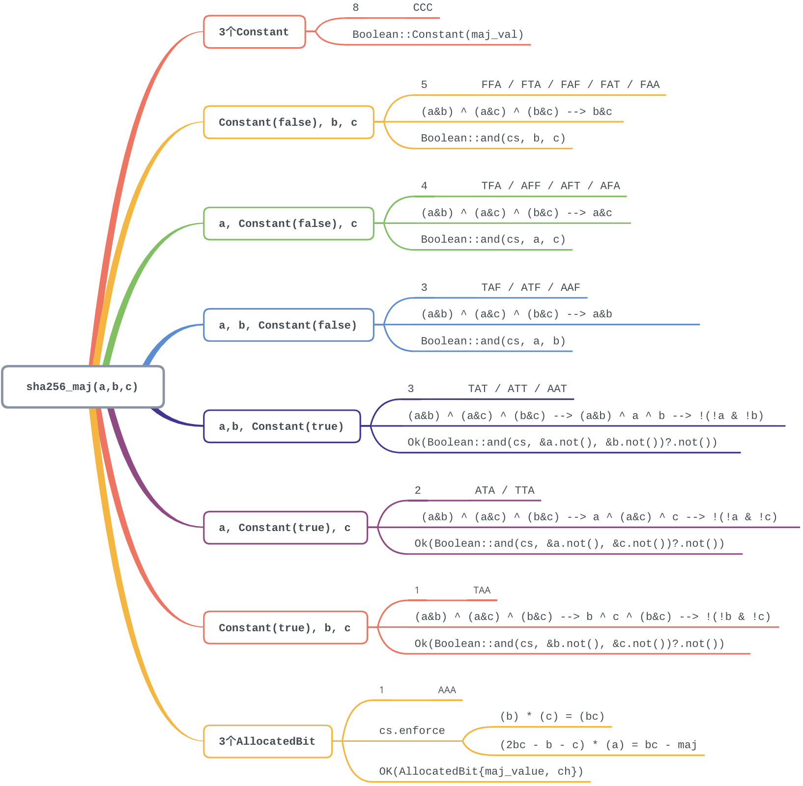

# bellman中SHA256算术电路的构建

longcpp @ 20200416

本文梳理[bellman](https://github.com/zkcrypto/bellman)中SHA256的算术电路的构造过程以加深对算术电路的理解. Sean Bowe在20170404的博客[Bellman: zk-SNARKs in Rust](https://electriccoin.co/blog/bellman-zksnarks-in-rust/)中最早介绍了bellman库的实现细节.

## SHA256

首先要了解SHA256的具体计算过程.SHA256算法计算过程用如下伪代码展示, SHA256的所有的运算都是在32比特的无符号整数上进行的.  bellman库中从简单的比特开始逐步构造比特位运算的约束条件,32无符号整数的约束条件,并在此基础上完整的构造了SHA256的算术电路. Eli Ben-Sasson等人在2014年的论文[Zerocash: Decentralized Anonymous Payments from Bitcoin](https://eprint.iacr.org/2014/349)讨论了如何逐步构建SHA256的算术电路. bellman库中按照同样的思路完成了SHA256电路,最终的门电路个数要略少于Eli Ben-Sasson等人在14年论文中给出的构造.

```
Note: All variables are unsigned 32 bits and wrap modulo 232 when calculating

Initialize variables
(first 32 bits of the fractional parts of the square roots of the first 8 primes 2..19):
h0 := 0x6a09e667
h1 := 0xbb67ae85
h2 := 0x3c6ef372
h3 := 0xa54ff53a
h4 := 0x510e527f
h5 := 0x9b05688c
h6 := 0x1f83d9ab
h7 := 0x5be0cd19


Initialize table of round constants
(first 32 bits of the fractional parts of the cube roots of the first 64 primes 2..311):
k[0..63] :=
0x428a2f98, 0x71374491, 0xb5c0fbcf, 0xe9b5dba5, 0x3956c25b, 0x59f111f1, 0x923f82a4, 0xab1c5ed5,
0xd807aa98, 0x12835b01, 0x243185be, 0x550c7dc3, 0x72be5d74, 0x80deb1fe, 0x9bdc06a7, 0xc19bf174,
0xe49b69c1, 0xefbe4786, 0x0fc19dc6, 0x240ca1cc, 0x2de92c6f, 0x4a7484aa, 0x5cb0a9dc, 0x76f988da,
0x983e5152, 0xa831c66d, 0xb00327c8, 0xbf597fc7, 0xc6e00bf3, 0xd5a79147, 0x06ca6351, 0x14292967,
0x27b70a85, 0x2e1b2138, 0x4d2c6dfc, 0x53380d13, 0x650a7354, 0x766a0abb, 0x81c2c92e, 0x92722c85,
0xa2bfe8a1, 0xa81a664b, 0xc24b8b70, 0xc76c51a3, 0xd192e819, 0xd6990624, 0xf40e3585, 0x106aa070,
0x19a4c116, 0x1e376c08, 0x2748774c, 0x34b0bcb5, 0x391c0cb3, 0x4ed8aa4a, 0x5b9cca4f, 0x682e6ff3,
0x748f82ee, 0x78a5636f, 0x84c87814, 0x8cc70208, 0x90befffa, 0xa4506ceb, 0xbef9a3f7, 0xc67178f2


Pre-processing:
append the bit '1' to the message
append k bits '0', where k is the minimum number >= 0 such that the resulting message
 length (in bits) is congruent to 448(mod 512)
append length of message (before pre-processing), in bits, as 64-bit big-endian integer


Process the message in successive 512-bit chunks:
break message into 512-bit chunks
for each chunk
 break chunk into sixteen 32-bit big-endian words w[0..15]

 Extend the sixteen 32-bit words into sixty-four 32-bit words:
 for i from 16 to 63
     s0 := (w[i-15] rightrotate 7) xor (w[i-15] rightrotate 18) xor(w[i-15] rightshift 3)
     s1 := (w[i-2] rightrotate 17) xor (w[i-2] rightrotate 19) xor(w[i-2] rightshift 10)
     w[i] := w[i-16] + s0 + w[i-7] + s1

 Initialize hash value for this chunk:
 a := h0
 b := h1
 c := h2
 d := h3
 e := h4
 f := h5
 g := h6
 h := h7

 Main loop:
 for i from 0 to 63
     s0 := (a rightrotate 2) xor (a rightrotate 13) xor(a rightrotate 22)
     maj := (a and b) xor (a and c) xor(b and c)
     t2 := s0 + maj
     s1 := (e rightrotate 6) xor (e rightrotate 11) xor(e rightrotate 25)
     ch := (e and f) xor ((not e) and g)
     t1 := h + s1 + ch + k[i] + w[i]
     h := g
     g := f
     f := e
     e := d + t1
     d := c
     c := b
     b := a
     a := t1 + t2

 Add this chunk's hash to result so far:
 h0 := h0 + a
 h1 := h1 + b
 h2 := h2 + c
 h3 := h3 + d
 h4 := h4 + e
 h5 := h5 + f
 h6 := h6 + g
 h7 := h7 + h

Produce the final hash value (big-endian):
digest = hash = h0 append h1 append h2 append h3 append h4 append h5 append h6 append h7
```


## 约束系统的类型定义

在逐步考察bellman中SHA256的算术电路构造之前,需要先理解bellman中相关的类型和接口的定义. 约束系统中的变量定义为`Variable`, 而`Index`则表示输入变量或者辅助变量的索引值, bellman中"input variable"表示公开的输入值, 而"auxiliary variable"则表示需要保密的**witness**. 

```rust
/// Represents a variable in our constraint system.
#[derive(Copy, Clone, Debug)]
pub struct Variable(Index);

/// Represents the index of either an input variable or
/// auxiliary variable.
#[derive(Copy, Clone, PartialEq, Debug)]
pub enum Index {
    Input(usize),
    Aux(usize),
}

/// This represents a linear combination of some variables, with coefficients
/// in the scalar field of a pairing-friendly elliptic curve group.
#[derive(Clone)]
pub struct LinearCombination<E: ScalarEngine>(Vec<(Variable, E::Fr)>);
```

对一组变量的约束可以表示为这些变量的线性组合用`LinearCombination`表示, 其中每个元素为变量和对应的系数`(Variable, E::Fr)`, `E::Fr`表示双线性对友好的椭圆曲线点群的标量域, 通过`LinearCombination`的方法`Add`和`Sub`等可以继续添加或者删除相应的约束. 前述所有的类型定义,都是为了支撑`trait ConstraintSystem`的定义, 通过`alloc`方法可以在该约束系统内部分配一个私有变量, 而通过`alloc_input`则可以在该约束系统内部分配一个公开变量. 这两个方法的输入参数相同, 都包含一个满足`FnOnce() -> Into<String>`的标记`annotation`闭包以及一个满足`FnOnce() -> Result<E::Fr, SynthesisError>`的闭包`f`, `annotation`可以解释要分配的变量, 测试时借助该标记可以理解约束系统内部实际发生的动作, 而`f`则用于对分配的变量赋值.`LinearCombination`只是囊括了一些`Variable`以及相应的系数, 真正的约束条件是通过`enforce`方法在3个`LinearCombination`之间的添加代数约束构建的. 

```rust
/// Represents a constraint system which can have new variables
/// allocated and constrains between them formed.
pub trait ConstraintSystem<E: ScalarEngine>: Sized {
    type Root: ConstraintSystem<E>;

    /// Return the "one" input variable
    fn one() -> Variable {
        Variable::new_unchecked(Index::Input(0))
    }

    fn alloc<F, A, AR>(&mut self, annotation: A, f: F) -> Result<Variable, SynthesisError>
    where
        F: FnOnce() -> Result<E::Fr, SynthesisError>,
        A: FnOnce() -> AR,
        AR: Into<String>;

    fn alloc_input<F, A, AR>(&mut self, annotation: A, f: F) -> Result<Variable, SynthesisError>
    where
        F: FnOnce() -> Result<E::Fr, SynthesisError>,
        A: FnOnce() -> AR,
        AR: Into<String>;

    /// Enforce that `A` * `B` = `C`. The `annotation` function is invoked in testing contexts
    /// in order to derive a unique name for the constraint in the current namespace.
    fn enforce<A, AR, LA, LB, LC>(&mut self, annotation: A, a: LA, b: LB, c: LC)
    where
        A: FnOnce() -> AR,
        AR: Into<String>,
        LA: FnOnce(LinearCombination<E>) -> LinearCombination<E>,
        LB: FnOnce(LinearCombination<E>) -> LinearCombination<E>,
        LC: FnOnce(LinearCombination<E>) -> LinearCombination<E>;

    /// Create a new (sub)namespace and enter into it. Not intended
    /// for downstream use; use `namespace` instead.
    fn push_namespace<NR, N>(&mut self, name_fn: N)
    where
        NR: Into<String>,
        N: FnOnce() -> NR;

    /// Exit out of the existing namespace. Not intended for
    /// downstream use; use `namespace` instead.
    fn pop_namespace(&mut self);

    /// Gets the "root" constraint system, bypassing the namespacing.
    /// Not intended for downstream use; use `namespace` instead.
    fn get_root(&mut self) -> &mut Self::Root;

    /// Begin a namespace for this constraint system.
    fn namespace<NR, N>(&mut self, name_fn: N) -> Namespace<'_, E, Self::Root>
    where
        NR: Into<String>,
        N: FnOnce() -> NR,
    {
        self.get_root().push_namespace(name_fn);

        Namespace(self.get_root(), PhantomData)
    }
}
```

`alloc`, `alloc_input`和`enforce`是构建约束系统的核心方法. 而`push_namespace`, `pop_namespace`, `get_root`, `namespace`方法则为了给`ConstraintSystem`装饰`Namespace`. 可以将不同的`ConstraintSystem`包装在不同的`Namespace`中. 

```rust
/// This is a "namespaced" constraint system which borrows a constraint system (pushing
/// a namespace context) and, when dropped, pops out of the namespace context.
pub struct Namespace<'a, E: ScalarEngine, CS: ConstraintSystem<E>>(&'a mut CS, PhantomData<E>);
```

在bellman的`gadgets/tests/mod.rs`和`groth16/generator.rs`中分别为测试和groth16的相应结构体实现了`trait ConstraintSystem`. 本文中仅关注`gadgets/tests/mod.rs`中为`struct TestConstraintSystem`实现的`trait ConstraintSystem`.`struct TestConstraintSystem`在bellman中服务于测试的目的, 后续在梳理SHA256的算术电路构造时,也会依赖该结构体输出约束系统的内部信息帮助理解算术电路的构造过程. 结构体中, 哈希表`named_objects: HashMap<String, NamedObject>`会记录对应类型的`annotation`或者是`ConstraintSystem`的`Namespace`, 而`current_namespace: Vec<String>`则保持了当前的`namespace`,注意`Namespace`可以嵌套. `constraints`中则保存了线性组合A,B,C的信息, 而`inputs`和`aux`则分别用于保存公开输入和私有输入.

枚举类型`NamedObject`表示对应

```rust
#[derive(Debug)]
enum NamedObject {
    Constraint(usize),
    Var(Variable),
    Namespace,
}

/// Constraint system for testing purposes.
pub struct TestConstraintSystem<E: ScalarEngine> {
    named_objects: HashMap<String, NamedObject>,
    current_namespace: Vec<String>,
    constraints: Vec<(
        LinearCombination<E>, // A
        LinearCombination<E>, // B
        LinearCombination<E>, // C
        String,
    )>,
    inputs: Vec<(E::Fr, String)>, // 公开输入以及annotation
    aux: Vec<(E::Fr, String)>, // 私有输入以及annotation
}
```

为了在算术电路中支持常量运算, 公开输入的第一个变量总是设置为**1**(在zksnark中为双线性对友好的椭圆曲线的底层素数域上的乘法单位元), `TestConstraintSystem`的`new`方法实现中也体现了这一点. 哈希表中存入的键值对为` "ONE".into(),NamedObject::Var(TestConstraintSystem::<E>::one())`, 同时会在公开输入`inputs`中分配元素`(E::Fr::one(), "ONE".into())`. 这一点对于`verify(&self, expected: &[E::Fr]) -> bool`方法的实现也有影响, 关注其实现内部第一行`assert_eq!(expected.len() + 1, self.inputs.len());`, 该函数用于验证公开输入的值与预期的`expected`相同.

```rust
pub fn new() -> TestConstraintSystem<E> {
    let mut map = HashMap::new();
    map.insert(
        "ONE".into(),
        NamedObject::Var(TestConstraintSystem::<E>::one()),
    );

    TestConstraintSystem {
        named_objects: map,
        current_namespace: vec![],
        constraints: vec![],
        inputs: vec![(E::Fr::one(), "ONE".into())],
        aux: vec![],
    }
}

pub fn verify(&self, expected: &[E::Fr]) -> bool {
      assert_eq!(expected.len() + 1, self.inputs.len());

      for (a, b) in self.inputs.iter().skip(1).zip(expected.iter()) {
          if &a.0 != b {
              return false;
          }
      }

      true
 }
```

`TestConstraintSystem<E>`的`hash()`方法可以针对整个结构体计算哈希值, 而`pretty_input()`则可以将整个结构内容打印出来,在后续讨论SHA256算术电路构造时,我们会经常用到该方法观察约束系统的内部状态, 而`set(&mut self, path: &str, to: E::Fr)`方法,可以将指定路径处的`Variable`设置为`to`, 同样也有`get`和`get_input`方法. 接下来重点关注`is_satisfied`方法的实现, 具体的实现逻辑在方法`which_is_unsatisfied`中. 该函数中会依次检查结构体中存储的线性组合之间的约束关系`A * B = C`是否成立, 具体的求值发生在`eval_lc`函数内部.

```rust
pub fn which_is_unsatisfied(&self) -> Option<&str> {
    for &(ref a, ref b, ref c, ref path) in &self.constraints {
        let mut a = eval_lc::<E>(a.as_ref(), &self.inputs, &self.aux);
        let b = eval_lc::<E>(b.as_ref(), &self.inputs, &self.aux);
        let c = eval_lc::<E>(c.as_ref(), &self.inputs, &self.aux);

        a.mul_assign(&b);

        if a != c {
            return Some(&*path);
        }
    }

    None
}

pub fn is_satisfied(&self) -> bool {
    self.which_is_unsatisfied().is_none()
}
```

接下来考察`struct TestConstraintSystem`对应的`ConstraintSystem`实现, 具体逻辑参见下面代码中的数值.

```rust
impl<E: ScalarEngine> ConstraintSystem<E> for TestConstraintSystem<E> {
    type Root = Self;
		// 分配一个私有变量: 在aux中追加一个变量,值为f(),标记为当前namespace+annotation()
    fn alloc<F, A, AR>(&mut self, annotation: A, f: F) -> Result<Variable, SynthesisError>
    where
        F: FnOnce() -> Result<E::Fr, SynthesisError>,
        A: FnOnce() -> AR,
        AR: Into<String>,
    {
        let index = self.aux.len(); 
        let path = compute_path(&self.current_namespace, annotation().into());
        self.aux.push((f()?, path.clone()));
        let var = Variable::new_unchecked(Index::Aux(index));
        self.set_named_obj(path, NamedObject::Var(var)); // 在哈希表中记录

        Ok(var)
    }
		// 分配一个公开变量: 在inputs中追加一个变量,值为f(),标记为当前namespace+annotation()
    fn alloc_input<F, A, AR>(&mut self, annotation: A, f: F) -> Result<Variable, SynthesisError>
    where
        F: FnOnce() -> Result<E::Fr, SynthesisError>,
        A: FnOnce() -> AR,
        AR: Into<String>,
    {
        let index = self.inputs.len();
        let path = compute_path(&self.current_namespace, annotation().into());
        self.inputs.push((f()?, path.clone()));
        let var = Variable::new_unchecked(Index::Input(index));
        self.set_named_obj(path, NamedObject::Var(var)); // 在哈希表中记录

        Ok(var)
    }
		// 添加约束条件,在constras中追加约束条件(<a()>, <b()>, <c()>),也即 <a()>*<b()>=<c()>
    fn enforce<A, AR, LA, LB, LC>(&mut self, annotation: A, a: LA, b: LB, c: LC)
    where
        A: FnOnce() -> AR,
        AR: Into<String>,
        LA: FnOnce(LinearCombination<E>) -> LinearCombination<E>,
        LB: FnOnce(LinearCombination<E>) -> LinearCombination<E>,
        LC: FnOnce(LinearCombination<E>) -> LinearCombination<E>,
    {
        let path = compute_path(&self.current_namespace, annotation().into());
        let index = self.constraints.len();
        self.set_named_obj(path.clone(), NamedObject::Constraint(index));

        let a = a(LinearCombination::zero());
        let b = b(LinearCombination::zero());
        let c = c(LinearCombination::zero());

        self.constraints.push((a, b, c, path));
    }
  	// namespace 操作的部分不再讨论
}
```

基于前述讨论并参考下面的测试代码输出,可以对`TestConstraintSystem`的工作方式有直观认识.

```rust
fn test_cs() {
    use ff::PrimeField;
    use pairing::bls12_381::{Bls12, Fr};

    let mut cs = TestConstraintSystem::<Bls12>::new();
    assert!(cs.is_satisfied());
    assert_eq!(cs.num_constraints(), 0);
    let a = cs
        .namespace(|| "a")
        .alloc(|| "var", || Ok(Fr::from_str("10").unwrap()))
        .unwrap();
    let b = cs
        .namespace(|| "b")
        .alloc(|| "var", || Ok(Fr::from_str("4").unwrap()))
        .unwrap();
    let c = cs
        .alloc(|| "product", || Ok(Fr::from_str("40").unwrap()))
        .unwrap();

    cs.enforce(|| "mult", |lc| lc + a, |lc| lc + b, |lc| lc + c);
    assert!(cs.is_satisfied());
    assert_eq!(cs.num_constraints(), 1);

    println!("{}\n--------", cs.pretty_print());

    cs.set("a/var", Fr::from_str("4").unwrap());

    let one = TestConstraintSystem::<Bls12>::one();
    cs.enforce(|| "eq", |lc| lc + a, |lc| lc + one, |lc| lc + b);

    println!("{}\n--------", cs.pretty_print());

    assert_eq!(cs.num_constraints(), 2);
    assert!(!cs.is_satisfied());
    assert!(cs.which_is_unsatisfied() == Some("mult"));

    assert!(cs.get("product") == Fr::from_str("40").unwrap());

    cs.set("product", Fr::from_str("16").unwrap());
    assert!(cs.is_satisfied());

    {
        let mut cs = cs.namespace(|| "test1");
        let mut cs = cs.namespace(|| "test2");
        cs.alloc(|| "hehe", || Ok(Fr::one())).unwrap();
    }

    println!("{}\n--------", cs.pretty_print());

    assert!(cs.get("test1/test2/hehe") == Fr::one());
}

```

输出结果为, 可以看到`namespace`的嵌套效果,以及`TestConstraintSystem`中随着变量和约束变动的情况.

```bash
Testing started at 5:30 PM ...

mult: (`a/var`) * (`b/var`) = (`product`)

--------

mult: (`a/var`) * (`b/var`) = (`product`)
eq: (`a/var`) * (`ONE`) = (`b/var`)

--------

mult: (`a/var`) * (`b/var`) = (`product`)
eq: (`a/var`) * (`ONE`) = (`b/var`)

--------
```

## 基本比特运算的算术电路

SHA256内部运算包含了大量32位无符号整数的比特位运算和模加运算.本小节关注bellman中如何构造这些基本运算的算术电路, 

讨论位运算首先需要在约束系统内部实现比特变量的分配,然后再实现比特位运算算术电路约束, `gadgets/boolean.rs`中提供了相应实现.`struct AllocatedBit`表示约束系统内部的一个比特变量,并且通过在约束系统内部添加相应约束保证值只能为0或1.

```rust
/// Represents a variable in the constraint system which is guaranteed
/// to be either zero or one.
#[derive(Clone)]
pub struct AllocatedBit {
    variable: Variable,
    value: Option<bool>,
}
```

首先关注`struct AllocatedBit`的`alloc`方法如何在约束系统内部为`value: Option<bool>`分配对应的`AllocatedBit`. 其中对取值`x`只能为0或者1的约束是通过在约束系统内部添加 (1-x)*x=0 达成的. 

```rust
/// Allocate a variable in the constraint system which can only be a
/// boolean value.
pub fn alloc<E, CS>(mut cs: CS, value: Option<bool>) -> Result<Self, SynthesisError>
where
    E: ScalarEngine,
    CS: ConstraintSystem<E>,
{
    let var = cs.alloc( // cs 内部根据value值创建Variable
        || "boolean",
        || {
            if *value.get()? {
                Ok(E::Fr::one())
            } else {
                Ok(E::Fr::zero())
            }
        },
    )?;

    // Constrain: (1 - a) * a = 0
    // This constrains a to be either 0 or 1.
    cs.enforce( // 在cs内部添加约束(1-var)*var = 0
        || "boolean constraint",
        |lc| lc + CS::one() - var,
        |lc| lc + var,
        |lc| lc,
    ); // 保证Variable的值只能为0或1

    Ok(AllocatedBit {
        variable: var,
        value,
    })
}
```

接下来则容易理解`struct AllocatedBit`的`xor`, `and`, `and_not`以及`nor`方法. 在实现内部,比特位运算被转换为算术电路上`E::Fr`的加法/乘法约束,其中比特值为0对应的`E::Fr::zero()`,而比特值为1对应`E::Fr::One()`,浏览实现可以发现几个算术电路的约束均为1. 考虑对两个输入变量`a,b`用算术电路约束`c = a^b`,则总共需要3个约束.其中2个约束`a, b`的值只能为0或1, 另外1个用于约束`xor`运算关系成立.

后续的实现会涉及到的比特运算的等价变换过程,相关内容可以参考[Boolean Algebra](https://en.wikipedia.org/wiki/Boolean_algebra), 为了便于书写, 用`&`表示与运算, `|` 表示或运算, `^`表示异或运算, 用`!`表示取反运算, 下面代码中会用到的关系包括:

- `x & y = !(!x | !y)`, `!x & !y = !(x | y)`
- `x | y = !(!x & !y), !x | !y = !(x & y)`
- `x ^ y = (x | y) & !(x & y) = (x & !y) | (!x & y)`

```rust
pub fn xor<E, CS>(mut cs: CS, a: &Self, b: &Self) -> Result<Self, SynthesisError>
where
    E: ScalarEngine,
    CS: ConstraintSystem<E>,
{
  	// 根据a,b的值计算result_value,并在cs内分配对应的result_var
  	// .... 
		// 当`a = b`时有`c = a^b = 0`, 否则`c = 0`.
  	// c = a^b = (a | b) & !(a & b)=!(!a & !b) & !(a & b)
    // 等价于
    // (1 - (a * b)) * (1 - ((1 - a) * (1 - b))) = c
    // (1 - ab) * (1 - (1 - a - b + ab)) = c
    // (1 - ab) * (a + b - ab) = c
    // a + b - ab - (a^2)b - (b^2)a + (a^2)(b^2) = c
    // a + b - ab - ab - ab + ab = c
    // a + b - 2ab = c
    // -2a * b = c - a - b
    // 2a * b = a + b - c
    // (a + a) * b = a + b - c
  	// a^b=c 的算术电路约束为 (a + a) * (b) = (a + b - c)
    cs.enforce(
        || "xor constraint",
        |lc| lc + a.variable + a.variable,
        |lc| lc + b.variable,
        |lc| lc + a.variable + b.variable - result_var,
    );
  	// 返回结果
}

pub fn and<E, CS>(mut cs: CS, a: &Self, b: &Self) -> Result<Self, SynthesisError>
where
    E: ScalarEngine,
    CS: ConstraintSystem<E>,
{
  	// 根据a,b的值计算result_value,并在cs内分配对应的result_var
  	// .... 
  	// a & b = c 对应的算术电路约束为 (a) * (b) = (c)
    cs.enforce(
        || "and constraint",
        |lc| lc + a.variable,
        |lc| lc + b.variable,
        |lc| lc + result_var,
    );
  	// 返回结果
}

/// Calculates `a AND (NOT b)`.
pub fn and_not<E, CS>(mut cs: CS, a: &Self, b: &Self) -> Result<Self, SynthesisError>
where
    E: ScalarEngine,
    CS: ConstraintSystem<E>,
{
  	// 根据a,b的值计算result_value,并在cs内分配对应的result_var
  	// .... 
  	// a & (!b) = c 对应的算术电路约束为 (a) * (1-b) = (c)
    cs.enforce(
        || "and not constraint",
        |lc| lc + a.variable,
        |lc| lc + CS::one() - b.variable,
        |lc| lc + result_var,
    );
  	// 返回结果
}

/// Calculates `(NOT a) AND (NOT b)`.
pub fn nor<E, CS>(mut cs: CS, a: &Self, b: &Self) -> Result<Self, SynthesisError>
where
    E: ScalarEngine,
    CS: ConstraintSystem<E>,
{
  	// 根据a,b的值计算result_value,并在cs内分配对应的result_var
  	// .... 
  	// (!a) & (!b) = c 对应的算术电路约束为 (1-a) * (1-b) = (c)
    cs.enforce(
        || "nor constraint",
        |lc| lc + CS::one() - a.variable,
        |lc| lc + CS::one() - b.variable,
        |lc| lc + result_var,
    );
  	// 返回结果
}

```

`struct AllocatedBit`表示算术电路中一个比特的变量,但是电路中的比特也可能为常量值,为此进一步定义枚举类型`enum Boolean`,既可以表示电路中的一个比特的变量,也可以表示电路中一个比特的常量, 表示变量时还区分是对应的值还是对应值的取反.

```rust
/// This is a boolean value which may be either a constant or
/// an interpretation of an `AllocatedBit`.
#[derive(Clone)]
pub enum Boolean {
    /// Existential view of the boolean variable
    Is(AllocatedBit),
    /// Negated view of the boolean variable
    Not(AllocatedBit),
    /// Constant (not an allocated variable)
    Constant(bool),
}
```

针对`Boolean`构建算术电路约束时,需要考虑到可能为常量的情况,参见如下`enforc_equal<E,CS>`方法的实现. `enforc_equal<E,CS>`方法实现调用了`lc`方法. `lc`方法接受参数`one: Variable, coeff: E::Fr`, 并根据自身的值,返回线性组合.

```rust
pub fn lc<E: ScalarEngine>(&self, one: Variable, coeff: E::Fr) -> LinearCombination<E> {
    match *self {
        Boolean::Constant(c) => {
            if c { // 为常量true, 返回 <(one, coeff)>
                LinearCombination::<E>::zero() + (coeff, one)
            } else { // 为常量false, 返回<()>
                LinearCombination::<E>::zero()
            }
        }
      	// 为变量,并且是Is, 返回<(v, coeff)>
        Boolean::Is(ref v) => LinearCombination::<E>::zero() + (coeff, v.get_variable()),
      	// 为变量,并且是Not, 返回<(one, coeff), (v, -coeff)>
        Boolean::Not(ref v) => {
            LinearCombination::<E>::zero() + (coeff, one) - (coeff, v.get_variable())
        }
    }
}

pub fn enforce_equal<E, CS>(mut cs: CS, a: &Self, b: &Self) -> Result<(), SynthesisError>
where
    E: ScalarEngine,
    CS: ConstraintSystem<E>,
{ // 构建 a == b 的算术电路约束
    match (a, b) { 
        (&Boolean::Constant(a), &Boolean::Constant(b)) => {
            if a == b { // 都为常量,并且相等,直接返回Ok,无需额外约束
                Ok(())
            } else { // 都为常量,并且不相等, 直接返回Err,无需额外约束
                Err(SynthesisError::Unsatisfiable) 
            }
        }
        (&Boolean::Constant(true), a) | (a, &Boolean::Constant(true)) => {
          // 有一个为常量true,要求另一个也是true
          //  Is(a) --> <()> * <()> = <(1,1), (a, -1)> 
          //		--> 1-a=0 --> a=1 --> Is(a)=true
          // Not(a) --> <()> * <()> = <(1,1), (1,-1), (a,1)> 
          //		-->1-1+a=0 --> a=0 --> Not(a)=true
            cs.enforce( 
                || "enforce equal to one",
                |lc| lc,
                |lc| lc,
                |lc| lc + CS::one() - &a.lc(CS::one(), E::Fr::one()),
            ); 

            Ok(())
        }
        (&Boolean::Constant(false), a) | (a, &Boolean::Constant(false)) => {
          // 有一个常量为false,要求另一个也是false
          // Is(a) --> <()> * <()> = <(a,1)> 
          // 		--> a=0 --> Is(a)=false
          // Not(a) --> <()> * <()> = <(1,1), (a,-1)> 
          // 		--> a=1 --> Not(a)=false
            cs.enforce(
                || "enforce equal to zero",
                |lc| lc,
                |lc| lc,
                |_| a.lc(CS::one(), E::Fr::one()),
            );

            Ok(())
        }
        (a, b) => { 
          // a, b均为变量时,约束a=b
          // Is(a), Is(B) --> <()> * <()> = <(a, 1), (b, -1)> 
          // 		--> a-b=0 --> Is(a)=Is(b)
          // Is(a), Not(B) --> <()> * <()> = <(a, 1), (1, -1), (b, 1)> 
          // 		--> a-1+b=0 --> a+b=1 --> Is(a)=Not(b)
          // Not(a), Is(B) --> <()> * <()> = <(1,1), (a,-1), (b, -1)> 
          // 		--> 1-a-b=0 --> a+b=1 --> Not(a)=Is(b)
          // Not(a), Not(B) --> <()> * <()> = <(1,1), (a,-1), (1,-1), (b,1) 
          //		--> 1-a-1+b=0 --> a=b --> Not(a)=Not(b)
            cs.enforce(
                || "enforce equal",
                |lc| lc,
                |lc| lc,
                |_| a.lc(CS::one(), E::Fr::one()) - &b.lc(CS::one(), E::Fr::one()),
            );

            Ok(())
        }
    }
}
```

同样的`Boolean`也可以参与比特位运算`xor`和`and`:

```rust
/// Perform XOR over two boolean operands
pub fn xor<'a, E, CS>(cs: CS, a: &'a Self, b: &'a Self) -> Result<Self, SynthesisError>
where
    E: ScalarEngine,
    CS: ConstraintSystem<E>,
{
    match (a, b) {
      	// 一个为常量false, x ^ flase = x, 返回x
        (&Boolean::Constant(false), x) | (x, &Boolean::Constant(false)) => Ok(x.clone()),
      	// 一个为常量true, x ^ true = !x, 返回Not(x)
        (&Boolean::Constant(true), x) | (x, &Boolean::Constant(true)) => Ok(x.not()),
        // 都为变量,一个为Is,一个为Not
      	// a XOR (NOT b) = NOT(a XOR b)
      	// 通过递归调用返回, Boolean::xor(Is(a) ^ Is(b)).not()
        (is @ &Boolean::Is(_), not @ &Boolean::Not(_))
        | (not @ &Boolean::Not(_), is @ &Boolean::Is(_)) => {
            Ok(Boolean::xor(cs, is, &not.not())?.not())
        }
      	// 都为变量, 都为Not或者都为Is
        // a XOR b = (NOT a) XOR (NOT b)
      	// 返回 Is(AllocatedBit::xor(a^b))
        (&Boolean::Is(ref a), &Boolean::Is(ref b))
        | (&Boolean::Not(ref a), &Boolean::Not(ref b)) => {
            Ok(Boolean::Is(AllocatedBit::xor(cs, a, b)?))
        }
    }
}
```

相应的测试函数`test_boolean_xor`中对所有的输入组合进行了测试, 在测试函数中添加输出信息,有助于更好的理解`Boolean`的`xor`函数内部发生的事情,部分输出在下面展示.

```
a = True, b = False  // 都为常量时,cs中不增加任何约束


a = True, b = AllocatedTrue // 一个为常量, cs中仅增加关于变量的布尔约束

b/boolean constraint: (`ONE` - `b/boolean`) * (`b/boolean`) = (0)

a = True, b = AllocatedFalse

b/boolean constraint: (`ONE` - `b/boolean`) * (`b/boolean`) = (0)

a = AllocatedTrue, b = AllocatedTrue // 都为变量时, cs中有2个布尔约束,和一个xor约束

a/boolean constraint: (`ONE` - `a/boolean`) * (`a/boolean`) = (0)
b/boolean constraint: (`ONE` - `b/boolean`) * (`b/boolean`) = (0)
xor constraint: (2^1 . `a/boolean`) * (`b/boolean`) = (`a/boolean` + `b/boolean` - `xor result`)

a = NegatedAllocatedTrue, b = AllocatedTrue // 都为变量且a为Not, cs有2个布尔约束,1个xor约束

a/boolean constraint: (`ONE` - `a/boolean`) * (`a/boolean`) = (0)
b/boolean constraint: (`ONE` - `b/boolean`) * (`b/boolean`) = (0)
xor constraint: (2^1 . `b/boolean`) * (`a/boolean`) = (`a/boolean` + `b/boolean` - `xor result`)
```

```rust
/// Perform AND over two boolean operands
pub fn and<'a, E, CS>(cs: CS, a: &'a Self, b: &'a Self) -> Result<Self, SynthesisError>
where
    E: ScalarEngine,
    CS: ConstraintSystem<E>,
{
    match (a, b) {
      	// 一个为常量false, x & false = false, 返回常量false, 无需添加约束
        (&Boolean::Constant(false), _) | (_, &Boolean::Constant(false)) => {
            Ok(Boolean::Constant(false))
        }
      	// 一个为常量true, x & ture = x, 返回x
        (&Boolean::Constant(true), x) | (x, &Boolean::Constant(true)) => Ok(x.clone()),
      	// 都为变量, 一个为Is, 绑定到is, 一个为Not, 绑定到not
      	// 返回 is & not(not) --> Is(and_not(is, not))
        (&Boolean::Is(ref is), &Boolean::Not(ref not))
        | (&Boolean::Not(ref not), &Boolean::Is(ref is)) => {
            Ok(Boolean::Is(AllocatedBit::and_not(cs, is, not)?))
        }
      	// 都为变量, 都为Not
        // 返回 (NOT a) AND (NOT b) --> Is(nor(a, b))
        (&Boolean::Not(ref a), &Boolean::Not(ref b)) => {
            Ok(Boolean::Is(AllocatedBit::nor(cs, a, b)?))
        }
      	// 都为变量, 都为Is
        // 返回 a AND b --> Is(and(a,b))
        (&Boolean::Is(ref a), &Boolean::Is(ref b)) => {
            Ok(Boolean::Is(AllocatedBit::and(cs, a, b)?))
        }
    }
}
```

`test_boolean_and`中有关于`Boolean::and`方法的穷举测试, 为更好理解,在测试中添加输出信息,部分结果展示如下:

```
a = True, b = True // 都为常量时, cs中不增加任何约束


a = True, b = AllocatedTrue // 一个为变量时, cs中增加关于该变量的布尔约束

b/boolean constraint: (`ONE` - `b/boolean`) * (`b/boolean`) = (0)

a = AllocatedFalse, b = AllocatedFalse // 都为变量,并且为Is(a) Is(b)

a/boolean constraint: (`ONE` - `a/boolean`) * (`a/boolean`) = (0)
b/boolean constraint: (`ONE` - `b/boolean`) * (`b/boolean`) = (0)
and constraint: (`a/boolean`) * (`b/boolean`) = (`and result`)

a = AllocatedTrue, b = NegatedAllocatedTrue // 都为变量,并且为Is(a) Not(b)

a/boolean constraint: (`ONE` - `a/boolean`) * (`a/boolean`) = (0)
b/boolean constraint: (`ONE` - `b/boolean`) * (`b/boolean`) = (0)
and not constraint: (`a/boolean`) * (`ONE` - `b/boolean`) = (`and not result`)

a = NegatedAllocatedFalse, b = NegatedAllocatedFalse // 都为变量,并且为Not(a) Not(b)

a/boolean constraint: (`ONE` - `a/boolean`) * (`a/boolean`) = (0)
b/boolean constraint: (`ONE` - `b/boolean`) * (`b/boolean`) = (0)
nor constraint: (`ONE` - `a/boolean`) * (`ONE` - `b/boolean`) = (`nor result`)

```

## sha256_ch和sha256_maj

在此基础上,可以考察为了实现SHA256的算术电路而为`Boolean`添加的方法`sha256_ch`以及`sha256_maj`, 两个方法的都接受3个`Boolean`值`a,b,c`, 则内部实现中, 需要`a,b,c`所有可能的取值, 常量True, 常量False, 变量`Is`和变量`Not`,共有64种情况.

```rust
// sha256_ch(a,b,c) = (a&b) ^ ((!a) & c)
pub fn sha256_ch<'a, E, CS>(
    mut cs: CS,
    a: &'a Self,
    b: &'a Self,
    c: &'a Self,
) -> Result<Self, SynthesisError>
where
    E: ScalarEngine,
    CS: ConstraintSystem<E>,
{	
  	// 首先计算结果值 ch_val = (a & b) ^ ((!a) & c)
    let ch_value = match (a.get_value(), b.get_value(), c.get_value()) {
        (Some(a), Some(b), Some(c)) => {
            // (a and b) xor ((not a) and c)
            Some((a & b) ^ ((!a) & c))
        }
        _ => None,
    };
  
    match (a, b, c) { // 处理所有可能的64种情况
        (&Boolean::Constant(_), &Boolean::Constant(_), &Boolean::Constant(_)) => {
          	// 对于常量直接返回结果Constant(ch_value), 无需添加约束条件, (8)
            // They're all constants, so we can just compute the value.

            return Ok(Boolean::Constant(ch_value.expect("they're all constants")));
        }
        (&Boolean::Constant(false), _, c) => {
            // a 是常量false 
          	// (0&b) ^ ((!0) & c) --> 0 ^ (1 & c) --> c
            return Ok(c.clone());
        }
        (a, &Boolean::Constant(false), c) => {
          	// b 是常量false
          	// (a&0) ^ ((!a) & c) --> 0 ^ ((!a) & c) --> (!a) & c
            return Boolean::and(cs, &a.not(), &c);
        }
        (a, b, &Boolean::Constant(false)) => {
            // c 是常量false
          	// (a&b)^((!a)&0) --> (a&b) ^ 0 --> a&b
            return Boolean::and(cs, &a, &b);
        }
        (a, b, &Boolean::Constant(true)) => {
          	// c 是常量true
          	// (a&b)^((!a)&1) --> (a&b)^(!a) --> !(a & (!b))
          	// 根据 x ^ y = (x | y) & !(x & y) 有
          	// (a&b)^(!a) = ((a&b) | (!a)) & !( (a&b)&(!a) )
          	// 由于 (a&b)&(!a) = 0 --> !( (a&b)&(!a) ) = 1
          	// (a&b)^(!a) = (a&b) | (!a)
          	// 根据 x | y = !(!x & !y) 有
          	// (a&b)^(!a) = !(!(a&b) & !(!a)) = !(!(a&b) & a)
          	// 根据 x & y = !(!x | !y) 有 --> !(x&y) = !x | !y
          	// (a&b)^(!a) = !((!a | !b) & a)
          	// 根据 & 关于 | 的分配律有
          	// (a&b)^(!a) = !( (!a & a) | (!b & a) )
          	// (a&b)^(!a) = !(a & !b)
          	// 再进一步验证下
          	// a = 0, b = 1, (0&1)^(!0)=1=!(0&(!1))
          	// a = 0, b = 0, (0&0)^(!0)=1=!(0&(!0))
          	// a = 1, b = 1, (1&1)^(!1)=1=!(1&(!1))
          	// a = 1, b = 0, (1&0)^(!1)=0=!(1&(!0))
          	// (a&b)^(!a) --> !(a & (!b))变换减少了约束条件
            return Ok(Boolean::and(cs, &a, &b.not())?.not());
        }
        (a, &Boolean::Constant(true), c) => {
          	// b常量true
          	// (a&1)^((!a)&c) --> a^((!a)&c)
          	// 根据前一个分支的讨论有: (x&y)^(!x) = !(x & (!y))
          	// a^((!a)&c) = ((!a)&c)^(a) = !((!a) & !(c))
          	// a^((!a)^c) --> !(!(a)&(!c))变换减少了约束条件
            return Ok(Boolean::and(cs, &a.not(), &c.not())?.not());
        }
        (&Boolean::Constant(true), _, _) => {
          	// a 是常量true
          	// (1&b)^((!1)&c) --> b ^ (0 & c)
          	// ch的算术电路可以表示为(b-c)*a = (ch-c),
          	// a = 1时, 需要约束ch = b ^ (0 & c) = b
          	// 也即 (b-c) * 1 = (ch - c) --> ch = b
        } // 都是变量的情形, 
        (&Boolean::Is(_), &Boolean::Is(_), &Boolean::Is(_))
        | (&Boolean::Is(_), &Boolean::Is(_), &Boolean::Not(_))
        | (&Boolean::Is(_), &Boolean::Not(_), &Boolean::Is(_))
        | (&Boolean::Is(_), &Boolean::Not(_), &Boolean::Not(_))
        | (&Boolean::Not(_), &Boolean::Is(_), &Boolean::Is(_))
        | (&Boolean::Not(_), &Boolean::Is(_), &Boolean::Not(_))
        | (&Boolean::Not(_), &Boolean::Not(_), &Boolean::Is(_))
        | (&Boolean::Not(_), &Boolean::Not(_), &Boolean::Not(_)) => {}
    }

    let ch = cs.alloc(
        || "ch",
        || {
            ch_value
                .get()
                .map(|v| if *v { E::Fr::one() } else { E::Fr::zero() })
        },
    )?;
		
  	// ch = (a&b) ^ ((!a) & c)
  	// 由于 a 和 !a 不会同时为 1, 则对任意取值 (a&b) 和 ((!a) & c) 不会同时为1
   	// 在此前提下可以转换成整数运算, 有 ch = (a&b) + ((!a)&c) = ab + (1-a)c 
  	// ch = ab - ac + c = a(b-c) + c --> (b-c) * a = (ch-c)
  	// 也即Ch的算术电路约束个数为1
    cs.enforce(
        || "ch computation",
        |_| b.lc(CS::one(), E::Fr::one()) - &c.lc(CS::one(), E::Fr::one()),
        |_| a.lc(CS::one(), E::Fr::one()),
        |lc| lc + ch - &c.lc(CS::one(), E::Fr::one()),
    );

    Ok(AllocatedBit {
        value: ch_value,
        variable: ch,
    }
    .into())
}
```

为帮助理解,将`sha256_ch`的分支逻辑组织成如下的结构图:



从`test_boolean_sha256_ch`的穷举测试中挑选有代表性的几个输出结果,展示如下, 其中输入下面一行的数字表示 `cs`中约束的个数. 根据输入值的不同, `cs`中的约束个数最小可以为0(对应全部3个输入都是常量的情况), 最大可以为4(对应全部3个输入都是变量的情况)

```
True True True
0 

False AllocatedTrue True
1 
b/boolean constraint: (`ONE` - `b/boolean`) * (`b/boolean`) = (0)

False AllocatedTrue AllocatedTrue
2 
b/boolean constraint: (`ONE` - `b/boolean`) * (`b/boolean`) = (0)
c/boolean constraint: (`ONE` - `c/boolean`) * (`c/boolean`) = (0)

True AllocatedTrue AllocatedTrue // 对应分支: (&Boolean::Constant(true), _, _)
3 
b/boolean constraint: (`ONE` - `b/boolean`) * (`b/boolean`) = (0)
c/boolean constraint: (`ONE` - `c/boolean`) * (`c/boolean`) = (0)
ch computation: (`b/boolean` - `c/boolean`) * (`ONE`) = ( - `c/boolean` + `ch`)

AllocatedTrue AllocatedTrue AllocatedTrue
4 
a/boolean constraint: (`ONE` - `a/boolean`) * (`a/boolean`) = (0)
b/boolean constraint: (`ONE` - `b/boolean`) * (`b/boolean`) = (0)
c/boolean constraint: (`ONE` - `c/boolean`) * (`c/boolean`) = (0)
ch computation: (`b/boolean` - `c/boolean`) * (`a/boolean`) = ( - `c/boolean` + `ch`)

AllocatedFalse AllocatedFalse NegatedAllocatedTrue
4 
a/boolean constraint: (`ONE` - `a/boolean`) * (`a/boolean`) = (0)
b/boolean constraint: (`ONE` - `b/boolean`) * (`b/boolean`) = (0)
c/boolean constraint: (`ONE` - `c/boolean`) * (`c/boolean`) = (0)
ch computation: ( - `ONE` + `b/boolean` + `c/boolean`) * (`a/boolean`) = ( - `ONE` + `c/boolean` + `ch`)

NegatedAllocatedFalse NegatedAllocatedFalse NegatedAllocatedTrue
4 
a/boolean constraint: (`ONE` - `a/boolean`) * (`a/boolean`) = (0)
b/boolean constraint: (`ONE` - `b/boolean`) * (`b/boolean`) = (0)
c/boolean constraint: (`ONE` - `c/boolean`) * (`c/boolean`) = (0)
ch computation: ( - `b/boolean` + `c/boolean`) * (`ONE` - `a/boolean`) = ( - `ONE` + `c/boolean` + `ch`)
```

接下来考察`sha256_maj`的算术电路构造, 对于3个`Boolean`类型的输入`a, b, c`, 计算`maj_value = (a&b) ^ (a &c) ^ (b&c)`并在`cs`中增加相应的约束条件,与`sha256_ch`一样,同样需要根据输入的`Boolean`中存储的值的类型进行相应的分支处理. 当3个输入有一个为常量true时, 不失一般性, 假设`a`为常量true, 则`maj = (a&b) ^ (a&c) ^ (b&c)= b^c^(b&c)`. 先来考察如何对该形式进行等价变换.

- `x & y = !(!x | !y)`, `!x & !y = !(x | y)`
- `x | y = !(!x & !y), !x | !y = !(x & y)`
- `x ^ y = (x | y) & !(x & y) = (x & !y) | (!x & y)`

`x ^ y ^ (x&y) = (x^y) ^ (x&y) = ((x|y) & !(x&y)) ^ (x&y) `, 让`a = (x|y), b = (x&y)`, 则`x ^ y ^ (x&y)= (a & !b) ^ b `.  接`(a & !b) ^ b = [(a & !b) | b] & ![(a & !b) & b] = (a & !b) | b = a`, 则`(x&y) ^ x ^ y=x|y = !(!x & !y)`.

```rust
/// Computes (a and b) xor (a and c) xor (b and c)
pub fn sha256_maj<'a, E, CS>(
    mut cs: CS,
    a: &'a Self,
    b: &'a Self,
    c: &'a Self,
) -> Result<Self, SynthesisError>
where
    E: ScalarEngine,
    CS: ConstraintSystem<E>,
{
    let maj_value = match (a.get_value(), b.get_value(), c.get_value()) {
        (Some(a), Some(b), Some(c)) => {
            // (a and b) xor (a and c) xor (b and c)
            Some((a & b) ^ (a & c) ^ (b & c))
        }
        _ => None,
    };

    match (a, b, c) {
        (&Boolean::Constant(_), &Boolean::Constant(_), &Boolean::Constant(_)) => {
            // They're all constants, so we can just compute the value.
						// 都为常量,直接返回结果的值Boolean::Constant(maj_value)
            return Ok(Boolean::Constant(maj_value.expect("they're all constants")));
        }
        (&Boolean::Constant(false), b, c) => {
          	// a 为常量 false
          	// (a&b) ^ (a&c) ^ (b&c) --> b&c
            return Boolean::and(cs, b, c);
        }
        (a, &Boolean::Constant(false), c) => {
          	// b 为常量 false
          	// (a&b) ^ (a&c) ^ (b&c) --> a&c
            return Boolean::and(cs, a, c);
        }
        (a, b, &Boolean::Constant(false)) => {
            // c 为常量 false
          	// (a&b) ^ (a&c) ^ (b&c) --> a&b
            return Boolean::and(cs, a, b);
        }

        (a, b, &Boolean::Constant(true)) => {
          	// c 为常量 true
          	// (a&b) ^ (a&c) ^ (b&c) --> (a&b) ^ a ^ b
          	// 由于 (x&y) ^ x ^ y=x|y = !(!x & !y)
          	// (a&b) ^ (a&c) ^ (b&c) --> !(!a & !b)
            return Ok(Boolean::and(cs, &a.not(), &b.not())?.not());
        }
        (a, &Boolean::Constant(true), c) => {
          	// b 为常量 true
          	// (a&b) ^ (a&c) ^ (b&c) --> a ^ (a&c) ^ c
          	// 由于 (x&y) ^ x ^ y=x|y = !(!x & !y)
          	// (a&b) ^ (a&c) ^ (b&c) --> !(!a & !c)
            return Ok(Boolean::and(cs, &a.not(), &c.not())?.not());
        }
        (&Boolean::Constant(true), b, c) => {
          	// a 为常量 true
          	// (a&b) ^ (a&c) ^ (b&c) --> b ^ c ^ (b&c)
          	// 由于 (x&y) ^ x ^ y=x|y = !(!x & !y)
          	// (a&b) ^ (a&c) ^ (b&c) --> !(!b & !c)
            return Ok(Boolean::and(cs, &b.not(), &c.not())?.not());
        }
        (&Boolean::Is(_), &Boolean::Is(_), &Boolean::Is(_))
        | (&Boolean::Is(_), &Boolean::Is(_), &Boolean::Not(_))
        | (&Boolean::Is(_), &Boolean::Not(_), &Boolean::Is(_))
        | (&Boolean::Is(_), &Boolean::Not(_), &Boolean::Not(_))
        | (&Boolean::Not(_), &Boolean::Is(_), &Boolean::Is(_))
        | (&Boolean::Not(_), &Boolean::Is(_), &Boolean::Not(_))
        | (&Boolean::Not(_), &Boolean::Not(_), &Boolean::Is(_))
        | (&Boolean::Not(_), &Boolean::Not(_), &Boolean::Not(_)) => {}
    }

    let maj = cs.alloc(
        || "maj",
        || {
            maj_value
                .get()
                .map(|v| if *v { E::Fr::one() } else { E::Fr::zero() })
        },
    )?;
		// maj = (a&b) ^ (a&c) ^ (b&c), maj的值实则为3个输入值中的占多数的值
  	// 而除了上述的计算方式, maj有很多其他的计算方式,
  	// Amarù等人在"Majority logic synthesis" 链接如下
  	// https://hal.inria.fr/hal-01925946/file/paper.pdf
  	// 有maj的另外的计算公式: maj = (a&b) | (a&c) | (b&c) = (a|b) & (a|c) & (b|c)
  	// 由于x | y = !(!x & !y)
  	// 则有maj的等价形式 maj = !(!a & !b) & !(!a & !c) & !(!b & !c)
  
    // !(!a & !b) & !(!a & !c) & !(!b ∧ !c)
    // (1 - ((1 - a) * (1 - b))) * (1 - ((1 - a) * (1 - c))) * (1 - ((1 - b) * (1 - c)))
    // --> (a + b - ab) * (a + c - ac) * (b + c - bc)
  	// (a + b - ab) * (a + c - ac) = aa + ac -aac + ab + bc - abc - aab - abc +aabc
  	// = a + ac - ac + ab + bc - abc - ab - abc + abc = a  + bc - abc
  	// (a + bc - abc) * (b + c - bc) = ab + ac - abc + bc + bc - bc - abc - abc + abc
  	// = ab + ac - abc + bc - abc = -2abc + ab + ac + bc = a(-2bc + b + c) + bc
  	// 也即 maj = a(-2bc + b + c) + bc, 有2次乘法运算, 2个约束
  	// 1st: (b) * (c) = (t)
  	// maj = a(-2t + b + c) + t --> maj - t = (a) * (-2t + b + c) 
  	// 2st: (b + c - 2t) * (a) = (t - maj)

    let bc = Self::and(cs.namespace(|| "b and c"), b, c)?;

    cs.enforce(
        || "maj computation",
        |_| {
            bc.lc(CS::one(), E::Fr::one()) + &bc.lc(CS::one(), E::Fr::one())
                - &b.lc(CS::one(), E::Fr::one())
                - &c.lc(CS::one(), E::Fr::one())
        },
        |_| a.lc(CS::one(), E::Fr::one()),
        |_| bc.lc(CS::one(), E::Fr::one()) - maj,
    );

    Ok(AllocatedBit {
        value: maj_value,
        variable: maj,
    }
    .into())
}
```

为帮助理解,将`sha256_maj`的分支逻辑组织成如下的结构图:



同样借助`test_boolean_sha256_maj`并打印相关信息,可以看到约束系统内部的信息,可以看到`sha256_maj`的`cs`约束个数最多为5个. 

```
NegatedAllocatedTrue AllocatedTrue AllocatedTrue
5 
a/boolean constraint: (`ONE` - `a/boolean`) * (`a/boolean`) = (0)
b/boolean constraint: (`ONE` - `b/boolean`) * (`b/boolean`) = (0)
c/boolean constraint: (`ONE` - `c/boolean`) * (`c/boolean`) = (0)
b and c/and constraint: (`b/boolean`) * (`c/boolean`) = (`b and c/and result`)
maj computation: ( - `b/boolean` - `c/boolean` + 2^1 . `b and c/and result`) * (`ONE` - `a/boolean`) = ( - `maj` + `b and c/and result`)

NegatedAllocatedFalse NegatedAllocatedFalse NegatedAllocatedFalse
5 
a/boolean constraint: (`ONE` - `a/boolean`) * (`a/boolean`) = (0)
b/boolean constraint: (`ONE` - `b/boolean`) * (`b/boolean`) = (0)
c/boolean constraint: (`ONE` - `c/boolean`) * (`c/boolean`) = (0)
b and c/nor constraint: (`ONE` - `b/boolean`) * (`ONE` - `c/boolean`) = (`b and c/nor result`)
maj computation: (`ONE` + `b/boolean` + `c/boolean` + 2^1 . `b and c/nor result`) * (`ONE` - `a/boolean`) = ( - `maj` + `b and c/nor result`)
```

## 32位无符号整数运算

前一小节讨论了比特级别的运算与相应的算术电路构造, 然而sha256内部的基本运算是32比特的无符号整型运算: 位运算以及模加运算. 首先需要定义用于约束系统内部的32位无符号整型的定义`UInt32`. 意料之中,`UInt32`内部包含`Boolean`类型的向量,以及将向量对应的整数值(小端法表示).

```rust
/// Represents an interpretation of 32 `Boolean` objects as an
/// unsigned integer.
#[derive(Clone)]
pub struct UInt32 {
    // Least significant bit first
    bits: Vec<Boolean>,
    value: Option<u32>,
}
```

`UInt32`的`const`方法可以从32位的无符号整型创建一个`UInt32`常量,也即其中的`Boolen`都为常量, 而`alloc`方法可以在约束系统内部分配一个与输入参数`value: Option<u32>`对应的`UInt32`. 具体的实现逻辑为将`value`逐比特拆解,并通过`AllocatedBit::alloc`方法在约束系统内部分配比特, 利用`Boolen::from`方法从`AllocatedBit`创建`Boolen`值,这些`Boolen`值构成了`UInt32`的`bits: Vec<Boolean>`.

```rust
    /// Allocate a `UInt32` in the constraint system
    pub fn alloc<E, CS>(mut cs: CS, value: Option<u32>) -> Result<Self, SynthesisError>
    where
        E: ScalarEngine,
        CS: ConstraintSystem<E>,
    {
        let values = match value {
            Some(mut val) => {
                let mut v = Vec::with_capacity(32);

                for _ in 0..32 {
                    v.push(Some(val & 1 == 1));
                    val >>= 1;
                }

                v
            }
            None => vec![None; 32],
        };

        let bits = values
            .into_iter()
            .enumerate()
            .map(|(i, v)| {
                Ok(Boolean::from(AllocatedBit::alloc(
                    cs.namespace(|| format!("allocated bit {}", i)),
                    v,
                )?))
            })
            .collect::<Result<Vec<_>, SynthesisError>>()?;

        Ok(UInt32 { bits, value })
    }

```

SHA256算法内部运算还包括32位符号整数循环右移和右移,`UInt32`通过`rotr`和`shr`方法提供了对应的运算.值得注意的是, 比特移位不会在约束系统内部引入额外的约束. 在电路级别比特移位只需要线路重排, 对应的`UInt32`内部只需要将`bits: Vec<Boolean>`中`Boolen`值进行适当的重排即可. 接下来考虑SHA256算法运算: 32位无符号整数的异或, `sha256_maj`, `sha256_ch`以及模加运算. 其中前3个比特运算,基于`Boolen`的`xor`, `sha256_maj`以及`sha256_ch`方法容易实现, 而模加运算则可以通过技巧来减少所需的约束个数. `UInt32`的`xor`, `sha_maj`和`sha_ch`实现逻辑类似,为`bits: Vec<Boolean>`每个`Boolen`元素依次调用`Boolen`对应的方法即可, 参见`xor`的如下实现, 不再敖述`sha_maj`和`sha_ch`的实现.

```rust
/// XOR this `UInt32` with another `UInt32`
pub fn xor<E, CS>(&self, mut cs: CS, other: &Self) -> Result<Self, SynthesisError>
where
    E: ScalarEngine,
    CS: ConstraintSystem<E>,
{
    let new_value = match (self.value, other.value) {
        (Some(a), Some(b)) => Some(a ^ b),
        _ => None,
    };

    let bits = self
        .bits
        .iter()
        .zip(other.bits.iter())
        .enumerate()
        .map(|(i, (a, b))| Boolean::xor(cs.namespace(|| format!("xor of bit {}", i)), a, b))
        .collect::<Result<_, _>>()?;

    Ok(UInt32 {
        bits,
        value: new_value,
    })
}
```

借助如下的`test_uint32_xor_pretty_print`,可以了解`Uint32`的`xor`方法在约束系统内部引入的约束条件.

```rust
    #[test]
    fn test_uint32_xor_pretty_print() {
        let mut rng = XorShiftRng::from_seed([
            0x59, 0x62, 0xbe, 0x5d, 0x76, 0x3d, 0x31, 0x8d, 0x17, 0xdb, 0x37, 0x32, 0x54, 0x06,
            0xbc, 0xe5,
        ]);

        let mut cs = TestConstraintSystem::<Bls12>::new();

        let a = rng.next_u32();
        let b = rng.next_u32();

        let a_bit = UInt32::alloc(cs.namespace(|| "a_bit"), Some(a)).unwrap();
        let b_bit = UInt32::alloc(cs.namespace(|| "b_bit"), Some(b)).unwrap();

        let mut a_xor_b = a ^ b;
        let a_xor_b_bit = a_bit.xor(cs.namespace(|| "xor"), &b_bit).unwrap();

        assert!(cs.is_satisfied());
        assert!(a_xor_b_bit.value == Some(a_xor_b));

        for b in a_xor_b_bit.bits.iter() {
            match *b {
                Boolean::Is(ref b) => {
                    assert!(b.get_value().unwrap() == (a_xor_b & 1 == 1));
                }
                Boolean::Not(ref b) => {
                    assert!(!b.get_value().unwrap() == (a_xor_b & 1 == 1));
                }
                Boolean::Constant(b) => {
                    assert!(b == (a_xor_b & 1 == 1));
                }
            }
            a_xor_b >>= 1;
        }

        println!("{} {}", cs.num_constraints(), cs.pretty_print());
    }

```

通过输出的信息可以知道,上述代码的约束系统`cs`中最后有96个约束,其64个约束`a`和`b`的32比特确实为0和1,另外的32个则对应32比特的`xor`约束, 精简后的输出展示如下:

```
Testing started at 10:31 PM ...
96 
a_bit/allocated bit 0/boolean constraint: (`ONE` - `a_bit/allocated bit 0/boolean`) * (`a_bit/allocated bit 0/boolean`) = (0)
a_bit/allocated bit 1/boolean constraint: (`ONE` - `a_bit/allocated bit 1/boolean`) * (`a_bit/allocated bit 1/boolean`) = (0)

......
a_bit/allocated bit 30/boolean constraint: (`ONE` - `a_bit/allocated bit 30/boolean`) * (`a_bit/allocated bit 30/boolean`) = (0)
a_bit/allocated bit 31/boolean constraint: (`ONE` - `a_bit/allocated bit 31/boolean`) * (`a_bit/allocated bit 31/boolean`) = (0)
b_bit/allocated bit 0/boolean constraint: (`ONE` - `b_bit/allocated bit 0/boolean`) * (`b_bit/allocated bit 0/boolean`) = (0)
b_bit/allocated bit 1/boolean constraint: (`ONE` - `b_bit/allocated bit 1/boolean`) * (`b_bit/allocated bit 1/boolean`) = (0)
......
b_bit/allocated bit 30/boolean constraint: (`ONE` - `b_bit/allocated bit 30/boolean`) * (`b_bit/allocated bit 30/boolean`) = (0)
b_bit/allocated bit 31/boolean constraint: (`ONE` - `b_bit/allocated bit 31/boolean`) * (`b_bit/allocated bit 31/boolean`) = (0)
xor/xor of bit 0/xor constraint: (2^1 . `a_bit/allocated bit 0/boolean`) * (`b_bit/allocated bit 0/boolean`) = (`a_bit/allocated bit 0/boolean` + `b_bit/allocated bit 0/boolean` - `xor/xor of bit 0/xor result`)
xor/xor of bit 1/xor constraint: (2^1 . `a_bit/allocated bit 1/boolean`) * (`b_bit/allocated bit 1/boolean`) = (`a_bit/allocated bit 1/boolean` + `b_bit/allocated bit 1/boolean` - `xor/xor of bit 1/xor result`)
......
xor/xor of bit 30/xor constraint: (2^1 . `a_bit/allocated bit 30/boolean`) * (`b_bit/allocated bit 30/boolean`) = (`a_bit/allocated bit 30/boolean` + `b_bit/allocated bit 30/boolean` - `xor/xor of bit 30/xor result`)
xor/xor of bit 31/xor constraint: (2^1 . `a_bit/allocated bit 31/boolean`) * (`b_bit/allocated bit 31/boolean`) = (`a_bit/allocated bit 31/boolean` + `b_bit/allocated bit 31/boolean` - `xor/xor of bit 31/xor result`)
```

接下来考虑SHA256运算中所需的32位无符号整数的模加运算, 例如` w[i] := w[i-16] + s0 + w[i-7] + s1`以及`e = d + t1`, 也即2个或者多个32位无符号整数的模加. 因此bellman中为`UInt32`类型实现了`addmany`方法,用来处理2个或者多个32位无符号整数模加的算术电路构造. 对于模n的加法运算,有性质`(x+y mod n) + z mod n = (x + y + z) mod n`, 也即在处理多个模加运算时,可以先一起求和并在最后进行模运算. 基于此,可以理解`addmany`方法的实现.

```rust
    /// Perform modular addition of several `UInt32` objects.
    pub fn addmany<E, CS, M>(mut cs: M, operands: &[Self]) -> Result<Self, SynthesisError>
    where
        E: ScalarEngine,
        CS: ConstraintSystem<E>,
        M: ConstraintSystem<E, Root = MultiEq<E, CS>>,
    {
        // Make some arbitrary bounds for ourselves to avoid overflows
        // in the scalar field
        assert!(E::Fr::NUM_BITS >= 64);
        assert!(operands.len() >= 2); // Weird trivial cases that should never happen
        assert!(operands.len() <= 10);

        // Compute the maximum value of the sum so we allocate enough bits for
        // the result
        let mut max_value = (operands.len() as u64) * (u64::from(u32::max_value()));

				// result_value用于保存所有操作数之和,没有模2^32
        let mut result_value = Some(0u64);

        // This is a linear combination that we will enforce to equal the
        // output
        let mut lc = LinearCombination::zero();

        let mut all_constants = true;

        // Iterate over the operands
        for op in operands {
            // Accumulate the value
            match op.value {
                Some(val) => { // result_value += val
                    result_value.as_mut().map(|v| *v += u64::from(val));
                }
                None => {
                    result_value = None;
                }
            }

          	// 将当前操作数进行拆解: op = \sum_(i = 0 .. 31) bit_i * 2^i 
          	// 并表达成为线性组合 bit_i.lc(Cs::one(), 2^i)
            let mut coeff = E::Fr::one();
            for bit in &op.bits {
                lc = lc + &bit.lc(CS::one(), coeff);
								// 如果都是常量,可以提早返回
                all_constants &= bit.is_constant();

                coeff.double();
            }
        }

      	// 模加运算最终结果: result % (2^32)
        let modular_value = result_value.map(|v| v as u32);

        if all_constants && modular_value.is_some() {
          	// 如果操作数均为常量值,返回常量值即可,不会增加新的约束条件
            return Ok(UInt32::constant(modular_value.unwrap()));
        }

        // Storage area for the resulting bits
        let mut result_bits = vec![];

      	// 将result_value拆解为线性组合, n = ceil(log2(max_value))
      	// result_lc = \sum_(i=0...n-1) result_bit_i * 2^i
        let mut result_lc = LinearCombination::zero();

        // Allocate each bit of the result
        let mut coeff = E::Fr::one();
        let mut i = 0;
      	// 由于加法的最大可能值为max_value, 需要拆解的比特个数为 ceil(log2(max_value))
        while max_value != 0 { 
            let b = AllocatedBit::alloc(
                cs.namespace(|| format!("result bit {}", i)),
                result_value.map(|v| (v >> i) & 1 == 1),
            )?;

            // Add this bit to the result combination
            result_lc = result_lc + (coeff, b.get_variable());

            result_bits.push(b.into());

            max_value >>= 1;
            i += 1;
            coeff.double();
        }

        // 添加约束条件: result_val = \sum operands
      	// 这一约束条件足以保证 result_value % (2^32) = (\sum operands) % (2^32)
        cs.get_root().enforce_equal(i, &lc, &result_lc);

        // 模加运算的输出仅关心最低32比特
        result_bits.truncate(32);

        Ok(UInt32 {
            bits: result_bits,
            value: modular_value,
        })
    }
}
```

其中需要额外的讨论的是文件`multieq.rs`中为`struct MultiEq`提供的`enforce_equal`方法. `struct MultiEq`可以将多个比特的相等关系的约束组合成一个约束条件,有助于降低算术电路的约束个数, 而受制于`E::Fr::CAPACITY`的大小能够组成的条件有上限, 而通过`accumulate`和`enforc_equal`的配合, 可以在一个约束条件内约束尽可能多的比特的相等关系.

```rust
pub struct MultiEq<E: ScalarEngine, CS: ConstraintSystem<E>> {
    cs: CS,
    ops: usize,
    bits_used: usize,
    lhs: LinearCombination<E>,
    rhs: LinearCombination<E>,
}

impl<E: ScalarEngine, CS: ConstraintSystem<E>> MultiEq<E, CS> {

    fn accumulate(&mut self) {
        let ops = self.ops;
        let lhs = self.lhs.clone();
        let rhs = self.rhs.clone();
        self.cs.enforce(
            || format!("multieq {}", ops),
            |_| lhs,
            |lc| lc + CS::one(),
            |_| rhs,
        );
        self.lhs = LinearCombination::zero();
        self.rhs = LinearCombination::zero();
        self.bits_used = 0;
        self.ops += 1;
    }
	
  	// 约束num_bits个比特的相等关系,关系包含在`lhs`和`rhs`中
    pub fn enforce_equal(
        &mut self,
        num_bits: usize,
        lhs: &LinearCombination<E>,
        rhs: &LinearCombination<E>,
    ) { 
        // Check if we will exceed the capacity
      	// 如果超过了所能处理的最多的比特个数,则处理历史累计并重新开始
        if (E::Fr::CAPACITY as usize) <= (self.bits_used + num_bits) {
            self.accumulate(); 
        }

        assert!((E::Fr::CAPACITY as usize) > (self.bits_used + num_bits));

        let coeff = E::Fr::from_str("2").unwrap().pow(&[self.bits_used as u64]);
        self.lhs = self.lhs.clone() + (coeff, lhs);
        self.rhs = self.rhs.clone() + (coeff, rhs);
        self.bits_used += num_bits;
    }
}
```

通过下面测试函数`test_uint32_addmany_pretty_print`的输出可以更好的理解`addmany`在约束系统内部引入的约束条件.

```rust
#[test]
fn test_uint32_addmany_pretty_print() {
    let mut rng = XorShiftRng::from_seed([
        0x59, 0x62, 0xbe, 0x5d, 0x76, 0x3d, 0x31, 0x8d, 0x17, 0xdb, 0x37, 0x32, 0x54, 0x06,
        0xbc, 0xe5,
    ]);

    let mut cs = TestConstraintSystem::<Bls12>::new();

    let a = rng.next_u32();
    let b = rng.next_u32();
    let c = rng.next_u32();

    let mut expected = a.wrapping_add(b).wrapping_add(c);

    println!("a = {:#034b}", a);
    println!("b = {:#034b}", b);
    println!("c = {:#034b}", c);

    let a_bit = UInt32::alloc(cs.namespace(|| "a_bit"), Some(a)).unwrap();
    let b_bit = UInt32::constant(b);
    let c_bit = UInt32::alloc(cs.namespace(|| "c_bit"), Some(c)).unwrap();

    let r_bit = {
        let mut cs = MultiEq::new(&mut cs);
        UInt32::addmany(cs.namespace(|| "addition"), &[a_bit, b_bit, c_bit]).unwrap()
    };

    assert!(cs.is_satisfied());

    println!("r = {:#036b}", a as u64 + b as u64 + c as u64);
    println!("{} {}", cs.num_constraints(), cs.pretty_print());

    assert!(r_bit.value == Some(expected));

    for bit in r_bit.bits.iter() {
        match *bit {
            Boolean::Is(ref bit) => {
                assert!(bit.get_value().unwrap() == (expected & 1 == 1));
            }
            Boolean::Not(ref bit) => {
                assert!(!bit.get_value().unwrap() == (expected & 1 == 1));
            }
            Boolean::Constant(_) => unreachable!(),
        }

        expected >>= 1;
    }
}
```

根据下面的输出可以知道在计算`a + b + c mod 2^32`, 其中`b `为常量时,在约束系统内部总共引入了99个约束条件, 其中32个对应32比特的输入`a`, 32个对应32比特的输入`c`, 34个对应34比特的结果`a+ b + c`, 这是因为``ceil(n(log((2^32-1) *3, 2))) = 34`, 而最后1个约束条件对应`multieq`.参见下面精简后的输出结果展示, 尤其注意最后一个约束条件`multieq 0`的构成.

```
Testing started at 9:20 PM ...
a = 0b01001011101111100001110000010000
b = 0b01001111011000000100001010011100
c = 0b11000011000000111100011100000100
r = 0b0101011110001000100010010110110000
99 
a_bit/allocated bit 0/boolean constraint: (`ONE` - `a_bit/allocated bit 0/boolean`) * (`a_bit/allocated bit 0/boolean`) = (0)
......
a_bit/allocated bit 31/boolean constraint: (`ONE` - `a_bit/allocated bit 31/boolean`) * (`a_bit/allocated bit 31/boolean`) = (0)
c_bit/allocated bit 0/boolean constraint: (`ONE` - `c_bit/allocated bit 0/boolean`) * (`c_bit/allocated bit 0/boolean`) = (0)
......
c_bit/allocated bit 31/boolean constraint: (`ONE` - `c_bit/allocated bit 31/boolean`) * (`c_bit/allocated bit 31/boolean`) = (0)
addition/result bit 0/boolean constraint: (`ONE` - `addition/result bit 0/boolean`) * (`addition/result bit 0/boolean`) = (0)
......
addition/result bit 33/boolean constraint: (`ONE` - `addition/result bit 33/boolean`) * (`addition/result bit 33/boolean`) = (0)
multieq 0: (`ONE` + `a_bit/allocated bit 0/boolean` + 2^1 . `a_bit/allocated bit 1/boolean` + 2^2 . `a_bit/allocated bit 2/boolean` + ...... + 2^31 . `a_bit/allocated bit 31/boolean` + `c_bit/allocated bit 0/boolean` + 2^1 . `c_bit/allocated bit 1/boolean` + ...... + 2^30 . `c_bit/allocated bit 30/boolean` + 2^31 . `c_bit/allocated bit 31/boolean`) * (`ONE`) = (`addition/result bit 0/boolean` + 2^1 . `addition/result bit 1/boolean` + ...... + 2^33 . `addition/result bit 33/boolean`)
```

## SHA256的算术电路

前面的小节中, 已经完成了对SHA256内部基本运算的算术电路构造. 本小节讨论在此基础上构建整个SHA256算法的算术电路, bellman中相关实现在文件`bellman/src/gadgets/sha256.rs`. SHA256主要包括消息填充和压缩函数计算两步, 而主要的计算则集中在压缩函数计算中. `sha256_compression_function`中实现了压缩函数的算术电路构造,而基于此容易实现整个SHA256算法的算术电路构造. 例如`sha256_block_no_padding`处理不需要消息填充时的算术电路构造,内部其实是直接调用`sha256_compression_function`完成构造. `sha256_block_no_padding`的输入为`Boolen`的切片,输出(也即哈希值)类型为`Vec<Boolean>`.

```rust
pub fn sha256_block_no_padding<E, CS>(
    mut cs: CS,
    input: &[Boolean],
) -> Result<Vec<Boolean>, SynthesisError>
where
    E: ScalarEngine,
    CS: ConstraintSystem<E>,
{
    assert_eq!(input.len(), 512);

    Ok(
        sha256_compression_function(&mut cs, &input, &get_sha256_iv())?
            .into_iter()
            .flat_map(|e| e.into_bits_be())
            .collect(),
    )
}
```

完整的SHA256的算术电路构建在函数`sha256`中实现, 基本实现逻辑为先完成消息填充,然后对每个512比特的消息分块依次调用`sha256_compression_function`函数. 消息填充过程中,在输入确定的情况下,填充的内容是固定的,也即常量.此时借助`Boolen`中对常量和变量的区分, 容易将相关填充的比特信息表达为常量的`Boolen`,有助于减少约束系统内不的约束个数.

```rust
pub fn sha256<E, CS>(mut cs: CS, input: &[Boolean]) -> Result<Vec<Boolean>, SynthesisError>
where
    E: ScalarEngine,
    CS: ConstraintSystem<E>,
{
    assert!(input.len() % 8 == 0);

    let mut padded = input.to_vec();
    let plen = padded.len() as u64;
    // append a single '1' bit
    padded.push(Boolean::constant(true));
    // append K '0' bits, where K is the minimum number >= 0 such that L + 1 + K + 64 is a multiple of 512
    while (padded.len() + 64) % 512 != 0 {
        padded.push(Boolean::constant(false));
    }
    // append L as a 64-bit big-endian integer, making the total post-processed length a multiple of 512 bits
    for b in (0..64).rev().map(|i| (plen >> i) & 1 == 1) {
        padded.push(Boolean::constant(b));
    }
    assert!(padded.len() % 512 == 0);

    let mut cur = get_sha256_iv();
    for (i, block) in padded.chunks(512).enumerate() {
        cur = sha256_compression_function(cs.namespace(|| format!("block {}", i)), block, &cur)?;
    }

    Ok(cur.into_iter().flat_map(|e| e.into_bits_be()).collect())
```

接下来,重点关注`sha256_compression_function`的函数, 其输入为包含512比特信息的`Boolean`切片, 以及一个表示为`UInt32`切片的哈希值. 考虑到SHA256的MD结构,该值也就是前一次`sha256_compression_function`的输出,初始值为常量. `sha256_compression_function`实现内部逻辑是按照SHA256的算法规范,将基本运算所新生成的约束条件追加到约束系统`cs`中. 其中为了尽量利用`UInt32`的`addmany`方法来减少模加运算所引入的约束个数, 定义了新的枚举类型`enum Maybe`. 值得指出的是, `addmany`方法返回预期中的值但是并没有将约束立刻追加到`cs`中,而是通过`MultiEq`进行了缓存,以尽量用一个约束条件来包括尽可能多的模加运算的约束.

```rust
fn sha256_compression_function<E, CS>(
    cs: CS,
    input: &[Boolean],
    current_hash_value: &[UInt32],
) -> Result<Vec<UInt32>, SynthesisError>
where
    E: ScalarEngine,
    CS: ConstraintSystem<E>,
{
    assert_eq!(input.len(), 512);
    assert_eq!(current_hash_value.len(), 8);

    let mut w = input // 将512比特切分成16个UInt32
        .chunks(32)
        .map(|e| UInt32::from_bits_be(e))
        .collect::<Vec<_>>();

  	// 利用MultiEq来减少约束个数
    let mut cs = MultiEq::new(cs);

    for i in 16..64 {
        let cs = &mut cs.namespace(|| format!("w extension {}", i));

        // s0 := (w[i-15] rightrotate 7) xor (w[i-15] rightrotate 18) xor (w[i-15] rightshift 3)
        // rotr 不会引入约束条件
      	let mut s0 = w[i - 15].rotr(7); 
        s0 = s0.xor(cs.namespace(|| "first xor for s0"), &w[i - 15].rotr(18))?;
      	// 通过UInt32添加约束条件, shr不会引入约束条件
        s0 = s0.xor(cs.namespace(|| "second xor for s0"), &w[i - 15].shr(3))?;

        // s1 := (w[i-2] rightrotate 17) xor (w[i-2] rightrotate 19) xor (w[i-2] rightshift 10)
        let mut s1 = w[i - 2].rotr(17);
        s1 = s1.xor(cs.namespace(|| "first xor for s1"), &w[i - 2].rotr(19))?;
        s1 = s1.xor(cs.namespace(|| "second xor for s1"), &w[i - 2].shr(10))?;
				
      	// addmany内部通过`MultiEq`来减少约束个数
      	// UInt32::addmany会返回后续运算需要的UInt32值
      	// 但是相应的约束条件则缓存在MultiEq中,并没有立刻添加到约束系统内部
        let tmp = UInt32::addmany(
            cs.namespace(|| "computation of w[i]"),
            &[w[i - 16].clone(), s0, w[i - 7].clone(), s1],
        )?; 

        // w[i] := w[i-16] + s0 + w[i-7] + s1
        w.push(tmp);
    }

    assert_eq!(w.len(), 64);

    enum Maybe {
        Deferred(Vec<UInt32>),
        Concrete(UInt32),
    }

    impl Maybe {
        fn compute<E, CS, M>(self, cs: M, others: &[UInt32]) -> Result<UInt32, SynthesisError>
        where
            E: ScalarEngine,
            CS: ConstraintSystem<E>,
            M: ConstraintSystem<E, Root = MultiEq<E, CS>>,
        {
            Ok(match self {
                Maybe::Concrete(ref v) => return Ok(v.clone()),
                Maybe::Deferred(mut v) => {
                    v.extend(others.iter().cloned());
                  	// addmany内部借助MultiEq来减少约束个数
                    UInt32::addmany(cs, &v)?
                }
            })
        }
    }
		// 被模加运算更新的值表示为MayBe::Concrete类型
    let mut a = Maybe::Concrete(current_hash_value[0].clone());
    let mut b = current_hash_value[1].clone();
    let mut c = current_hash_value[2].clone();
    let mut d = current_hash_value[3].clone();
    let mut e = Maybe::Concrete(current_hash_value[4].clone());
    let mut f = current_hash_value[5].clone();
    let mut g = current_hash_value[6].clone();
    let mut h = current_hash_value[7].clone();

    for i in 0..64 {
        let cs = &mut cs.namespace(|| format!("compression round {}", i));

        // S1 := (e rightrotate 6) xor (e rightrotate 11) xor (e rightrotate 25)
        let new_e = e.compute(cs.namespace(|| "deferred e computation"), &[])?;
        let mut s1 = new_e.rotr(6);
        s1 = s1.xor(cs.namespace(|| "first xor for s1"), &new_e.rotr(11))?;
        s1 = s1.xor(cs.namespace(|| "second xor for s1"), &new_e.rotr(25))?;

        // ch := (e and f) xor ((not e) and g)
        let ch = UInt32::sha256_ch(cs.namespace(|| "ch"), &new_e, &f, &g)?;

        // temp1 := h + S1 + ch + k[i] + w[i]
        let temp1 = vec![
            h.clone(),
            s1,
            ch,
            UInt32::constant(ROUND_CONSTANTS[i]),
            w[i].clone(),
        ];

        // S0 := (a rightrotate 2) xor (a rightrotate 13) xor (a rightrotate 22)
        let new_a = a.compute(cs.namespace(|| "deferred a computation"), &[])?;
        let mut s0 = new_a.rotr(2);
        s0 = s0.xor(cs.namespace(|| "first xor for s0"), &new_a.rotr(13))?;
        s0 = s0.xor(cs.namespace(|| "second xor for s0"), &new_a.rotr(22))?;

        // maj := (a and b) xor (a and c) xor (b and c)
        let maj = UInt32::sha256_maj(cs.namespace(|| "maj"), &new_a, &b, &c)?;

        // temp2 := S0 + maj
        let temp2 = vec![s0, maj];

        /*
        h := g
        g := f
        f := e
        e := d + temp1
        d := c
        c := b
        b := a
        a := temp1 + temp2
        */

        h = g;
        g = f;
        f = new_e;
        e = Maybe::Deferred(temp1.iter().cloned().chain(Some(d)).collect::<Vec<_>>());
        d = c;
        c = b;
        b = new_a;
        a = Maybe::Deferred(
            temp1
                .iter()
                .cloned()
                .chain(temp2.iter().cloned())
                .collect::<Vec<_>>(),
        );
    }

    /*
        Add the compressed chunk to the current hash value:
        h0 := h0 + a
        h1 := h1 + b
        h2 := h2 + c
        h3 := h3 + d
        h4 := h4 + e
        h5 := h5 + f
        h6 := h6 + g
        h7 := h7 + h
    */

    let h0 = a.compute(
        cs.namespace(|| "deferred h0 computation"),
        &[current_hash_value[0].clone()],
    )?;

    let h1 = UInt32::addmany(
        cs.namespace(|| "new h1"),
        &[current_hash_value[1].clone(), b],
    )?;

    let h2 = UInt32::addmany(
        cs.namespace(|| "new h2"),
        &[current_hash_value[2].clone(), c],
    )?;

    let h3 = UInt32::addmany(
        cs.namespace(|| "new h3"),
        &[current_hash_value[3].clone(), d],
    )?;

    let h4 = e.compute(
        cs.namespace(|| "deferred h4 computation"),
        &[current_hash_value[4].clone()],
    )?;

    let h5 = UInt32::addmany(
        cs.namespace(|| "new h5"),
        &[current_hash_value[5].clone(), f],
    )?;

    let h6 = UInt32::addmany(
        cs.namespace(|| "new h6"),
        &[current_hash_value[6].clone(), g],
    )?;

    let h7 = UInt32::addmany(
        cs.namespace(|| "new h7"),
        &[current_hash_value[7].clone(), h],
    )?;

    Ok(vec![h0, h1, h2, h3, h4, h5, h6, h7])
}
```

在bellman库的电路构造过程中添加合适的输出信息,并执行`test_full_block`,

```rust
#[test]
fn test_full_block() {
    let mut rng = XorShiftRng::from_seed([
        0x59, 0x62, 0xbe, 0x3d, 0x76, 0x3d, 0x31, 0x8d, 0x17, 0xdb, 0x37, 0x32, 0x54, 0x06,
        0xbc, 0xe5,
    ]);

    let iv = get_sha256_iv();

    let mut cs = TestConstraintSystem::<Bls12>::new();
    let input_bits: Vec<_> = (0..512)
        .map(|i| {
            Boolean::from(
                AllocatedBit::alloc(
                    cs.namespace(|| format!("input bit {}", i)),
                    Some(rng.next_u32() % 2 != 0),
                )
                .unwrap(),
            )
        })
        .collect();

    sha256_compression_function(cs.namespace(|| "sha256"), &input_bits, &iv).unwrap();

    assert!(cs.is_satisfied());
    assert_eq!(cs.num_constraints() - 512, 25840);
    println!("cs.num_constraints {}", cs.num_constraints());
}
```

得到的输出结果如下. 可以看出`sha256_compression_function`的约束个数为26352, 其中512个位输入的512比特的布尔约束,也即SHA256本身的约束条件为26352-512=25840. `sha256_compression_function`中主要包含两个循环,在每个循环结束时,输出当时的约束个数,并计算相比本次循环增加的约束个数,另外每次调用`MultiEq`的`accumulate`方法时,均输出提示信息,可以看到每次调用`accumulate`方法会引入一个新的约束, 而该方法在整个SHA256的算术电路构造中总共调用了26次. 暂不考虑`accumulate`引入的约束条件, `compute w`的每次迭代会引入149个约束,而接下来的64轮迭代中,每次迭代大概会引入294个约束条件. 直观上比较奇怪的是64轮迭代开始的第一轮,各种运算没有引入任何约束条件,这是因为第1轮迭代的输入在该测试中都是`Boolen`常量, 可以看到`Boolean`引入常量和变量区分而导致的复杂度,确实在算术电路的构造中有所报偿.

```
Testing started at 11:49 PM ...
num_constraints 512
compute w
    round 16, num_constraints 661, up by 149
    round 17, num_constraints 810, up by 149
    round 18, num_constraints 959, up by 149
    round 19, num_constraints 1108, up by 149
    round 20, num_constraints 1257, up by 149
    round 21, num_constraints 1406, up by 149
    round 22, num_constraints 1555, up by 149
********accumulate called********
    round 23, num_constraints 1705, up by 150
    round 24, num_constraints 1854, up by 149
    round 25, num_constraints 2003, up by 149
    round 26, num_constraints 2152, up by 149
    round 27, num_constraints 2301, up by 149
    round 28, num_constraints 2450, up by 149
    round 29, num_constraints 2599, up by 149
********accumulate called********
    round 30, num_constraints 2749, up by 150
    round 31, num_constraints 2898, up by 149
    round 32, num_constraints 3047, up by 149
    round 33, num_constraints 3196, up by 149
    round 34, num_constraints 3345, up by 149
    round 35, num_constraints 3494, up by 149
    round 36, num_constraints 3643, up by 149
********accumulate called********
    round 37, num_constraints 3793, up by 150
    round 38, num_constraints 3942, up by 149
    round 39, num_constraints 4091, up by 149
    round 40, num_constraints 4240, up by 149
    round 41, num_constraints 4389, up by 149
    round 42, num_constraints 4538, up by 149
    round 43, num_constraints 4687, up by 149
********accumulate called********
    round 44, num_constraints 4837, up by 150
    round 45, num_constraints 4986, up by 149
    round 46, num_constraints 5135, up by 149
    round 47, num_constraints 5284, up by 149
    round 48, num_constraints 5433, up by 149
    round 49, num_constraints 5582, up by 149
    round 50, num_constraints 5731, up by 149
********accumulate called********
    round 51, num_constraints 5881, up by 150
    round 52, num_constraints 6030, up by 149
    round 53, num_constraints 6179, up by 149
    round 54, num_constraints 6328, up by 149
    round 55, num_constraints 6477, up by 149
    round 56, num_constraints 6626, up by 149
    round 57, num_constraints 6775, up by 149
********accumulate called********
    round 58, num_constraints 6925, up by 150
    round 59, num_constraints 7074, up by 149
    round 60, num_constraints 7223, up by 149
    round 61, num_constraints 7372, up by 149
    round 62, num_constraints 7521, up by 149
    round 63, num_constraints 7670, up by 149
cs.num_constraints 7670
compute 64 rounds
    round i 0 num_constraints 7670, increment by 0
********accumulate called********
    round i 1 num_constraints 7869, increment by 199
    round i 2 num_constraints 8131, increment by 262
    round i 3 num_constraints 8425, increment by 294
    round i 4 num_constraints 8719, increment by 294
********accumulate called********
    round i 5 num_constraints 9014, increment by 295
    round i 6 num_constraints 9308, increment by 294
    round i 7 num_constraints 9602, increment by 294
********accumulate called********
    round i 8 num_constraints 9897, increment by 295
    round i 9 num_constraints 10191, increment by 294
    round i 10 num_constraints 10485, increment by 294
    round i 11 num_constraints 10779, increment by 294
********accumulate called********
    round i 12 num_constraints 11074, increment by 295
    round i 13 num_constraints 11368, increment by 294
    round i 14 num_constraints 11662, increment by 294
********accumulate called********
    round i 15 num_constraints 11957, increment by 295
    round i 16 num_constraints 12251, increment by 294
    round i 17 num_constraints 12545, increment by 294
    round i 18 num_constraints 12839, increment by 294
********accumulate called********
    round i 19 num_constraints 13134, increment by 295
    round i 20 num_constraints 13428, increment by 294
    round i 21 num_constraints 13722, increment by 294
********accumulate called********
    round i 22 num_constraints 14017, increment by 295
    round i 23 num_constraints 14311, increment by 294
    round i 24 num_constraints 14605, increment by 294
    round i 25 num_constraints 14899, increment by 294
********accumulate called********
    round i 26 num_constraints 15194, increment by 295
    round i 27 num_constraints 15488, increment by 294
    round i 28 num_constraints 15782, increment by 294
********accumulate called********
    round i 29 num_constraints 16077, increment by 295
    round i 30 num_constraints 16371, increment by 294
    round i 31 num_constraints 16665, increment by 294
    round i 32 num_constraints 16959, increment by 294
********accumulate called********
    round i 33 num_constraints 17254, increment by 295
    round i 34 num_constraints 17548, increment by 294
    round i 35 num_constraints 17842, increment by 294
********accumulate called********
    round i 36 num_constraints 18137, increment by 295
    round i 37 num_constraints 18431, increment by 294
    round i 38 num_constraints 18725, increment by 294
    round i 39 num_constraints 19019, increment by 294
********accumulate called********
    round i 40 num_constraints 19314, increment by 295
    round i 41 num_constraints 19608, increment by 294
    round i 42 num_constraints 19902, increment by 294
********accumulate called********
    round i 43 num_constraints 20197, increment by 295
    round i 44 num_constraints 20491, increment by 294
    round i 45 num_constraints 20785, increment by 294
    round i 46 num_constraints 21079, increment by 294
********accumulate called********
    round i 47 num_constraints 21374, increment by 295
    round i 48 num_constraints 21668, increment by 294
    round i 49 num_constraints 21962, increment by 294
********accumulate called********
    round i 50 num_constraints 22257, increment by 295
    round i 51 num_constraints 22551, increment by 294
    round i 52 num_constraints 22845, increment by 294
    round i 53 num_constraints 23139, increment by 294
********accumulate called********
    round i 54 num_constraints 23434, increment by 295
    round i 55 num_constraints 23728, increment by 294
    round i 56 num_constraints 24022, increment by 294
********accumulate called********
    round i 57 num_constraints 24317, increment by 295
    round i 58 num_constraints 24611, increment by 294
    round i 59 num_constraints 24905, increment by 294
    round i 60 num_constraints 25199, increment by 294
********accumulate called********
    round i 61 num_constraints 25494, increment by 295
    round i 62 num_constraints 25788, increment by 294
    round i 63 num_constraints 26082, increment by 294
add compressed chunk to current hash value
********accumulate called********
cs.num_constraints() = 26351
********accumulate called********
cs.num_constraints 26352

```


## SHA256原像的零知识证明

至此已经分析了跟SHA256哈希算法的算术构造电路相关的所有实现逻辑. 借助bellman在路径`groth16`下实现的zksnark方案,可以在前述的算术电路的基础上快速实现关于SHA256原像的零知识证明. 

```rust
use bellman::{
    gadgets::{
        boolean::{AllocatedBit, Boolean},
        multipack,
        sha256::sha256,
    },
    groth16, Circuit, ConstraintSystem, SynthesisError,
};
use pairing::{bls12_381::Bls12, Engine};
use rand::{thread_rng, Rng};
use sha2::{Digest, Sha256};
use std::time::SystemTime;

struct Sha256Demo {
    preimage: Vec<u8>,
}

impl<E: Engine> Circuit<E> for Sha256Demo {
    fn synthesize<CS: ConstraintSystem<E>>(self, cs: &mut CS) -> Result<(), SynthesisError> {
        let mut preimage_bits: Vec<Boolean> = [].to_vec();

        for (byte_i, preimage_byte) in self.preimage.into_iter().enumerate() {
            for bit_i in (0..8).rev() {
                let cs = cs.namespace(|| format!("preimage bit {} {}", byte_i, bit_i));
                preimage_bits.push(
                    AllocatedBit::alloc(cs, Some((preimage_byte >> bit_i) & 1u8 == 1u8))
                        .unwrap()
                        .into(),
                );
            }
        }

        let digest = sha256(cs.namespace(|| "sha256(preimage)"), &preimage_bits).unwrap();
        multipack::pack_into_inputs(cs, &digest)
    }
}

fn eval_sha256_circuit<E: Engine>(num_bytes: usize) {
    let random_bytes: Vec<u8> = (0..num_bytes).map(|_| thread_rng().gen()).collect();
    let start = SystemTime::now();
    let params = {
        let c = Sha256Demo {
            preimage: random_bytes,
        };
        println!("generate_random_parameters");
        groth16::generate_random_parameters::<E, _, _>(c, &mut thread_rng()).unwrap()
    };
    println!(
        "generate random parameters: {:?}",
        SystemTime::now().duration_since(start).unwrap()
    );

    println!("prepare_verifying_key");
    let pvk = groth16::prepare_verifying_key(&params.vk);

    let preimage_bytes: Vec<u8> = (0..num_bytes).map(|_| thread_rng().gen()).collect();
    let digest = Sha256::digest(&preimage_bytes);
    let preimage = Sha256Demo {
        preimage: preimage_bytes,
    };

    println!("create_random_proof");
    let start = SystemTime::now();
    let proof = groth16::create_random_proof(preimage, &params, &mut thread_rng()).unwrap();
    println!(
        "prover time: {:?}",
        SystemTime::now().duration_since(start).unwrap()
    );

    let digest_bits = multipack::bytes_to_bits(&digest);
    let inputs = multipack::compute_multipacking::<E>(&digest_bits);

    println!("verify_proof");
    let start = SystemTime::now();
    assert!(
        groth16::verify_proof(&pvk, &proof, &inputs).unwrap(),
        "correct!!"
    );
    println!(
        "verifier time: {:?}",
        SystemTime::now().duration_since(start).unwrap()
    );
}

fn main() {
    const NUM_HASHES: usize = 4;
    for i in 0..NUM_HASHES {
        let num_bytes = (i + 1) * 32;
        println!("hashing {:?} bytes", num_bytes);
        eval_sha256_circuit::<Bls12>(num_bytes);
    }
}
```

在16年的MBP Intel(R) Core(TM) i7-6700HQ CPU @ 2.60GHz上, 执行结果为:

```
hashing 32 bytes
generate_random_parameters
generate random parameters: 4.920951s
prepare_verifying_key
create_random_proof
prover time: 316.308ms
verify_proof
verifier time: 3.527ms
hashing 64 bytes
generate_random_parameters
generate random parameters: 9.098672s
prepare_verifying_key
create_random_proof
prover time: 618.207ms
verify_proof
verifier time: 3.518ms
hashing 96 bytes
generate_random_parameters
generate random parameters: 10.82202s
prepare_verifying_key
create_random_proof
prover time: 643.497ms
verify_proof
verifier time: 3.825ms
hashing 128 bytes
generate_random_parameters
generate random parameters: 16.487377s
prepare_verifying_key
create_random_proof
prover time: 1.225353s
verify_proof
verifier time: 4.015ms
```

